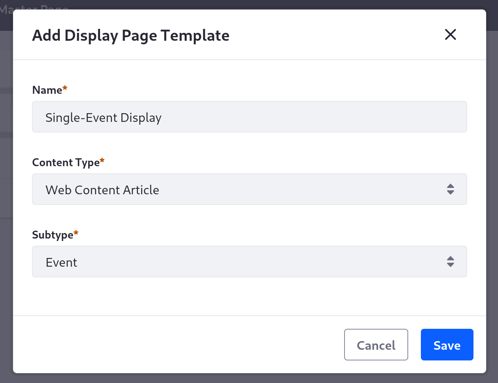
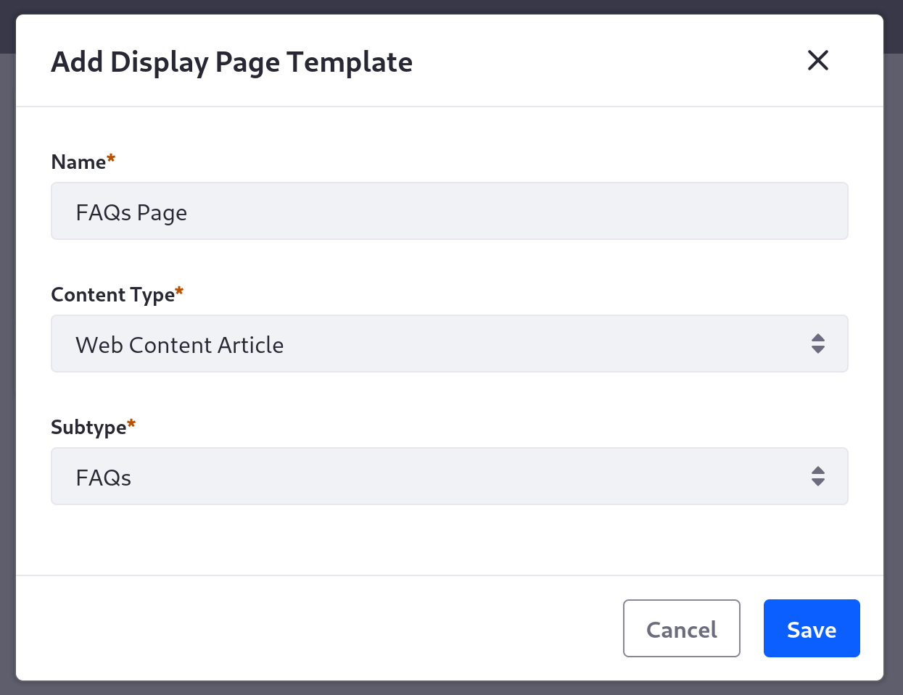
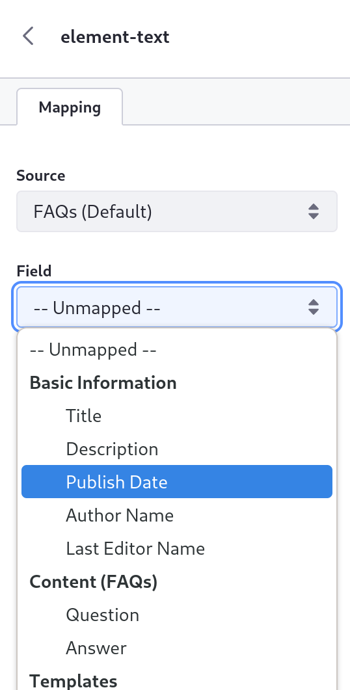
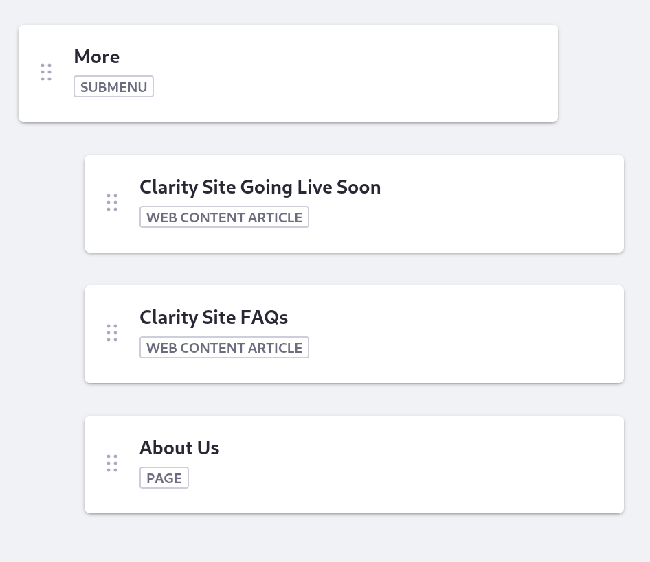
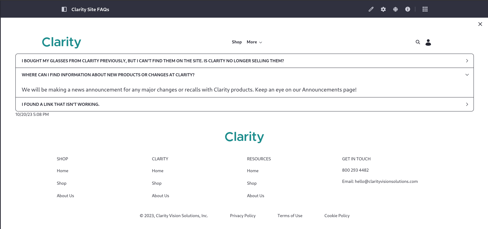

# Adding Simple Display Page Templates

Display page templates are page templates used to display a specific piece of content. Use them if you want somewhere where you can look at a specific article in its own context.

Here, you'll create a display page template specific to each of your web content types (Event and FAQs), and then you'll use them to add new pages to your site.

Olivia, the content manager, doesn't have permission to create new page templates. Log in as your site administrator, Preston Palmer, before you begin.

## Add the Event Display Page Template

1. Navigate to the Site Menu &rarr; *Design* &rarr; *Page Templates*.

1. Click the *Display Page Templates* tab.

1. Click *Add* (  ).

1. Choose the master page template you created previously, *Clarity MP*.

   

1. In the *Name* field, enter "Single-Event Display".

1. From the *Content Type* drop-down menu, select *Web Content Article*.

   The *Subtype* drop-down menu appears once you make the selection.

1. Select *Event* from the Subtype drop-down menu.

   

1. Click *Save*.

   You automatically begin editing a display page based on the Clarity MP master page.

1. In the Fragments menu on the left, scroll down to the *Content Display* fragment group, and drag a *Content Display* fragment onto the drop zone.

   

   By default, this fragment automatically displays whatever content the page is being used for.

1. Click the Content Display fragment you added.

   The menu on the left side of the screen changes to the Browser tab to reflect your selection. The menu on the right shows this fragment's configuration.

   

1. Click the *Styles* tab from the menu on the right side of the screen.

1. Under *Spacing*, click the top and bottom margins (in the outer rectangle) and set them to use the *Spacer 3* margin (1 rem).

   This creates a buffer of space, above and below where your template is displayed.

1. Click the left margin and set it to use the *Spacer 5* margin (3 rem) so the article content is moved further to the right on the page.

   

1. Click *Publish* at the top of the page.

1. Back on the Display Page Templates page, click the Actions menu (  ) for your new Single-Event Display template and click *Mark as Default*.

   Now any Event articles automatically use this template by default on their display pages.

You have a basic page to display a single Event. Later, you'll create a better page that can display more events dynamically.

Next, create a template to display a list of FAQs.

## Add the FAQs Display Page Template

1. While on the Display Page Templates page, click *Add* (  ).

1. Select the *Clarity MP* master page template again.

1. In the *Name* field, enter "FAQs Page".

1. From the *Content Type* drop-down menu, select *Web Content Article*.

   The *Subtype* drop-down menu appears once you make the selection.

1. Select *FAQs* from the Subtype drop-down menu.

   

1. Click *Save*.

1. In the Fragments menu on the left, scroll down to the *Content Display* fragment group, and drag a *Content Display* fragment onto the drop zone.

1. Click the Content Display fragment you added.

   The menus on both sides of the screen change to reflect your selection.

1. Click the *Styles* tab in the menu on the right.

1. Set the left and right margins to *Spacer 5* (3 rem).

1. Under the *Text* section, change the font size to *Font Size Large*.

1. Scroll up to *Basic Components* in the Fragments menu, and drag a *Paragraph* fragment under the Content Display fragment.

1. Click the Paragraph fragment you added.

1. Click the *Styles* tab in the menu on the right.

1. Set the left and right margins to *Spacer 5* (3 rem).

1. In the Browser menu on the left, click the *element-text* component inside the Paragraph fragment.

   The menu on the right changes again to the text configuration. Now you can map the paragraph's text to something related to the page's content.

1. From the *Field* drop-down menu on the right side of the screen, select *Publish Date*.

   

   Now the article's last publish date displays in a new fragment beneath the body of the FAQs article.

1. Click *Publish* at the top of the screen.

1. Back on the Display Page Templates page, click the Actions menu (  ) for your new Single-Event Display template and click *Mark as Default*.

   This makes the new FAQs Page template the default for any FAQs articles. Notice that the Single-Event Display template is still the default for Event articles.

Now you have a template to display any Event or FAQs articles you want on your site, on their own pages. Next, let's add a couple of them to the site.

## Add Display Pages to the Site's Navigation

1. Navigate to the Site Menu &rarr; *Site Builder* &rarr; *Navigation Menus*.

1. Click the Clarity Header Menu.

1. Click *Add*, and select the Event article you created previously, *Clarity Site Going Live Soon*.

1. Click *Add*, and select the FAQs article you created previously, *Clarity Site FAQs*.

1. Drag both of the new articles so they are both under the *More* submenu, before the About Us page.

   

   Now the navigation menu on your site has these two display pages under the More submenu.

1. Go back to the Clarity site's home page.

1. On the navigation menu, click each of the display pages to see how they look.

   Each of these pages shows the content for their respective articles. The article's contents automatically display using the web content templates you created, and they are positioned on the page using the display page templates.

   

Congratulations! You've completed this module on adding and displaying new types of web content.

Next, get started with [Workflow and Publishing Tools](../workflow-and-publishing-tools.md).

## Relevant Concepts

* [Using Display Page Templates](https://learn.liferay.com/web/guest/w/dxp/site-building/displaying-content/using-display-page-templates)
* [Publishing Content with Display Pages](https://learn.liferay.com/web/guest/w/dxp/site-building/displaying-content/using-display-page-templates/publishing-content-with-display-pages)
