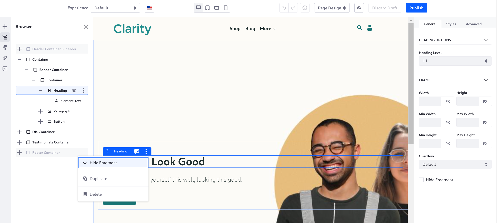

---
toc:
- ./creating-pages/importing-fragments-and-resources.md
- ./creating-pages/adding-the-home-page.md
- ./creating-pages/defining-the-pages-header-and-footer.md
- ./creating-pages/completing-the-site-structure.md
- ./creating-pages/adding-the-sign-in-page.md
- ./creating-pages/creating-navigation-menus.md
- ./creating-pages/designing-the-home-page.md
uuid: 30c0c2ed-18a3-460f-a7e3-48cb46b608d1
---
# Creating Pages

Now that Clarity's public site settings are configured, it's time to add and configure some pages so users can access the site.

Once you're done with the lessons here, Clarity's public site will have this structure:

- Home
- Search
- Shop
- Events
- FAQ
- About Us
   - Careers

The Home and Search pages will be usable and have content, while most of the others will be populated during the Content Management module. The Shop page will be blank until the Commerce Architect course. Begin by repurposing the default Home page of the site, then move into creating and configuring the site's pages.

## Editing Content Pages

There are several page types in Liferay, but [content pages](https://learn.liferay.com/en/w/dxp/site-building/creating-pages/using-content-pages) are the default type and the one used most in this module. Content pages provide a convenient user interface for managing and editing page content and design. You can add widgets and fragments to content pages. In this module, Clarity's pages will be designed and populated primarily through the use of fragments.

## Using Fragments

[Fragments](https://learn.liferay.com/en/w/dxp/site-building/creating-pages/page-fragments-and-widgets/using-fragments) are reusable snippets of HTML, JavaScript (if necessary), and CSS that you add to content pages to build the look-and-feel and add content. There are handy out-of-the-box fragments Clarity can leverage, and custom fragments they can build as needed. Whether custom or built-in, fragment compositions are exportable collections of fragments that you can re-use across pages, sites, and systems.

   - Custom fragments are developed by you, if none of the [out-of-the-box fragments](https://learn.liferay.com/en/w/dxp/site-building/creating-pages/page-fragments-and-widgets/using-fragments/default-fragments-reference) suit your needs. Often you can start by [copying an existing fragment](https://learn.liferay.com/en/w/dxp/site-building/creating-pages/page-fragments-and-widgets/using-fragments/duplicating-fragments) that contains some of the HTML, CSS, or JavaScript you'll need to create your own fragment.
   - [Fragment compositions](https://learn.liferay.com/en/w/dxp/site-building/creating-pages/page-fragments-and-widgets/using-fragments/saving-fragment-compositions) are reusable fragment groups you've added to the content page editor and saved for repeated use.

## Defining Common Page Elements with Master Pages

In addition to the main page content, many sites require a common header and footer across pages. With [master pages](https://learn.liferay.com/en/w/dxp/site-building/creating-pages/defining-headers-and-footers/master-page-templates), Clarity can define these common elements. If a master page isn't defined, the *Blank* master is used. In this case, the header has the Liferay logo and label, a page-based navigation menu, the search bar widget, and the Sign In/personal menu. Using a custom master page, Clarity can define the header and footer of site pages using the content page editor:

## Navigating the Site/Site Navigation Menus

Clarity needs site navigation. Navigation menus are built with the [Navigation Menus application](https://learn.liferay.com/en/w/dxp/site-building/site-navigation/using-the-navigation-menus-application), and displayed on pages using the [Menu Display fragment or widget](https://learn.liferay.com/en/w/dxp/site-building/site-navigation/configuring-menu-displays). Site page hierarchies are commonly displayed in the page header.

## Configuring a Search Page

Clarity wants a [search page](https://learn.liferay.com/en/w/dxp/using-search/search-pages-and-widgets/working-with-search-pages/search-pages) in the site, and a search bar in the master page header. They can rely on the [search page template](https://learn.liferay.com/en/w/dxp/using-search/search-pages-and-widgets/working-with-search-pages/using-a-search-page-template) to accomplish this with little effort.

[Let's Go!](./creating-pages/importing-fragments-and-resources.md)
