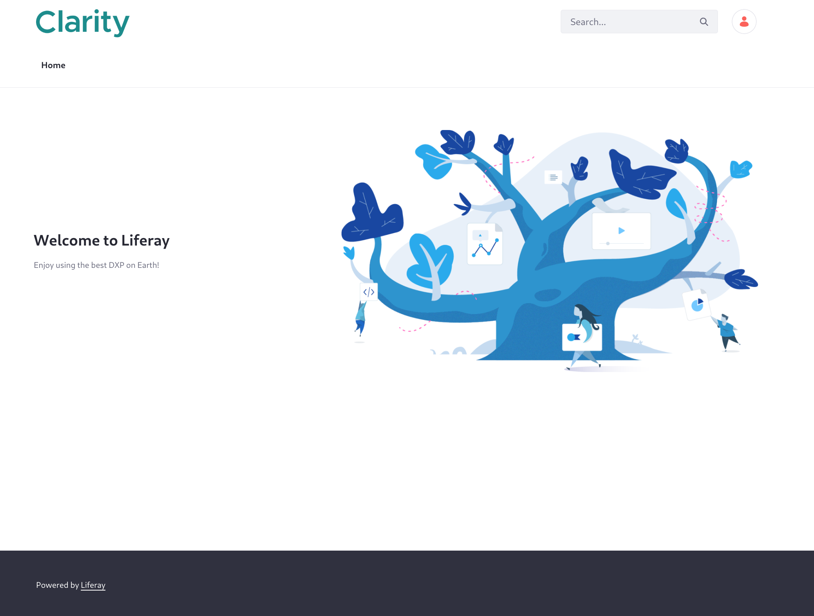
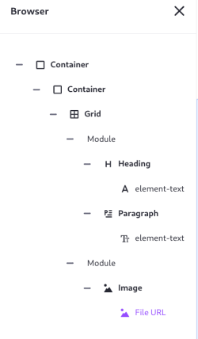
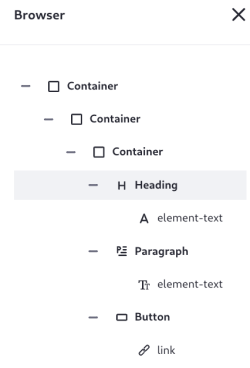
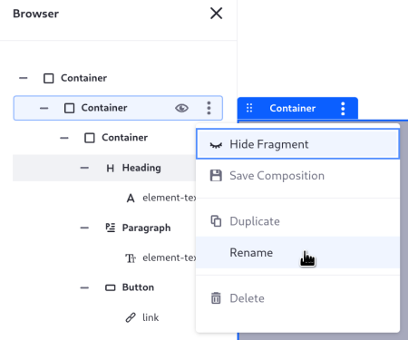

# Adding the Home Page

Right now, browsing to <http://localhost:8080> still shows the default site. In the last module, you changed the instance name and set the logo. This began to give the site a customized look and feel.

Clarity needs its own home page. Page creation and management is the work of a site administrator, and can be completed by anyone with the proper permissions. Out-of-the-box, Liferay comes with a role named Site Administrator that provides the required permissions. Users assigned to the role and who are members of the site can act as an administrator for the site. The setup script executed in the first module has your Liferay instance pre-populated with just such a user, Preston Palmer.

<!-- When did we do this? I missed it. -Rich -->

1. Log in as the site administrator, Preston Palmer: `preston@clarityvisionsolutions.com`, password `test`.

1. Go to the home page and click *Edit* () in the administrative header.

   The content page editor appears. This is where you add content, functionality, and structure to the page.

1. Open the browser () and expand all the elements to get a snapshot of the page's structure: 

   

1. Click the outermost container's *Actions* menu (), then click _Delete_.

   Now your page is a blank slate. There's still a header and footer that must be changed (in the next exercise), but the default page content is gone!

1. Click the plus icon () to open the Fragments and Widgets sidebar menu.

1. Drag a _Container_ fragment onto the page.

   Containers define configurable drag and drop zones for fragments and widgets. Adding all content page elements to a container makes styling the page more convenient.

1. Add a banner to the container. Search for _Banner_ in the Fragments and Widgets sidebar menu and drag it into the container you already added.

   The banner consists of two containers, a heading, a paragraph, and a button.

   In the Browser sidebar (), expand the elements to see the current page element hierarchy:

   

1. Rename the Banner's top level container. In the Browser sidebar, open the *Actions* menu () and click _Rename_.

   

1. Enter _Banner Container_.

1. Click _Banner Container_ in the browser sidebar and open its settings (in the right sidebar menu). In the General section, set the minimum height of the banner to 80VH. This ensures the banner takes up 80% of the Viewport Height of the current device.

1. Configure the banner so its inner container is centered. Set the Banner Container's Content Display to _Flex Column_ and Justify Content to _Center_.

1. Configure the inner container and its elements (heading, paragraph, and button) to have some padding around them. Click the innermost _Container_ in the sidebar to open its settings, then click _Styles_.

1. Change the padding to be 1 REM all around. In the Spacing settings, choose _Spacer 3_ for the padding on the right, left, top, and bottom of the element.

   The value for each spacer setting is defined by the page's [Style Book](https://learn.liferay.com/en/w/dxp/site-building/site-appearance/style-books).

1. Set an image as the banner's background. *Background* is a property for each container element's configuration. Click _Banner Container_ in the browser sidebar.

1. Open the _Styles_ menu in the right sidebar, and set the *Background Image* to `clarity-banner-image`.

1. Set the text color for the Heading and Paragraph elements. Open each one's _Styles_ tab, click the color, and choose _Brand Color 4_.

1. Change the text on the page by double clicking the element to edit:

   - **Heading:** _See Well, Look Good_
   - **Paragraph:** You've never seen yourself this well, looking this good.
   - **Button:** Learn More

1. Click the _Publish_ Button.

Now there's a home page for Clarity. It's not fully implemented yet, but users can navigate to the site and it's clearly for Clarity, not Liferay.

Next: [create a custom header and footer for all pages](./defining-the-pages-header-and-footer.md).

## Relevant Concepts

* [Adding Pages to a Site](https://learn.liferay.com/web/guest/w/dxp/site-building/creating-pages/adding-pages/adding-a-page-to-a-site)
* [Page Fragments and Widgets](https://learn.liferay.com/web/guest/w/dxp/site-building/creating-pages/page-fragments-and-widgets)
* [Configuring Fragments](https://learn.liferay.com/web/guest/w/dxp/site-building/creating-pages/page-fragments-and-widgets/using-fragments/configuring-fragments)
