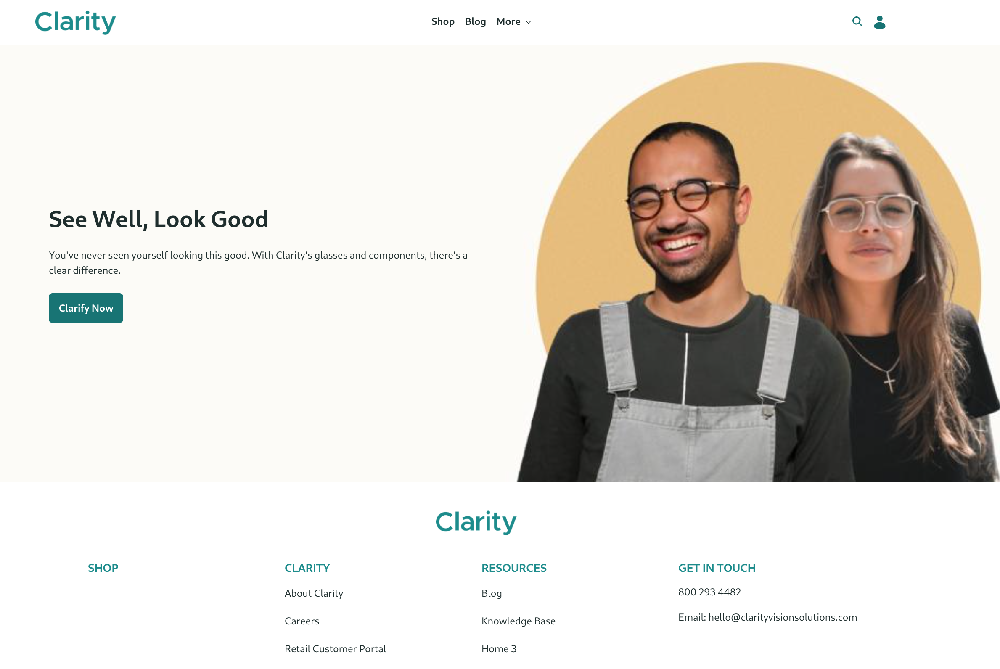

# Designing the Home Page

<!-- Tell a story about this process? An it-savvy marketing manager found Liferay's documentation on using fragments to build out a page, and made a nice banner that serves as a simple version 1 of the home page. But the design team wants more from the page. -->
Clarity's home page is simple. It contains the header and footer defined in the master page, and a simple banner that links to the Shop page:

The design team at Clarity wants more from the home page:

1. Highlight the uniqueness of the company.
1. Show off some specific products.
1. Display customer testimonials.

In Liferay you can use [Fragments](https://learn.liferay.com/en/w/dxp/site-building/creating-pages/page-fragments-and-widgets/using-fragments), which are reusable snippets of HTML, JavaScript (if necessary), and CSS to build the look and feel of the site pages. Clarity's design team doesn't have the expertise to develop the custom fragments needed to build a nifty home page, but they can use the built-in fragments and any custom fragments given to them by the development team to compose the home page.

The first piece of content after the header is similar to the current banner, but instead of the large image as a background it features a series of images implemented as a slider, so that every 5 seconds a new image appears.

1. Open the Home page in editing mode.

1. Add the _home-page-slider-composition_ to the page.

1. Publish the page.

The slider images can be updated, as can the number of slides. Each slide has a title and paragraph text. These are created with web content.

<!-- Should the Web Content come in with this lesson or be imported already, in ./importing-fragments-and-resources.md -->

<!-- I think since you don't go over Web Content until a later module, it should have been imported. You may also want to say here that Web Content is covered later. -Rich -->

After the slider comes a list of points highlighting the uniqueness of Clarity and its products. 

<!-- Note: the link to the bullet style probably needs to be updated. Could use a custom fragment/resource so it's there on import. -->

1. Open the Home page in editing mode.

1. Add the _home-page-uniqueness-composition_ to the page.

1. Publish the page.

The last piece of content is for showing customer testimonials. In this case the image remains the same, but the text is changed to display customer quotes.

1. Open the Home page in editing mode.

1. Add the _home-page-testimonials-composition_ to the page.

1. Publish the page.

SCREENSHOT/GIF
<!-- Oops, though I finished this article! This is about when I learned of the switch to Clarity -->

Now Clarity's basic pages are in place and the home page is fleshed out. However, the navigation menu could use some enhancements. 

<!-- We could just configure the Careers page to be excluded from the Menu Display navigation, like we did with search and sign-in-->

<!-- No; people should be able to find the Careers page. In fact, I don't think it should be a child of About Us. -Rich -->

   

Next, create a [new main navigation menu](./creating-navigation-menus.md) for the master page's header.
