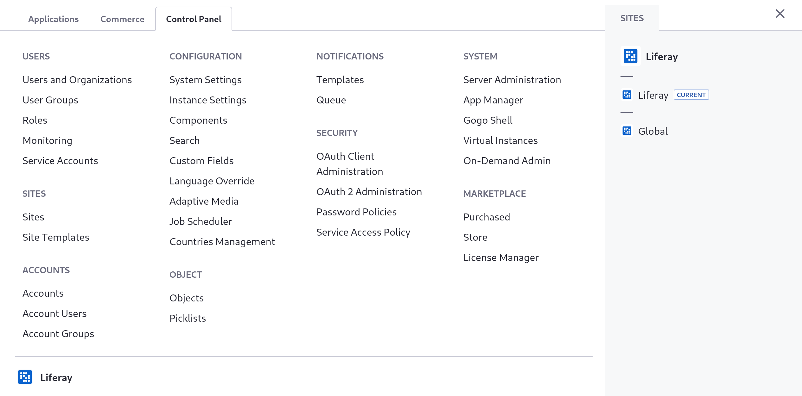
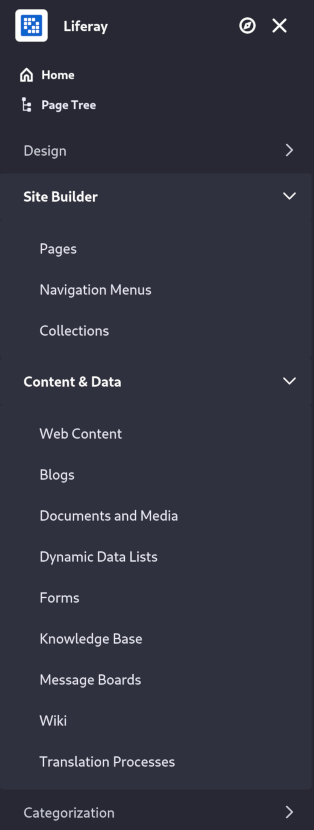

---
toc:
  - ./site-settings/changing-the-default-sites-name-and-logo.md
  - ./site-settings/changing-your-public-sites-settings.md
uuid: f77b9dc7-1187-41bb-9af4-a8f5912f532f
---
# Site Settings

To get started managing Clarity's public website, you'll first need to establish some basic settings. Site settings encompass everything from the site's name and logo, to its URL and membership policy. Help Clarity's administrators configure all of these settings to set the foundation for adding in pages and content.

Some settings are safe to enable for most kinds of sites, such as enabling an accessibility menu for users. Other settings, such as the site's membership type, must be configured differently for different types of sites. Clarity's private intranet, for example, requires the private membership setting when you add it in a later module.

This module walks through configuring the site settings for the public Clarity site, for customers to access. In these exercises, you'll change settings for

* The site's name and logo
* The site's URL
* The site's description
* The site's email domain
* The accessibility menu

As you make these changes, you'll navigate with these menus:

* The **Control Menu** is the bar at the top of the screen, which includes context-specific controls for the page you're on. For example, on a site that you have administrative permissions for (like the image above), you can see buttons to edit (  ) or configure (  ) the page. It also includes the button to show or hide the Site Menu (  ) and the Global Menu (  ). If you don't have permission to view the Control Menu menu, you can't access either of these other menus.

* The **Global Menu** (  ) is a group of menus that you can switch between with the tabs at the top: the *Applications Menu*, the *Commerce Menu*, and the *Control Panel*. You can also switch to a different site context via the links on the right.

* The **Site Menu** is broken into various other menus for things on the site you are managing. You must have have the *Access in Site and Asset Library Administration* permission for each type of content or setting to see it in the Site Menu.

Once you're familiar with these menus, it's time to start changing your site's settings.

The new public site replaces the Liferay home site that exists out-of-the-box, so some of the basic settings must be changed in your *instance settings*. The first step is to change those instance settings to repurpose the site for Clarity.

[Let's Go!](./site-settings/changing-the-default-sites-name-and-logo.md)
