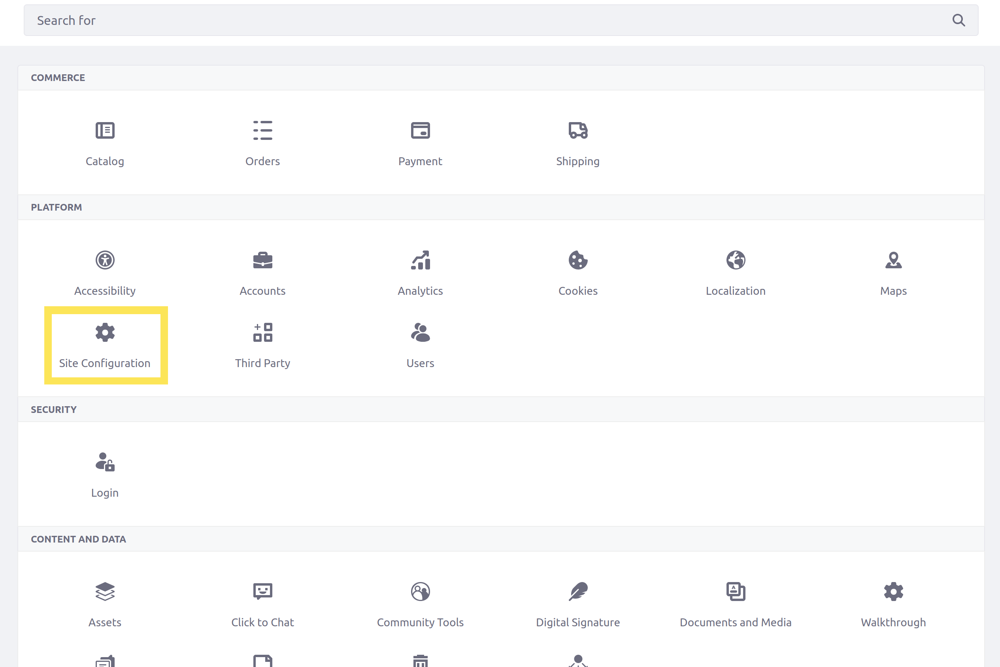
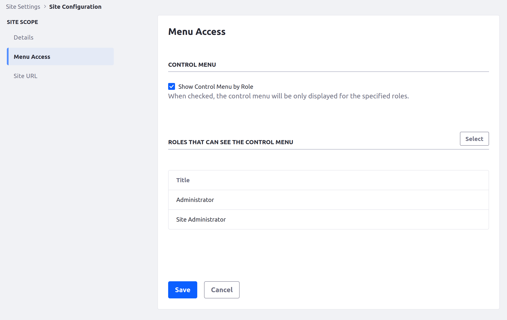
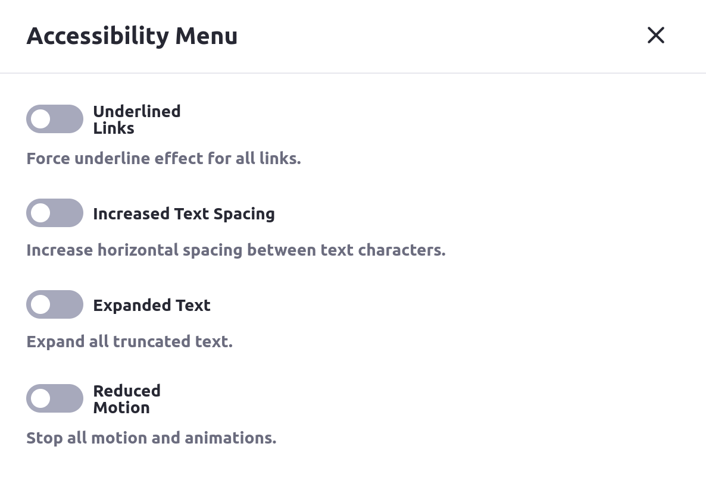

# Changing Your Public Site's Settings

Now that you've made the first changes to the Delectable Bonsai site, you're ready to change more site-specific settings.

Since the instance settings changes are done, Kyle doesn't need to make the rest of the changes himself. Log out and log back in as NAME NAME, your public site administrator, before you begin.

<!-- TODO: update with the actual public site administrator's name once it's been added to the imported users -->

## Add a Site Description

Now the Delectable Bonsai site needs a description to match its purpose as a public marketplace.

1. Return to the Delectable Bonsai Site.

   Visiting `localhost:8080/web/guest` redirects to the default site with a self-hosted instance.

1. On the Site menu, click *Configuration* &rarr; *Site Settings*.

1. On the Site Settings page, click *Site Configuration*.

   

1. Fill in the *Description* field: "Get your bonsai maple syrup at Delectable Bonsai!"

1. Click *Save*.

## Examine Site Membership Settings

At the bottom of this screen, you also have two controls for site membership:

**Membership Type**: Define how membership works on your site. Your choices are users can join your site (*Open*), the site is visible but users must request to join (*Restricted*), or users must be specifically invited to the site and can't see it otherwise (*Private*).

**Allow Manual Membership Management**: Choose if users can be added or removed manually to the site.

More restrictive membership types will be appropriate when you make the private intranet and extranet sites later.

For this site, keep the default options so any user can register for an account. 

## Restrict Menu Access by Role

Next, you'll restrict access to the site's key menus on your site. Disabling the Control Menu (the menu bar across the top of the screen) for users on your site also prevents access to the Site Menu on the left.

By default, new members joining your site already won't have access to these menus because they won't have [roles with those permissions](https://learn.liferay.com/web/guest/w/dxp/users-and-permissions/roles-and-permissions/understanding-roles-and-permissions). However, the Delectable Bonsai public site should still use this setting to carefully select which roles grant access to the menus.

1. While on the Site Configuration page, click *Menu Access* under Site Scope.

1. Click the checkbox for *Show Control Menu by Role*.

   

1. Click *Save*.

Now only users with specifically chosen roles on your site (by default, only global administrators or site administrators) can see these important menus. For now, don't add any new roles.

## Change the Site URL

The friendly URL is the part of the URL after the slash (`/`) that directs to your specific site. Configure the Delectable Bonsai's friendly URL to one that's more appropriate.

1. While on the Site Configuration page, click *Site URL* under Site Scope.

1. In the *Friendly URL* field, replace the default value (`/guest`) with the new value: `/p`.

1. Click *Save*.

Now `/p` is appended to the URL for the public site, and the home page redirects you to it correctly because of [your previous instance setting change](./changing-the-default-sites-name-and-logo.md#change-other-important-instance-settings).

## Examine Cookie Preferences

Next, examine the settings for users to accept or decline site cookies.

1. Click the *Back* button at the top of the page to return to the Site Settings menu.

1. Click *Cookies*.

   

Here, the upper checkbox enables a banner and a consent panel, which give users more controls over the cookies they opt into with the site in Explicit Cookie Consent Mode.

The banner notifies users if they have not accepted the site's cookies and explains why they are needed, with an optional *Decline All* button. The consent panel helps users see and choose which types of cookies to opt into.

The Delectable Bonsai site will need a web page with an explanation of the company's privacy policy to properly configure the banner and consent panel. For now, leave the option unchecked.

## Enable the Accessibility Menu

Enable the accessibility menu for the Delectable Bonsai site so users can tweak site behavior for better access and readability.

1. Click the Back button at the top of the page to return to the Site Settings menu.

1. Click *Accessibility*.

   

1. Check the *Enable Accessibility Menu* checkbox.

1. Click *Save*.

With this option enabled, users viewing the site's pages can use the tab key to reveal an *Open Accessibility Menu* button. Clicking that button displays a pop-up modal with accessibility options.

Congratulations! You've completed this module on configuring your public website.

Next, get started [creating pages for the site](../creating-pages.md).

## Relevant Concepts

* [Navigating DXP](https://learn.liferay.com/web/guest/w/dxp/getting-started/navigating-dxp)
* [Site Settings Reference](https://learn.liferay.com/web/guest/w/dxp/site-building/site-settings/site-settings-ui-reference)
* [Understanding Roles and Permissions](https://learn.liferay.com/web/guest/w/dxp/users-and-permissions/roles-and-permissions/understanding-roles-and-permissions)
