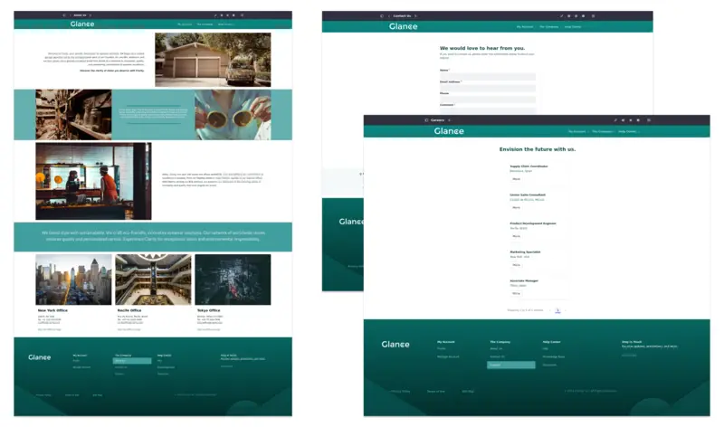

---
toc:
  - ./site-templates/creating-a-site-template-and-uploading-files.md
uuid: 61acac6f-ca72-4aae-ae13-4cef75a634a1
---
# Site Templates

With *Site Templates*, you can create a prototype or boilerplate not just for a page, but for an entire site. Here are some key advantages:

1. *Time and Effort Savings and Ease of Site Creation*. If you need multiple sites with the same structure and content, you can create a site template with predefined layouts, pages, and content. This saves time and effort during the site creation process as users can create new sites based on these templates with minimal configuration.

1. *Consistency Across Sites and Standardized Content*. Define a consistent look and feel across multiple websites to ensure a uniform brand identity and user experience. You can also keep consistency by standardizing content (e.g., headers, footers, and navigation menus) across multiple sites.

   

1. *Global Updates*. You can apply changes globally to all sites that use the same template. This simplifies maintenance and ensures the same updates are applied uniformly across all associated sites.

1. *Reusability*. Templates can be reused across different projects or initiatives, promoting scalability.

Each template includes most standard site applications for adding pages, stylebooks, web content, and more. Sites created with a template inherit all of the template's data. And once you create a site using a template, you can change it in two ways: by making changes outside the template to customize that individual site, or by making changes to the template so those changes automatically propagate to connected sites.

Here's what you'll learn: 

- You'll create a [site template](https://learn.liferay.com/web/guest/w/dxp/site-building/sites/site-templates), populate it with pages, and create other sites with it.

- [You'll change your site's theme](https://learn.liferay.com/web/guest/w/dxp/getting-started/changing-your-sites-appearance) and apply a [style book](https://learn.liferay.com/web/guest/w/dxp/site-building/site-appearance/style-books/using-a-style-book-to-standardize-site-appearance) to your new theme. This customizes your site's appearance and applies a set of visual rules to provide a consistent design and experience across the site and its pages.

- You'll create a [master page template](https://learn.liferay.com/web/guest/w/dxp/site-building/creating-pages/defining-headers-and-footers/master-page-templates) and use it to define elements common to every page (e.g. menus, header and footer) so you can maintain and manage them easily.

- You'll use [fragment compositions](https://learn.liferay.com/web/guest/w/dxp/site-building/creating-pages/page-fragments-and-widgets/using-fragments/saving-fragment-compositions) to build your pages. You can use [layout elements](https://learn.liferay.com/web/guest/w/dxp/site-building/creating-pages/page-fragments-and-widgets/using-fragments/using-layout-elements) to design your page and save the whole structure as a fragment. Use it in other pages and templates that support fragments whenever necessary. This results in a more consistent user experience.

- You'll use an [object definition](https://learn.liferay.com/w/dxp/building-applications/objects/creating-and-managing-objects) and map it to a [form container fragment](https://learn.liferay.com/web/guest/w/dxp/building-applications/objects/using-fragments-to-build-forms) to create and manage a contact form to use in your site.

  You can create an object with fields to be used in a form (e.g. name, phone number, and email address) and map it to a form container fragment to generate a form for customers to submit.

- You'll create a [collection](https://learn.liferay.com/w/dxp/site-building/displaying-content/collections-and-collection-pages/creating-collections) of [web content articles](https://learn.liferay.com/web/guest/w/dxp/content-authoring-and-management/web-content/web-content-articles) with job postings and use a [collection display fragment](https://learn.liferay.com/web/guest/w/dxp/site-building/displaying-content/collections-and-collection-pages/displaying-collections#adding-a-collection-display-fragment-to-a-page) to show a list of job postings in a page.

  Collections are sets of content items you can use to group, filter, and display information. The items in this collection are web content articles, content created based on a specific structure that defines its available fields. The articles contain information about job postings (e.g. job title, location, and description).

- You'll create [navigation menus](https://learn.liferay.com/web/guest/w/dxp/site-building/site-navigation/using-the-navigation-menus-application) to determine which elements are included in a menu, and how they are organized. Then, configure the [menu display fragments](https://learn.liferay.com/web/guest/w/dxp/site-building/site-navigation/configuring-menu-displays) located in your master template so you can show your navigation menus in all pages through the template.

- Finally, you'll [create a new site](https://learn.liferay.com/web/guest/w/dxp/site-building/sites/adding-a-site) using your site template. After that, you are free to add specific pages and other elements an intranet for Clarity employees called Glance and a B2B platform.

Ready?

[Let's Go!](./site-templates/creating-a-site-template-and-uploading-files.md)
