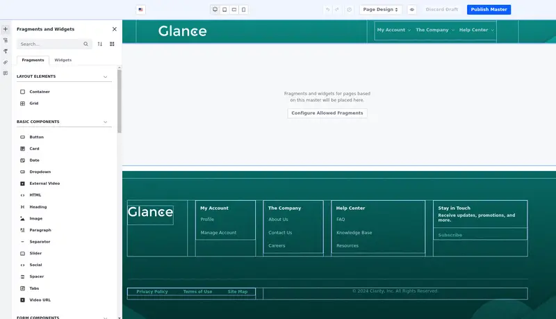
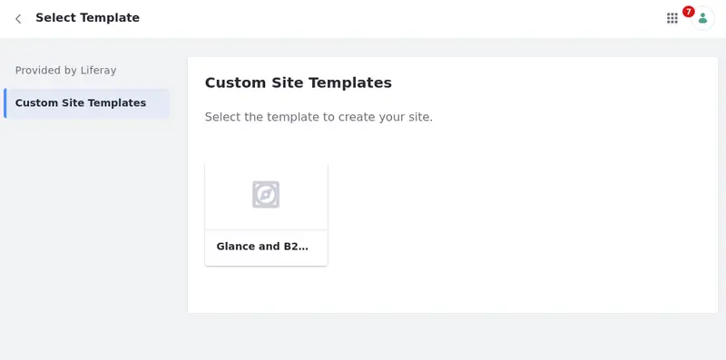

# Creating a New Site

It is time to create a new site based on the template.

But, before you do that, fix the navigation menu in the footer used in the Main template.

## Creating the Navigation Menu and Configuring the Menu Display

Create the following pages: Profile, Manage Account, FAQ, Knowledge Base, and Resources. You'll use those pages to create your navigation menus.

1. Open the *Site Menu* () and select *Site Builder* &rarr; *Navigation Menus*.

1. Click *Add* () and name it `The Company Navigation`.

1. Click *Add* and select *Page*. Select the pages you created during this module: About Us, Contact Us, and Careers. Click *Select*.

Create the other navigation menus. One is called `My Account Navigation`, and it contains the Profile and the Manage Account pages. The other is called `Help Center Navigation` and it contains the FAQ, Knowledge Base, and Resources pages.

Next, you'll create a primary navigation to use in the menu located in the header:

1. Create a navigation menu and call it `Primary Navigation`.

1. Click *Add* and select *Submenu*. Name it `My Account`. Add two more submenus and name them `The Company` and `Help Center`.

1. Click *Actions* () beside My Account and select *Add Child* &rarr; Page. Select the *Profile* and the *Manage Account* pages.

1. Repeat the process with the other submenus. Add the child pages as you created the other navigation menus.

   The Company: About Us, Contact Us, and Careers.
   Help Center: FAQ, Knowledge Base, and Resources.

   

Once the navigation menus are created, you can configure the menu displays in the Main page template.

1. Open the *Site Menu* () and select *Design* &rarr; *Page Templates*.

1. Under the Masters tab, click the *Main* template to start editing the master page.

   You can also click *Actions* () and select *Edit*.

1. In the Menu Display under My Account, click *Options* &rarr; *Configuration*

1. Select *Choose Menu* and click *Select*. Choose *My Account Navigation*.

1. Under Display Template, choose *Pills Stacked* and click *Save*.

The menu display shows the navigation menu with the Profile and Manage Account pages.

Configure the navigation menus in the other menu displays just like in the video below:

Your menus should look like this when finished: 

Next, you'll create a site based on the template you just created.

## Creating a Site Based on the Template

1. Open the Global Menu (), select the *Control Panel* tab, and under Sites, click *Sites*.

1. Click *Add* (). Select the *Custom Site Templates* tab and click *Glance and B2B Site Template*. Name your new site `Glance` and click *Add*.

   

1. Change the theme of your new site to the Dialect theme.

1. If you have problems with the menu in the header, edit the Main master page, start configuring the Menu Display and select the appropriate Menu.

Your new site is generated and you can use all the resources created within the Site Template or create new elements for your site! Repeat the same process and create the Clarity B2B site as well.

<!-- What's the B2B site's name? -Rich -->
<!-- I asked the designer and she did not know . I don't think there is one. So I called it Clarity B2B just in case. - Eric -->

Try it. Don't forget to apply the Dialect theme to your new site as by default it uses the Classic theme. This way you can maintain your standard site appearance.

That's it. Congratulations, Liferay Learner! You have just completed this module.

During these lessons, you have learned how to create a site template, change your site's theme, apply a style book to your site's theme, create a site template, create pages, use compositions, create forms mapped to object definitions, use collection displays, create navigation menus, configure menu displays, and create a new site based on a site template.

Phew! That was a lot. Keep on practicing!

Next, you'll learn how to modify the [Site Look and Feel.]()

## Relevant Concepts

- [Using the Navigation Menus Application](https://learn.liferay.com/web/guest/w/dxp/site-building/site-navigation/using-the-navigation-menus-application)
- [Configuring Menu Displays](https://learn.liferay.com/web/guest/w/dxp/site-building/site-navigation/configuring-menu-displays)
- [Site Templates](https://learn.liferay.com/web/guest/w/dxp/site-building/sites/site-templates)
