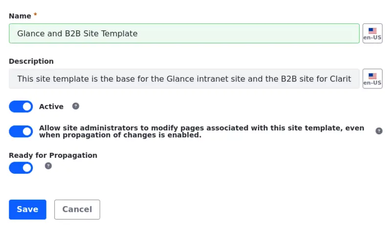
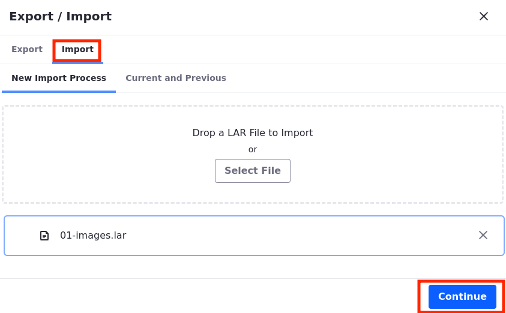
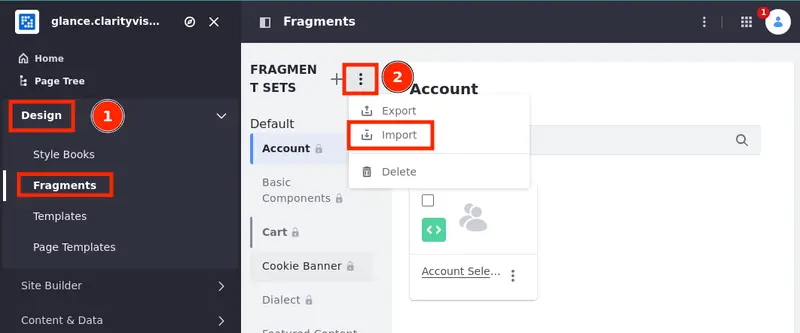

# Creating a Site Template and Uploading Files

Before you start editing your site template, there are some steps you have to take to set up the environment.

## Use the Virtual Instance

1. Navigate to `http://glance.clarityvisionsolutions.com:8080/` (the virtual instance you created in the Liferay Administrator course).

   If you haven't created one yet, see [Configuring Virtual Instances](../../liferay-administrator/configuration/configuring-virtual-instances.md) in the Liferay Administrator course and follow the steps to create one.

1. Log in as Kyle Klein, the instance's administrator.

   If you have just created the virtual instance, it has no user accounts in it. Create one for Kyle Klein so he can administer this instance as well. Follow the steps in [Create an Administrator](../../liferay-administrator/users-accounts-organizations/managing-users.md#create-an-administrator) to register Kyle and make him an administrator of this instance.

## Create a Site Template

Once in the virtual instance, create the site template that will be used to create other sites.

1. Open the *Global Menu* (), select the *Control Panel* tab, and click *Site Templates* under Sites.

   

1. Click *Add* () and fill the creation menu with the following information:

   | Field | Information |
   | :--- | :--- |
   | Name | Glance and B2B Site Template |
   | Description | This site template is the base for the Glance intranet site and the B2B site for Clarity. |
   | Active | On |
   | Allow site administrators to modify pages associated with this site template | On |
   | Ready for Propagation | On |

   

<!-- Are there permissions to be given to users? -->

1. Once you create the site template, click on its *Name*. The site template opens in a new tab. You can start editing the template now.

## Change the Site's Theme

For this exercise, use the Dialect theme with a style book designed for this theme. To alter the theme for your site,

1. Open the *Site Menu* () and select *Site Builder* &rarr; *Pages* (1).

1. Click *Options* () and choose *Configuration*.

1. Under Theme, click *Change Current Theme* and select Dialect.

1. Save the alteration by rolling to the end of the page and clicking *Save*.



## Import Resources

1. Download the [resources for this exercise](./liferay-h2a2.zip).

   ```bash
   curl https://resources.learn.liferay.com/courses/latest/en/application-development/modeling-data-structures/liferay-h2a2.zip -O
   ```
1. Unzip the file.

   ```bash
   unzip liferay-h2a2.zip
   ```

   This .zip file includes elements that you'll use to create your site template (e.g. images, custom fragments, and custom compositions).

## Import the Style Book

1. Open the *Site Menu* () and select *Design* &rarr; *Style Books* (1).

1. Click *Options* () and choose *Import*.

1. In the Import modal, click *Choose File*, select the `01-glance-style-book.zip` file, and click *Import*.

   You can also drag and drop the file into the modal.

1. Back to the Style Books app page, click *Actions* () in your Glance Style Book card and choose *Mark as Default*.

The style book is now in place. Use it to standardize your site's appearance.

### Import Images

1. Open the *Site Menu* () and select *Content & Data* &rarr; *Documents and Media* (1).

1. At the top-right corner of the page, Click *Options* () &rarr; *Export/Import* (2).

1. In the Export/Import modal, select the *Import* tab.

1. Click *Select File* and select the `02-glance-images.lar` file &rarr; click *Continue*.

   You can also drag and drop the file into the modal.

   

1. Use the default configurations and click *Import*. Once the process is finished, close the modal.

You can use the imported images throughout the site template now.

### Import Fragments and Compositions

1. Open the *Site Menu* () and select *Design* &rarr; *Fragments* (1).

1. Next to Fragment Sets, Click *Actions* () &rarr; *Import* (2).

   

1. Click *Select File* and select the `03-glance-custom-fragments-and-compositions.zip` file &rarr; *Import*.

1. Once the process is finished, click *Done*.

You can use the custom fragments and compositions throughout the site template now.

The rest of the files will be used in future lessons.

Next, let's [create the master page template.](./creating-the-master-page-template.md)

## Relevant Concepts

- [Virtual Instances](https://learn.liferay.com/web/guest/w/dxp/system-administration/configuring-liferay/virtual-instances)
- [Site Templates](https://learn.liferay.com/web/guest/w/dxp/site-building/sites/site-templates)
- [Changing Your Site's Appearance](https://learn.liferay.com/web/guest/w/dxp/getting-started/changing-your-sites-appearance)
- [Using a Style Book to Standardize Site Appearance](https://learn.liferay.com/web/guest/w/dxp/site-building/site-appearance/style-books/using-a-style-book-to-standardize-site-appearance)
- [Documents and Media](https://learn.liferay.com/web/guest/w/dxp/content-authoring-and-management/documents-and-media)
- [Using Fragments](https://learn.liferay.com/web/guest/w/dxp/site-building/creating-pages/page-fragments-and-widgets/using-fragments)
- [Saving Fragment Compositions](https://learn.liferay.com/web/guest/w/dxp/site-building/creating-pages/page-fragments-and-widgets/using-fragments/saving-fragment-compositions)