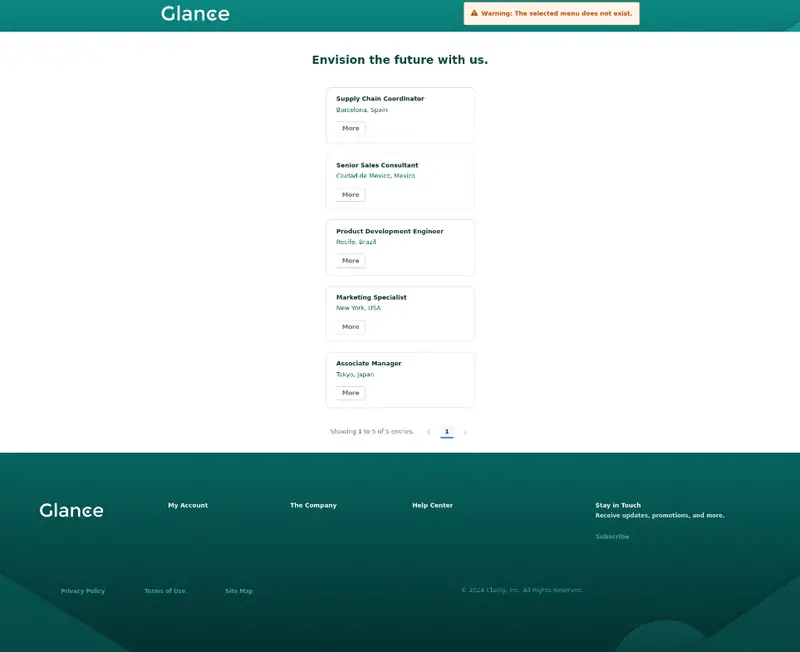

# Creating the Careers Page

The Careers page shows a list of available job postings. When you click a posting a page appears with more details about the job. To create the page, use web content structures and templates to create and show the job postings and display page templates to show the details about the job.

## Importing the Web Content, Structures, and Templates

1. Open the *Site Menu* () and select *Content & Data* &rarr; *Web Content*.

1. Click *Options* () and select *Export/Import*.

1. Select the *Import* tab and choose the `05-glance-careers-job-posting-web-content.lar` file (that was included in the zip file with the resources for this module). Click *Continue*.

1. Use the default settings and click *Import*. After the import process is complete, close the modal.

The web content articles, structure, and template are imported. Now, create a collection to display the content in a page.

## Creating a Collection

1. Open the *Site Menu* () and select *Site Builder* &rarr; *Collections*.

1. Click *New* and choose *Dynamic Collection*. Name it `Job Postings Collection`.

1. Under Item Type, select *Web Content Article* and, under Item Subtype, select *Job Posting*. Click *Save*.

Now, import the display page template.

## Importing the Display Page Template

1. Open the *Site Menu* () and select *Design* &rarr; *Page Templates*.

1. Select the *Display Page Templates* tab, click *Options* () and select *Import*.

1. Select the `06-glance-careers-job-posting-display-page-template.zip` file (included in the zip file with the resources for this module) and click *Import*. After the import process is complete, click *Done*.

The display page template is imported. You can use it to show more details about a job posting.

## Create and Edit the Careers Page

1. Open the *Site Menu* () and select *Site Builder* &rarr; *Pages*.

1. Click *Add* () &rarr; *Add Site Template Page* and select the Main template.

1. Name the page `Careers` and click *Add*. The page editor appears.

1. While editing the page, look at the Fragments and Widgets tab on the left of the page editor and search for `Careers Composition`.

1. Drag and drop the Careers composition in the editing area.

1. Change the Heading text to `Envision the future with us.`.

1. Double-click the first Dialect text component inside the collection item's container. Under the Mapping tab, change the field to `Job Title`.

   When dealing with collection displays, you only have to alter one of the occurrences of the component. All the other occurrences are repetitions applied to the other collection items.

   

1. Double-click the second Dialect text component inside the collection item's container. Under the Mapping tab, change the field to `Location`.

1. Double-click the Dialect button inside the collection item's container. Under the Link tab, change the link to `Mapped URL` and the field to `Job Posting DPT`.

<!-- Maybe it should be named Job Posting Display Page Template -->

   Once users click the button, the display page template appears. 

   

1. Change the Dialect button's text to `More`.

1. Publish the page.

This is how the Careers page should look once it's finished:

Next: [create the menu navigation and use your site template to generate another site.](./creating-a-new-site.md)

## Relevant Concepts

- [Web Content](https://learn.liferay.com/web/guest/w/dxp/content-authoring-and-management/web-content)
- [Using Collections](https://learn.liferay.com/web/guest/w/dxp/site-building/displaying-content/using-collections)
- [Using Display Page Templates](https://learn.liferay.com/web/guest/w/dxp/site-building/displaying-content/using-display-page-templates)
- [Using Multiple Display Page Templates to Create Multi-Step Applications](https://learn.liferay.com/web/guest/w/dxp/site-building/displaying-content/using-display-page-templates/using-multiple-display-page-templates-to-create-multi-step-applications)
