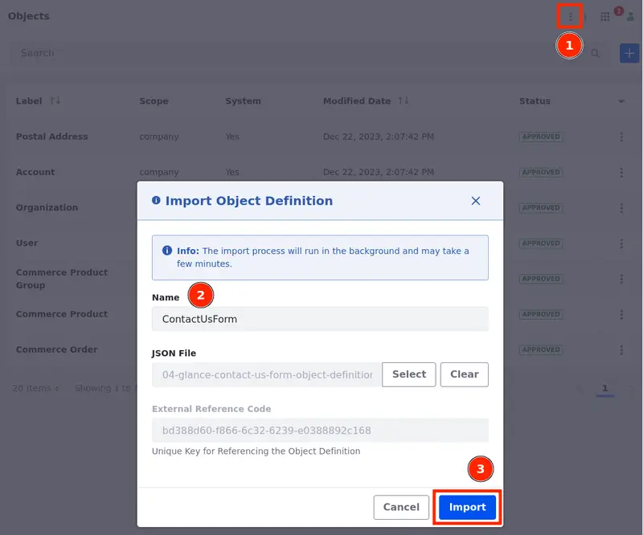
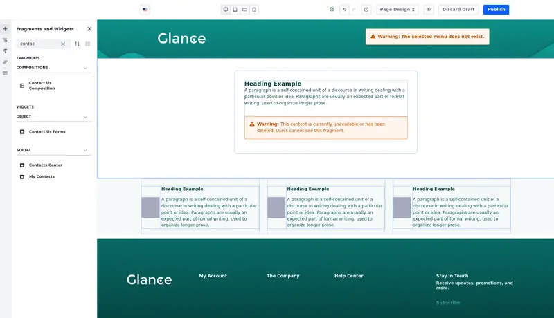

# Creating the Contact Us Page

The Contact Us page has a form users should fill out if they want to contact the company. To create this form, import an object definition and map it to a Form Container fragment.

## Importing the Object Definition

1. Open the Global Menu (), select the Control Panel tab, and click *Object* under Objects.

1. Click *Options* () (1) and select *Import Object Definition*. Name the object definition `ContactUsForm`, select the `04-glance-contact-us-form-object-definition.json` file (that was included in the zip file with the resources for this module) (2), and click *Import* (3).

   

The object definition has four fields (Name, Email Address, Phone, and Comment) and it appears under Object in the Control Panel tab of your Product Menu.

Next, create the Contact Us page and add a form container fragment to it.

## Create the Page

1. Open the *Site Menu* () and select *Site Builder* &rarr; *Pages*.

1. Click *Add* () &rarr; *Add Site Template Page* and select the Main template.

1. Name the page `Contact Us` and click *Add*. The page editor appears. 

1. While editing the page, look at the Fragments and Widgets tab on the left of the page editor and search for `Contact Us Composition`.

1. Drag and drop the Contact Us composition in the editing area.

### Editing the Content in the Contact Us Page

Alter the elements in the composition. Use the information in the table below:

| Component | Content |
| :--- | :--- |
| Main Heading | We would love to hear from you |
| Main Paragraph | If you want to contact us, please enter the information below to direct your inquiry. |
| Left Image | `Icon-geolocation.png` |
| Left Heading | New York Office |
| Left Paragraph | 10019, NY. USA   Tel: +1-212-555-0139   nyoffice@clarity.com |
| Middle Image | `Icon-geolocation.png` |
| Middle Heading | Recife Office |
| Middle Paragraph | Rua da Aurora, Recife. Brazil   +55 81 2020-5000   recifeoffice@clarity.com |
| Right Image | `Icon-geolocation.png` |
| Right Heading | Tokyo Office |
| Right Paragraph | Bunkyo, Tokyo 112-0001   Tel: +81 75 429-7496   tokyooffice@clarity.com |

Add your Form Container to the page and map it to the Contact Us Form object definition. The existing form container with a warning was left in the composition so you know where to place your form container.

<!-- Or is it better to take the container out of the composition and tell the user to place the fragment in the container? -->

<!-- No, this is good. -Rich -->

1. Look at the Fragments and Widgets tab on the left of the page editor and search for `Form Container`.

   The form container only appears if you have an object definition in place.

1. Drag and drop the *Form Container* into the editing area on top of the existing one and map your form container to the Contact Us Form object.

1. Drag and drop the fields to reorder them. The order should be Name, Email Address, Phone, and Comment.

1. Delete the old form container by clicking *Options* on top of the component and selecting *Delete* or through the Browser.

With the form mapped and in place, style the way it looks.

1. Click the *Form Container* component. In the menu on the right, select the General tab and set the `Min Width` to 360 px.

1. Select the Styles tab and set the following properties:

   | Property | Value |
   | :--- | :--- |
   | Padding Top | 0.5 rem |
   | Padding Right | 1.5 rem |
   | Padding Left | 1.5 rem |
   | Padding Bottom | 1.0 rem |
   | Background Color | Color Brand Primary Lighten 4 |
   | Border Radius | 10 px |

   

   <!-- Are you sure this is a best practice? -Rich -->

1. Publish the page.

The Contact Us page should look like this when it is finished:

Next: [create the Careers page.](./creating-the-careers-page.md)

## Relevant Concepts

- [Creating and Managing Objects](https://learn.liferay.com/web/guest/w/dxp/building-applications/objects/creating-and-managing-objects)
- [Exporting and Importing Object Definitions](https://learn.liferay.com/web/guest/w/dxp/building-applications/objects/creating-and-managing-objects/exporting-and-importing-object-definitions)
- [Using Fragments to Build Forms](https://learn.liferay.com/web/guest/w/dxp/building-applications/objects/using-fragments-to-build-forms)
- [Personalizing Custom Forms Using Form Fragments](https://learn.liferay.com/web/guest/w/dxp/site-building/creating-pages/page-fragments-and-widgets/using-fragments/personalizing-custom-forms-using-form-fragments)
