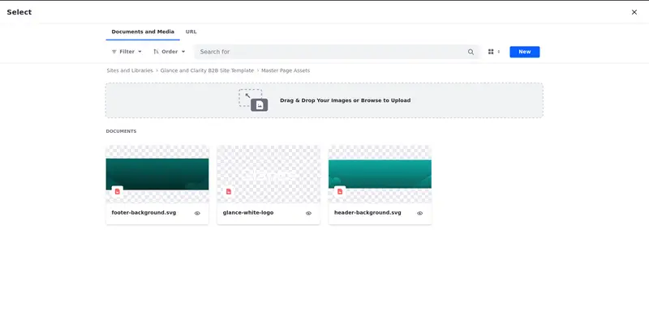

# Creating the Master Page Template

*Master page templates* provide a way to define elements common to every page, so you can maintain and manage them without having to deploy a plugin.

You can use the same master page template across an entire site or have unique templates for each page.

In this exercise, you are creating a master page template called "Main" which is used to create the pages for the site template.

## Creating and Editing the Master Page Template

1. Open the *Site Menu* () and select *Design* &rarr; *Page Templates*.

1. Under the Masters tab, click *Add* (). Name this page template "Main" and click *Save*.

   You are redirected to the page editor.

1. In the search bar under Fragments and Widgets, search for `Header` (1). The custom header composition you imported shows under Compositions (2). Drag and drop it on top of the Drop Zone (3).

   

1. Next, search for the `Footer`. The custom footer composition also shows under Compositions. Drag and drop it under the Drop Zone.

With the header and the footer in place, edit the way they look and their contents.

### Editing the Look and Feel of the Custom Header

The header composition is almost complete. Add the missing logo to the Image fragment:

1. Click the *Image* fragment twice to select the image-square inside the Image fragment. On the right, select the *Image Source* tab.

   You can also select the image-square by using the Browser menu on the left (1).

   

1. Under Image, click the + icon, open the *Assets* folder and select the `glance-white-logo.svg` image.

Your custom header is ready.

### Editing the Look and Feel of the Custom Footer

Start by organizing the top grid. First, Add the logo to the footer:

1. In the first grid module, double-click the *Image* fragment (this selects the image-square inside the Image fragment). On the right, select the *Image Source* tab.

1. Under Image, click the + icon, open the *Assets* folder and select the `glance-white-logo.svg` image.

   You can also click the `image-square` component twice to open the modal where you select the image.

   

Second, alter the headings for the menu displays:

1. In the second grid module, double-click the Dialect Text to edit it and change its text to `My Account`.

   

1. Repeat the last step to add and alter the heading for the menu displays in the next two grids. Add a `The Company` and a `Help Center` heading to the other grids.

   You can also duplicate the Dialect Text component (using the Browser or the options menu that shows once you click the component), reposition the duplicates in the next modules, and change their text.

   

   The menu displays are going to be set later.

Third, create a section where the user can subscribe to the company's mailing list to receive updates, offers, and other announcements directly to their inbox:

1. In the last grid module, change the Dialect Text to `Stay in Touch`.

1. Change the Dialect Text under it to `Receive updates, promotions, and more.`

1. Change the Dialect Button's text to `Subscribe`.

Now, it's time to organize the bottom grid:

1. First, change the Dialect Button's texts to `Privacy Policy`, `Terms of Use`, and `Site Map`.

   

1. In the second module, change the Dialect Text to `© 2023 Clarity, Inc. All Rights Reserved`

   

Your custom footer is ready.

Once you are done editing the header and the footer, click *Publish Master*.

Coming up next, let's [create a page based on the Main template and populate it.](./creating-the-about-us-page.md)

## Relevant Concepts

- [Master Page Templates](https://learn.liferay.com/web/guest/w/dxp/site-building/creating-pages/defining-headers-and-footers/master-page-templates)
- [Using Fragments](https://learn.liferay.com/web/guest/w/dxp/site-building/creating-pages/page-fragments-and-widgets/using-fragments)