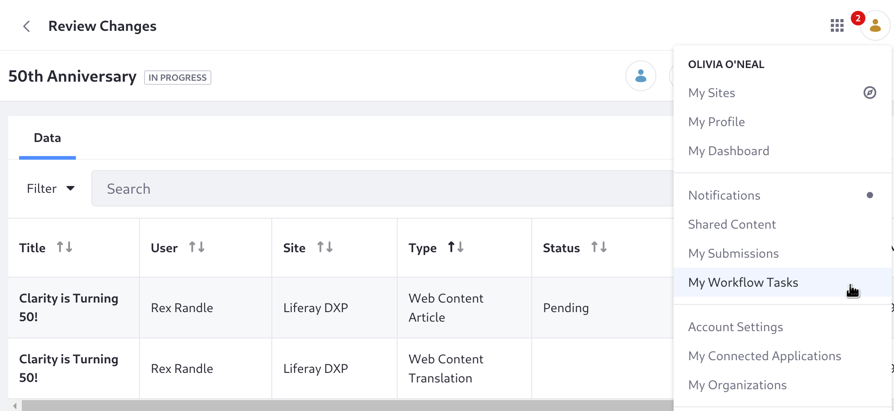

---
toc:
- ./workflow-and-publishing-tools/using-workflow-with-faqs.md
- ./workflow-and-publishing-tools/creating-a-publication-template-for-claritys-special-events.md
- ./workflow-and-publishing-tools/working-with-the-50th-anniversary-publication.md
- ./workflow-and-publishing-tools/publishing-the-50th-anniversary-content.md
uuid: 2784080b-e770-4715-b844-7fcca38e50b0
---
# Workflow and Publishing Tools

Now that Clarity's site is up and running and even has some content, you can discover some of Liferay's publishing tools, [workflow](https://learn.liferay.com/w/dxp/process-automation/workflow) and [publications](https://learn.liferay.com/w/dxp/site-building/publishing-tools/publications).

When finished, several Clarity users will have collaborated to create a push of approved content to the live site, in support of its 50th anniversary promotional event. Initially, the FAQs worked on by Rex Randle, Clarity's Customer Advocacy Specialist, will be configured to use the Single Approver workflow process, so that they can be reviewed by the Content Manager, Olivia O'Neal, before publication on the site. After this, the 50th anniversary content will be prepared and published to the live site in a publication process backed by a publications template.

## Workflow

Liferay includes a workflow engine. With it, users can configure review and approval processes for content such as blogs, web content, or wikis so users can collaborate to make content publishable. The Workflow application makes it possible to define any number of business processes/workflows, deploy them, and manage them through a user interface. Workflow processes can integrate with Users, Groups, and Roles as reviewers and approvers. After you defined your review process, you can select which types of content require a review process before publication.

## Publications

Use publications to develop, track, and publish changes across your instance. Liferay tracks which version of your content is displayed on your live sites, and users create separate publications to group their changes into publishable blocks. Publications are most useful for collaborating on important pushes of related content into your production environment all at once.

## Publications and Workflow

Workflow is used for structured review processes, while publications are suited for preparing content for discrete content pushes. Workflow can be used inside a publication, and that's exactly what Clarity will do, by workflow enabling the event structure so that all new events are reviewed and approved. Once all the content (inside and outside the workflow) is in place, the publication process is used to push the content into the live site.

Ready to explore Liferay's publishing tools?

[Let's Go!](./workflow-and-publishing-tools/using-workflow-with-faqs.md)
