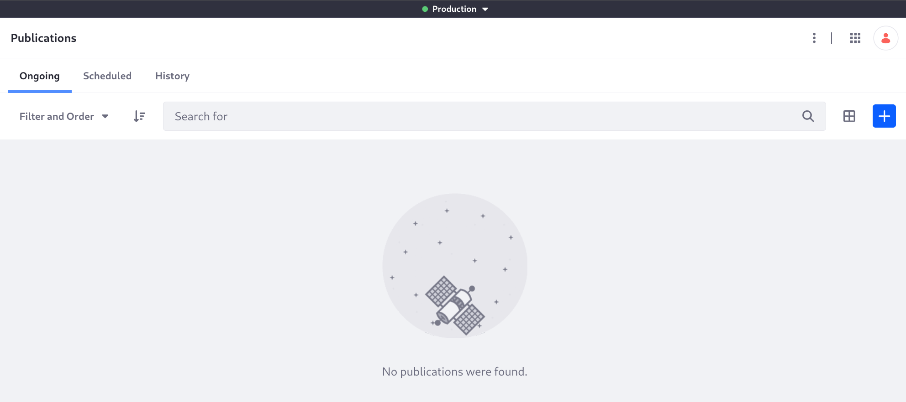
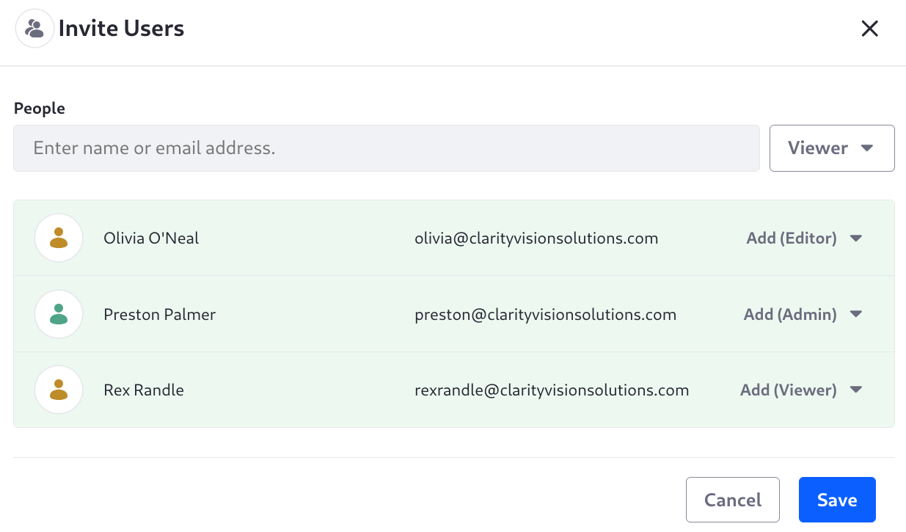
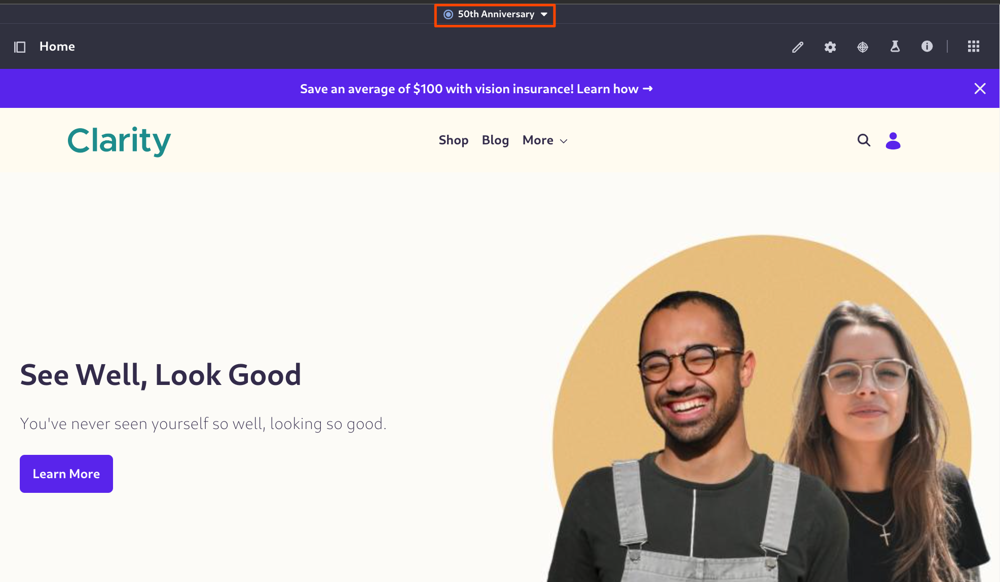

# Creating Publications for Clarity's Special Events

<!-- Duplicates the reference doc title, so make this more specific, like Creating Publications for Clarity's Special Events -->

Clarity wants to celebrate its 50th anniversary with some special frames available only for a limited time. They must prepare content across the site to announce the event and show off the frames. This will result in a one-time content push for releasing the frames and marketing materials all at once. For this kind of dedicated content push, where multiple content creators can work together until the final version is ready, use [Publications](https://learn.liferay.com/en/w/dxp/site-building/publishing-tools/publications).

To enable publications in Liferay, first log in with the administrator Kyle Klein: email `kyle@clarityvisionsolutions.com`, password `learn`. Then,
<!-- Would Kyle represent a real user type that might be doing this lesson? -->

1. Open the *Global Menu* () &rarr; *Applications* &rarr; *Publications*.

1. Toggle *Enable Publications*. New options appear.

   

1. Toggle *Sandbox Only* mode so users are directed automatically to their last working publication when they log in. 

   <!-- I don't think we want sandbox only mode enabled, because we don't need publications automatically appearing for each users first login -->
   <!-- From the docs: If they don't have one, a new publication is generated for them using the `screen.name - date` naming pattern. You can use publication templates to set default values for these auto-generated publications. See [Using Publication Templates](./using-publication-templates.md) for more information. -->

1. Do not enable *Allow Unapproved Changes*. In this scenario users must not publish unapproved changes to production.

1. Click *Save* to save your configuration. You're redirected to the Publications application page, and the publications bar appears:

   

## Creating a Special Event Publication Template

You can jump right in and create the publication, but Clarity is likely to have more special events in the future, and these will require similar publications. To streamline this, Kyle can create a publication template:

1. Open the *Global Menu* () &rarr; *Applications* &rarr; *Publications*.

1. Click *Actions* () &rarr; *Templates*.

1. Click *Add* () and enter:

   **Template Name:** _Special Event_

   **Description:** _Create content in preparation for a special event_

1. Click _Default Template_ to set this template as the default for new publications.
   <!-- Decide what to do about the Default Sandbox Template option -->

1. Expand _Publication Information_ and enter the Publication Name: _REPLACE THIS: ${CURRENT_USERNAME}, ${TODAY_DATE}_.

   See [Using Publication Templates](https://learn.liferay.com/en/w/dxp/site-building/publishing-tools/publications/using-publication-templates) for more information.

   

1. Expand _Publication Collaborators_ and click _Add Users_.

1. In the Invite Users dialog, search for and add users to these publication roles:
<!-- To take this a step further we could create a custom role for working on the publications. It takes a Regular Role to gather these permissions, according to the docs -->

   - Administrator: Preston Palmer
   - Editor: Olivia O'Neal
   - Viewer: Rex Randle

   

   Importantly, publications roles only grant permission for viewing or managing the publication itself, and do not grant page and content editing permission. These permissions must be given explicitly. See [Assigning Roles to Publication Collaborators](https://learn.liferay.com/w/dxp/site-building/publishing-tools/publications/publications-permissions#assigning-roles-to-publication-collaborators) to see the permissions these roles provide their users.

1. Click _Save_ and confirm that you'd like to invite these users.

1. Click _Create_ to finish adding the publication template.

## Creating the 50th Anniversary Publication

Preston Palmer is a publication administrator in the template, so log in with this user to create the 50th anniversary event's publication:

1. In the publications bar, click _Create New Publication_.

   

1. Replace the name with _50th Anniversary_.

1. Click _Create_.

   Preston is automatically working in the new publication after it's created.

   

## Working on the 50th Anniversary Changes

<!-- Consider a better name -->

Sign in as Olivia O'Neal, then

<!-- Problem: currently when Kyle Klein creates a publication based on a template that's marked as the default and the default sandbox template,
So far I see no evidence that inviting users via the publication template does anything. If my admin user creates a publication based on the template, the invited users cannot see the publication when they log in.
-->

Name, Default Template, Default Sandbox Template, 

Publication Information: Publication Name, Publication Description

From the UI: Info--You can use string template tokens to dynamically generate various snippets you can use in the publication's name and description. The available tokens are:
${RANDOM_HASH}
${TODAY_DATE}
${CURRENT_USERNAME}

   <!-- From the docs, I don't know what automatically created publications are 
   **Default Template**: Manually created publications use this template by default, but you can select an alternative template during publication creation. When [Sandbox Only mode](./enabling-publications.md#how-to-enable-publications) is enabled, automatically created publications use the template if a Default Sandbox Template isn't set.

   **Default Sandbox Template**: Automatically created publications use this template when [Sandbox Only mode](./enabling-publications.md#how-to-enable-publications) is enabled. You can still create publications manually using an alternative template.
   -->

