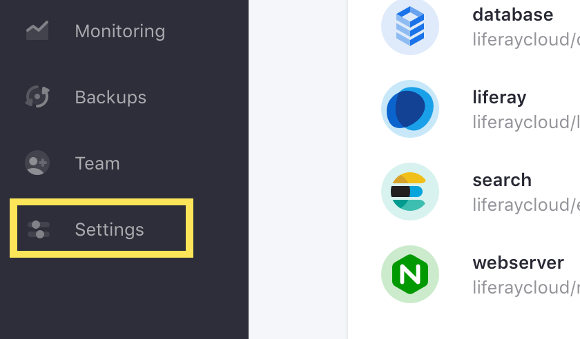
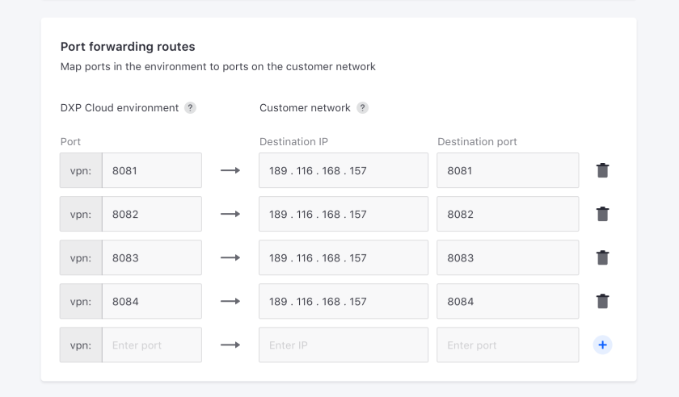

# Stage 7: Connecting the VPN

If required for your development environment, the last stage of migration is to connect your Cloud environment to your private network. This involves configuring (or updating) your VPN server and then setting up the connection on the Liferay Cloud console.

You may need to connect your Liferay Cloud environment to a VPN if:

* Your own project requirements involve the use of a VPN
* You want to connect your environment to an [LDAP server](https://learn.liferay.com/dxp/latest/en/users-and-permissions/connecting-to-a-user-directory/connecting-to-an-ldap-directory.html?highlight=ldap)
* You want to connect to environment to another directory server
* You need to use a remote application that interacts with other web services

If you do not need to configure a VPN server, then you can skip to the [next steps](#next-steps).

## Configure the VPN Server

You must configure your VPN server so that a secure connetion can be established between Liferay Cloud and an internal network.

You can configure your VPN connection to use `EAP-TLS` or `EAP-MSCHAPV2` authentication protocols. See [Configuring a VPN Server](../infrastructure-and-operations/networking/configuring-a-vpn-server.md) for help on configuring the VPN server.

## Create and Configure the VPN Connection

Next, use the Liferay Cloud console to create the VPN connection for the server you configured.

1. In the Liferay Cloud console, navigate to the environment you want to connect the VPN to (such as `prd`), depending on your project's requirements.

1. Click *Settings* on the left side of the screen.

    

1. Scroll down to the VPN section, and click *Create New VPN*.

    

1. Configure all of the VPN settings to match your VPN server's configuration:

    * **Name** (Used to identify the VPN)
    * **Description**
    * **Protocol** (IPSec or OpenVPN)

1. Map ports in your Liferay Cloud environment to ports in your private network.

    

    Mapping ports is useful to redirect requests in the Liferay Cloud environment to specific services in the private network.

1. Click *Create and Connect VPN*.

The VPN connection is established when you click the button. It may take some time for the VPN server to connect successfully.

## Check the VPN Server Response

To verify that your VPN is connected to your Liferay Cloud environment successfully, run a `curl` command to test the connection:

1. In the Liferay Cloud environment (in the same environment you connected to the VPN), navigate to the `liferay` service.

1. Click on the Shell tab to access the `liferay` service's shell.

    

1. Run this command (and replace `####` with the number of any port you mapped to your private network):

    ```bash
    curl vpn:####
    ```

If you get a response from the VPN server when you run the command, then the VPN server is configured and connected properly.

## Next Steps

Now you have set up your VPN connection and your migration to Liferay Cloud is complete! Complete the [next steps after migration](./next-steps-after-migration.md) to make sure your environment is ready to go.
