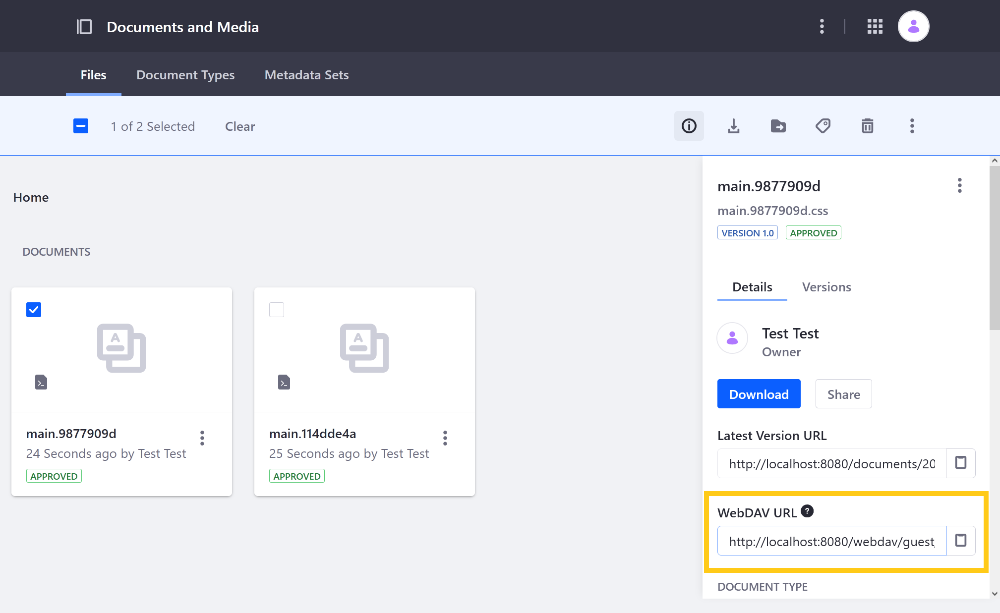
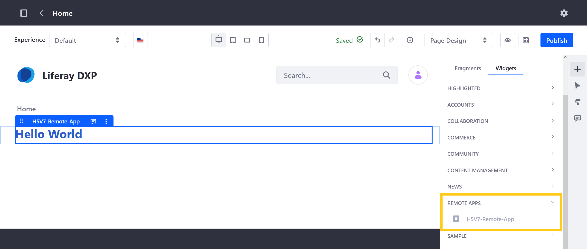

# Creating a Basic Custom Element

{bdg-secondary}`Available Liferay 7.4+`

Custom elements are a type of client extension that use Liferay's front-end infrastructure to register external, remote applications with the Liferay platform and render them as widgets.

```{warning}
Custom elements or IFrames being deployed in the same way as other types of client extensions is a **beta feature** in Liferay 7.4. This tutorial uses a different way to deploy custom element remote applications, and it is still the recommended approach until a future update.
```

Here you'll create a basic remote application using Liferay's [`create_remote_app.sh`](https://raw.githubusercontent.com/liferay/liferay-portal/master/tools/create_remote_app.sh) script. After the application is generated, you'll compile its code and host its `.js` and `.css` files. Once hosted, you'll copy each file's URLs and use them to create a custom element. Finally, you can deploy the application to site pages as a widget.


```{note}
Custom element client extensions are agnostic regarding how applications are built, packaged, and hosted. This tutorial only offers a convenient way to create a sample custom element application.
```

Running `create_remote_app.sh` requires the latest versions of [Node.JS](https://nodejs.org/), [NPM](https://www.npmjs.com/), and [YARN](https://classic.yarnpkg.com/). Before proceeding, ensure these tools are installed.

## Run the `create_remote_app.sh` Script

When calling `create_remote_app.sh`, you must provide a valid HTML element name and specify the desired JavaScript framework (i.e., React or Vue).

Run this command to generate the React application's code:

```bash
curl -Ls https://github.com/liferay/liferay-portal/raw/master/tools/create_remote_app.sh | bash -s h5v7-remote-app react
```

This calls the script with two arguments: a custom HTML element name (`h5v7-remote-app`) and the desired JavaScript framework (`react`).

When finished running, the script automatically creates a new React application which includes these elements in a folder named `h5v7-remote-app`:

```bash
h5v7-remote-app
├── node_modules
├── README.md
├── package.json
├── public
│   └── index.html
├── src
│   ├── common
│   │   ├── services
│   │   │   └── liferay
│   │   │       ├── api.js
│   │   │       └── liferay.js
│   │   └── styles
│   │       ├── hello-world.scss
│   │       ├── index.scss
│   │       └── variables.scss
│   ├── index.js
│   └── routes
│       ├── hello-bar
│       │   ├── components
│       │   └── pages
│       │       └── HelloBar.js
│       ├── hello-foo
│       │   ├── components
│       │   └── pages
│       │       └── HelloFoo.js
│       └── hello-world
│           ├── components
│           └── pages
│               └── HelloWorld.js
└── yarn.lock
```

### Understanding the `index.js` File

   ```{literalinclude} ./creating-a-basic-custom-element/resources/liferay-h5v7.zip/h5v7-remote-app/src/index.js
       :language: js
   ```

The generated `index.js` file includes two customizations necessary for using the application as a Liferay custom element remote application.

* `WebComponent`: On line 21, the application is declared a `WebComponent` so it can connect to Liferay's framework.
* `ELEMENT_ID`: On line 30, `ELEMENT_ID` is set to `h5v7-remote-app`, instead of the conventional `<div id="root" />`. This is because a remote application's HTML Element Name must match the application's `ELEMENT_ID`, and `<div id="root" />` does not work for this purpose.

### Understanding the React Routes

The generated code includes three routes: `hello-world` (default), `hello-foo`, and `hello-bar`. Routes are alternative sets of code that you can use when running an application. See [Using Routes with Custom Elements](./using-routes-with-custom-elements.md) for a basic example.

## Building the React Application

After running `create_remote_app.sh`, navigate to the new `h5v7-remote-app` folder and build the application:

```bash
cd h5v7-remote-app
```

```bash
yarn build
```

This command creates an optimized production build, which includes the `.js` and `.css` files necessary for running the application.

Before proceeding, confirm the code has compiled successfully and take note of the application's `.js` and `.css` files.

```
Creating an optimized production build...
Compiled successfully.

File sizes after gzip:

  43.51 kB  build/static/js/main.114dde4a.js
  121 B     build/static/css/main.9877909d.css
```

These files must be [hosted](#hosting-the-application-files) in a location accessible to Liferay. They can be hosted on a remote server or a data storage system optimized for serving static resources. For demonstration purposes, this example uploads them to Liferay's Document Library and hosts them using WebDAV URLs.

```{tip}
Unique file names are generated for every build. When testing your custom applications, remember to update your `.js` and `.css` files after builds.
```

## Hosting the Application Files

For demonstration purposes this tutorial hosts the application’s static resources in Liferay’s Document Library. In a production environment, you should host the application’s files on a server optimized for hosting static resources.

```{include} /_snippets/run-liferay-dxp.md
```

Then, follow these steps:

1. Open the *Site Menu* (), expand *Content & Data*, and go to *Documents and Media*.

1. Click the *Add* button () and select *Multiple Files Upload*.

1. Drag and drop the `.js` and `.css` files into the upload area.

   Alternatively, use *Select Files* to upload them.

   

1. Click *Publish*.

This adds the files to the Document Library and assigns them unique URLs, which you'll use to create the remote application.

To view each file's URL, click the *Info* icon () and select a file. Copy each file's *WebDAV URL* and save them for use in the next step.



For example,

* `http://localhost:8080/webdav/guest/document_library/main.114dde4a.js`
* `http://localhost:8080/webdav/guest/document_library/main.9877909d.css`

## Registering the Application with Liferay

1. Open the *Global Menu* (), click the *Applications* tab, and go to *Remote Apps*.

1. Click the *Add* button ().

1. Enter these values:

   | Field | Value |
   | :--- | :--- |
   | Name | H5V7-Remote-App |
   | Type | Custom Element |
   | HTML Element Name | `h5v7-remote-app` |
   | URL | WebDAV URL for the `.js` file |
   | CSS URL | WebDAV URL for the `.css` file |
   | Portlet Category Name | Remote Apps |

1. Click *Save*.

Once saved, Liferay creates a widget named H5V7-Remote-App, which you can deploy to site pages like other page widgets. This widget appears under the selected Portlet Category Name.



## Additional Information

* [Browser-Based Client Extensions](../../browser-based-client-extensions.md)
* [Understanding Custom Element and IFrame Client Extensions](../understanding-custom-element-and-iframe-client-extensions.md)
* [Using Routes with Custom Elements](./using-routes-with-custom-elements.md)
* [Remote Applications UI Reference](../remote-applications-ui-reference.md)
