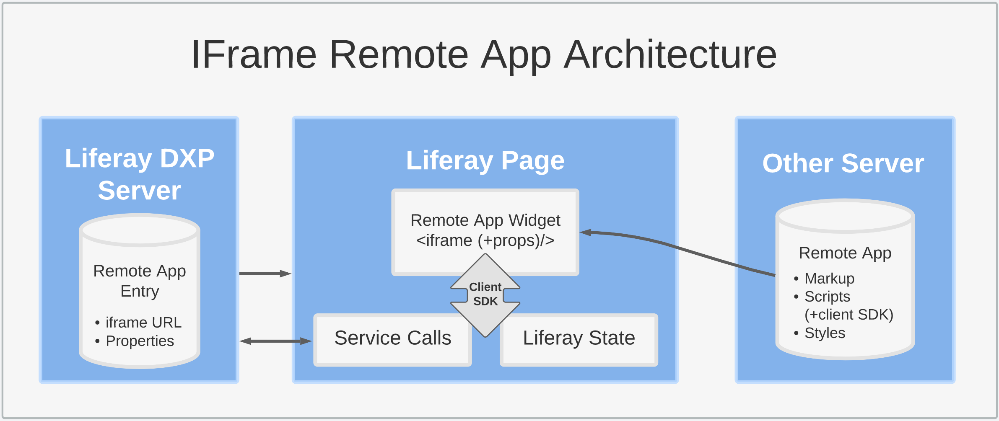

# Understanding Custom Element and IFrame Client Extensions

Custom Element and IFrame client extensions register applications with Liferay and render them as widgets on site pages.

When you create one of these front-end extensions, Liferay generates and adds the widget to the OSGi service registry. You can set additional properties at the entry or widget scope to configure how the applications are rendered.

Custom element and IFrame applications are hosted differently, rendered differently, and have different levels of access to Liferay services and runtime data.

```{tip}
The [custom element](#using-the-custom-element-type) type offers greater integration with the Liferay platform and supports more complex scenarios.
```

## Using the Custom Element Type

The custom element client extension type renders external application code into a separate HTML `<custom-element>` and provides full integration with the Liferay host page. The architecture for custom element applications includes three main parts: the Liferay server, the Liferay host page, and the server storing your application's code. Liferay uses these files to create the application in a browser.


Each custom element entry includes an HTML element name and URLs to any necessary JavaScript and CSS files. They can also include properties rendered with the application at runtime.

When added to a page, Liferay inserts the client extension's JavaScript and CSS files directly into the page via `<script>` and `<link>` elements. The JavaScript declares and instantiates the application, and the CSS files style it.

```{important}
The application's code must declare the custom element and provide an HTML element name matching the name in the Remote Apps entry. For this reason, it must use an [IIFE](https://developer.mozilla.org/en-US/docs/Glossary/IIFE) to ensure the custom element declaration runs in the browser as soon as the app code is loaded.
```

When the remote app's widget is added to a page, it renders the application markup by first generating a tag with the provided HTML element name and then executing the logic defined in the element's code. If the entry or widget instance includes properties, they are added to the generated custom element markup (`<custom-element (+props)/>`).

Once rendered, the application is integrated fully into the Liferay page so it can use Liferay's public JavaScript API and reuse style classes already available in the host page. You can, however, change this by how you build the custom element and where you put its style rules. For example, if the application's markup uses [Shadow DOM](https://developer.mozilla.org/en-US/docs/Web/Web_Components/Using_shadow_DOM), the custom element's styles and the host page can be isolated from one another.

```{note}
When multiple instances of the custom element widget are added to a page, Liferay only includes the application's URLs once.
```

## Using the IFrame Type

The IFrame client extension type renders external applications into a separate `<iframe>` element, which allows for limited interaction with the host page using Liferay's client SDK API. The architecture for IFrame applications includes three main parts: the Liferay server, the Liferay host Page, and the external server hosting your application.



Each IFrame entry stores an IFrame URL that links to an application, typically served from an external server. As a result, the application must provide an HTML document including markup, scripts, styles, and (optionally) the client SDK.

When you add the client extension's widget to a page, Liferay uses the entry's URL to render an `<iframe>` tag populated with the external application's content. If the entry or widget instance includes properties, they are passed to the application as additional URL attributes (`<iframe (+properties)/>`) so the app can access them programmatically.

```{note}
IFrame apps must be deployed to a server so they can assemble their own markup and send it to the browser to fill the widget's `<iframe>` element. By contrast, [Custom Element apps](#using-the-custom-element-type) don't require a server to produce markup. They only require the application's code be available via URLs, since the browser is responsible for running the necessary logic via the app's widget and JavaScript code.
```

By default, all browsers impose the 'same-origin' policy for IFrame applications to prevent information flow between a host page and its external applications. Liferay provides a client SDK script to allow limited communication between IFrame elements and a Liferay page. It works by implementing a communication protocol with the page via the `postMessage()` API. To use this script, it must be included in the application's markup.

When an IFrame app uses the client SDK, the Liferay page receives instructions to perform certain actions on behalf of the application as the current logged-in user. This includes making service calls to the DXP server and accessing state details (e.g., opening a toast in the host page, calling headless APIs, running GraphQL queries, accessing style properties).

## Additional Information

* [Introduction to Client Extensions](../../client-extensions.md)
* [Creating a Basic Custom Element](./tutorials/creating-a-basic-custom-element.md)
* [Remote Applications UI Reference](./remote-applications-ui-reference.md)
