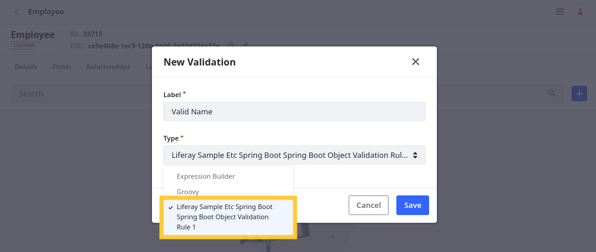

---
toc:
  - ./microservice-client-extensions/using-a-microservice-client-extension.md
  - ./microservice-client-extensions/object-action-yaml-configuration-reference.md
  - ./microservice-client-extensions/object-validation-rule-yaml-configuration-reference.md
  - ./microservice-client-extensions/workflow-action-yaml-configuration-reference.md
  - ./microservice-client-extensions/notification-type-yaml-configuration-reference.md
uuid: c35ace6c-9e29-4e9e-be37-b4799a8b21d5
---
# Microservice Client Extensions

{bdg-secondary}`Available Liferay DXP 7.4 (self-hosted)`   {bdg-secondary} `Available Liferay Experience Cloud (SaaS)`

Define microservice client extensions to run your own code in response to events in your Liferay instance. How you implement the code is up to you: use the patterns and technologies you like. Microservice client extensions are hosted outside of Liferay and are triggered by cues from Liferay itself.

Microservice client extensions require pre-configured authentication profiles to handle requests properly and call protected Liferay APIs. You can add authentication profiles by including them as client extensions within the same project (e.g., [OAuth user agent client extensions](./configuration-client-extensions.md#oauth-user-agent-client-extensions)).

Microservice client extensions are hosted automatically when deployed within Liferay Experience Cloud. If self-hosting a Liferay instance, you must host the microservices that these client extensions use separately.

## Object Action Client Extensions

{bdg-secondary}`Available Liferay DXP 7.4 (self-hosted)`   {bdg-secondary} `Available Liferay Experience Cloud (SaaS)`

Object action client extensions define external action handlers that bind to an [object definition's](../objects.md) action events. Your microservice's handler code is executed when the object action occurs.

Use the `type` value in your `client-extension.yaml` file to specify an object action client extension:

```yaml
type: objectAction
```

## Object Validation Rule Client Extension

Object Validation Rule client extensions define custom [validations](../objects/creating-and-managing-objects/validations.md) that you can add to object definitions. They work by defining external event handlers that bind to object entry submission events and execute when users create or update entries. When creating these client extensions, you can use any number of conditions for determining valid field inputs, but each condition must set and return the `validationCriteriaMet` key as either `true` or `false`. See [ObjectValidationRule1RestController](https://github.com/liferay/liferay-portal/blob/master/workspaces/liferay-sample-workspace/client-extensions/liferay-sample-etc-spring-boot/src/main/java/com/liferay/sample/ObjectValidationRule1RestController.java) for a basic example.

To use this type of client extension, add the `objectValidationRule` type to your `client-extension.yaml` file:

```yaml
type: objectValidationRule
```

Once deployed, these client extensions appear as options when adding validations to an object definition. See [Adding Custom Validations](../objects/creating-and-managing-objects/validations/adding-custom-validations.md) for more information.



## Workflow Action Client Extensions

{bdg-secondary}`Available Liferay DXP 7.4 (self-hosted)`   {bdg-secondary} `Available Liferay Experience Cloud (SaaS)`

Workflow action client extensions define external workflow action handlers that bind to action events from a [Liferay workflow](../../process-automation/workflow/introduction-to-workflow.md). Your microservice's handler code is executed when the workflow action occurs.

Use the `type` value in your `client-extension.yaml` file to specify a workflow action client extension:

```yaml
type: workflowAction
```

## Notification Type Client Extensions

{bdg-secondary}`Available Liferay DXP 7.4 (self-hosted)`   {bdg-secondary} `Available Liferay Experience Cloud (SaaS)`

Notification type client extensions define external notification handlers that bind to [notification events](../../process-automation/notifications.md) in Liferay. Your microservice's handler code is executed when the notification event occurs.

Use the `type` value in your `client-extension.yaml` file to specify a notification type client extension:

```yaml
type: notificationType
```

## Related Topics

* [Introduction to Client Extensions](../client-extensions.md)
* [Configuring Client Extensions in `client-extension.yaml`](./working-with-client-extensions.md#configuring-client-extensions-in-client-extension-yaml)
