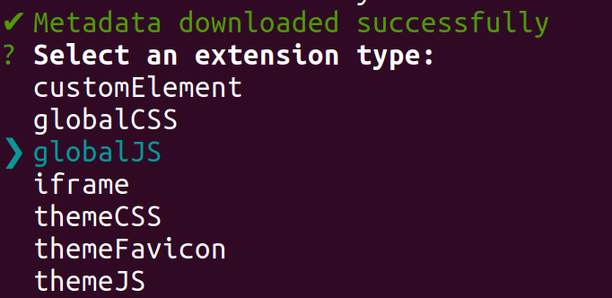

# Working with Client Extensions

> Available in Liferay 7.4+

You can use a variety of types of client extensions to extend Liferay without using OSGi modules. Here are some important topics to help you understand how to work with client extensions and get started.

## Required Tools and Settings

You need to set up these prerequisites to get started developing client extensions for your Liferay instance:

1. Java 8 or JDK 11.

    ```{note}
    Please see the [compatibility matrix](https://help.liferay.com/hc/en-us/articles/4411310034829-Liferay-DXP-7-4-Compatibility-Matrix) for information on supported JDKs, databases, and environments. See [JVM Configuration](../../installation-and-upgrades/references/jvm-configuration.html) for recommended JVM settings.
    ```

1. [Blade CLI](../tooling/blade-cli/installing-and-updating-blade-cli.html).

1. A Liferay workspace. You can use [Blade CLI](../tooling/liferay-workspace/creating-a-liferay-workspace.html#creating-a-liferay-workspace-with-blade-cli) to set this up quickly for your version of Liferay.

    If you already have a Liferay workspace, ensure you have the latest Gradle workspace plugin by running this command:

    ```bash
    curl -s https://search.maven.org/solrsearch/select\?q\=a:%22com.liferay.gradle.plugins.workspace%22\&rows\=1 | sed -E 's/.*latestVersion":"([0-9\.]+)",.*/\1/'
    ```

1. Feature flags enabled for client extensions. If you are hosting Liferay on-premises, add these properties to your Liferay server's [`portal-ext.properties` file](../../installation-and-upgrades/reference/portal-properties.md). Otherwise, add these properties to a `portal-ext.properties` file within your Liferay workspace's `configs/{ENV}/` folder (for the applicable environment(s)).

    ```
    feature.flag.LPS-153457=true
    feature.flag.LPS-166479=true
    ```

1. The [`lcp` CLI tool](https://learn.liferay.com/liferay-cloud/latest/en/reference/command-line-tool.html) (if you are using LXC).

## The Definition of a Client Extension

Client extensions are defined by `client-extension.yaml` files. They contain these definitions:

* `name`: The client extension's name (as it appears in the Liferay UI).

* `type`: The client extension's type (`globalCSS`, `customElement`, `themeFavicon`, etc.). This determines the way Liferay handles the client extension when it is deployed.

* `url`: An absolute or relative URL that any resources contained in the client extension are served from. For example, an [IFrame client extension](./browser-based-client-extensions/understanding-custom-element-and-iframe-client-extensions.md#using-the-iframe-type) has a `url` field defining the location of the external application, like [this example](https://github.com/liferay/liferay-portal/blob/master/workspaces/sample-minimal-workspace/client-extensions/able-iframe/client-extension.yaml#L4). A [theme favicon](./browser-based-client-extensions.md#theme-favicon-client-extensions) client extension may instead have a simple relative path to the favicon image, like [this](https://github.com/liferay/liferay-portal/blob/master/workspaces/sample-minimal-workspace/client-extensions/able-theme-favicon/client-extension.yaml#L4).

A client extension project (which is organized as a folder inside of your Liferay workspace's `client-extensions/` directory) contains a single `client-extension.yaml` file. This file defines one or more client extensions contained in the project. For example, [this project's `client-extension.yaml` file](https://github.com/liferay/liferay-portal/blob/master/workspaces/sample-minimal-workspace/client-extensions/baker/client-extension.yaml) contains the definition for three `iframe` client extensions, called `Baseball`, `Football`, and `Hockey`.

Any other source files needed for the client extensions in your project are contained inside of a `src/` folder in the project. The types of client extensions you use determine what additional files you need for them.

## Generating a New Client Extension Project

You can use the Blade CLI to generate the basic skeleton for a new client extension project.

```{note}
If you are generating client extensions for the first time in your workspace, you may need to create the `client-extensions` folder manually.
```

Run this command within your `client-extensions/` folder to generate the client extension project:

```bash
blade create -t client-extension [new-folder-name]
```

Then use the arrow keys to select the desired type of client extension, and press Enter.



The tool creates a new folder with your chosen name, containing a `client-extension.yaml` file and a `src/` folder with a bare-bones version of any needed files. For example, if you chose to generate a `globalJS` type, the project is initialized with a `src/global.js` file containing a placeholder `window.alert` message.

If you want to package multiple client extensions together in one project, you must manually add the new definition to the `client-extension.yaml` file. The Blade CLI only creates the skeleton for new projects with a single type of client extension to start with. However, it may still help to generate a new project with the tool to understand what the `client-extension.yaml` entry and source files you need to start with.

<!-- TODO: Add another section on the actual development of client extensions. This may need to just give a brief overview, but otherwise branch off and point to constituent articles for the different types (right now all we have is browser-based client extensions, which might even need to be recategorized?). -->

## Deploying to Your Liferay Instance

When client extensions are built, they are converted into `.zip` archives that can be deployed to any Liferay instance. Each resulting `.zip` archive contains a `.json` file that incorporates all of the necessary settings for the given client extension.

Deploying client extensions is always a matter of placing the client extension `.zip` files in the correct location for your Liferay installation. Different commands allow you to do this depending on how your Liferay instance is hosted.

### Deploying to LXC

If you are using LXC, first run this command from your workspace's `client-extensions/` folder:

```bash
../gradlew clean build
```

This compiles all of your client extensions into `.zip` files in each project's `dist/` folder. Run the command within a specific project's folder instead to only build one project.

Then run this command to deploy each client extensions to your chosen environment:

```bash
lcp deploy --extension <extension-zip-file>
```

The tool prompts you to select a project, and then the environment to deploy to. The `.zip` files are uploaded to your LXC project once the command completes.

### Deploying to a Self-Hosted Liferay Instance

If you are hosting your Liferay installation on-premises, you can use the workspace bundle zip to deploy your client extensions. Build and deploy your client extensions with this command from your workspace's `client-extensions/` folder:

```bash
../gradlew clean distBundleZip
```

If you must instead manually deploy the `.zip` files to a Liferay instance, run this command:

```bash
../gradlew clean build
```

Then copy all of the `.zip` files from each client extension project's `dist/` folder. Place the files in your target server's `${Liferay Home}/osgi/client-extensions/` folder to deploy them.

## Additional Information

* [Browser-Based Client Extensions](./browser-based-client-extensions.md)
* [Creating Your First JavaScript Client Extension](./browser-based-client-extensions/tutorials/creating-your-first-javascript-client-extension.md)
