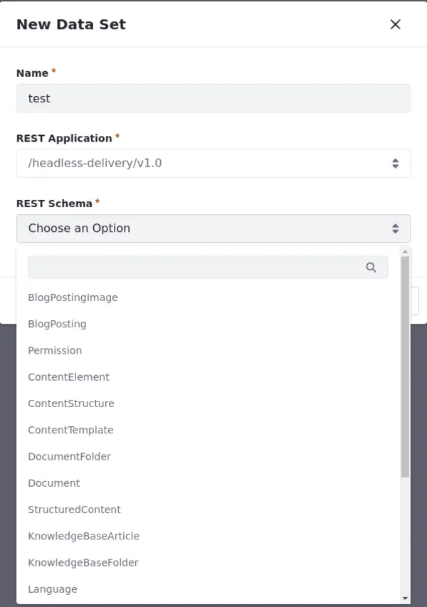

---
toc:
  - ./data-sets/creating-data-sets.md
  - ./data-sets/data-set-views.md
uuid: 314a9243-1503-437a-a275-802b8b5a571b
- Development and Tooling
- Data Sets
- Liferay Self-Hosted
- Liferay SaaS
---
# Data Sets
{bdg-secondary}`Liferay DXP 2024.Q1 U112`
{bdg-link-primary}`[Beta Feature](../system-administration/configuring-liferay/feature-flags.md#beta-feature-flags)`

Data sets are collections of related data that can be accessed individually or in combination or managed as a single entity.

In Liferay, use the Data Set Manager application to [create and manage data sets](./data-sets/creating-data-sets.md) from different resources available through Liferay Headless APIs. This includes but is not restricted to, object definitions, blog postings, documents, user accounts, commerce-related elements, etc. Use the [API Explorer](../headless-delivery/consuming-apis/consuming-rest-services.md) to access the full list of available REST applications.



Using the data set manager, [create data set views](./data-sets/data-set-views.md) to customize and display the data in different ways.

While creating or editing your data set view, select the [fields](./data-sets/data-set-views/data-set-view-fields.md) you want to display, define and pre-apply [filters](./data-sets/data-set-views/data-set-view-filters.md), set default sorting rules, redirect users to a different URL where they can perform [actions](./data-sets/data-set-views/data-set-view-actions.md), and configure pagination options for your data set view.

<!-- when new actions are added, this paragraph needs to be updated. Eric -->

[Display your data set view](./data-sets/data-set-views/using-data-set-view-actions.md#using-a-data-set-fragment-in-a-content-page) in content pages using the Data Set fragment.

Combine the data set fragment with [experiences](../site-building/personalizing-site-experience/experience-personalization/creating-and-managing-experiences.md) and [segments](../site-building/personalizing-site-experience/segmentation/creating-and-managing-user-segments.md) to show different content to different audiences.


```{raw} html
:file: ../landingpage_template.html
```

```{raw} html
:file: data-sets/landing.html
```