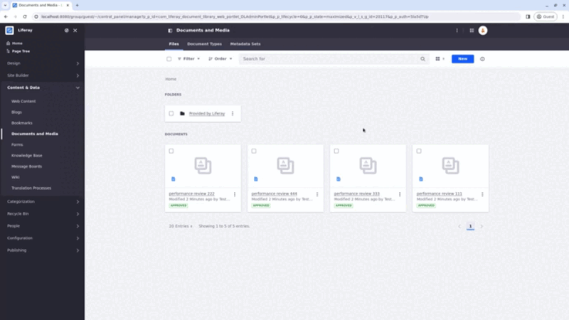

# Using Data Set View Actions

Here are some use cases to exemplify how to use data set view actions and perform different tasks.

## Use Case: Using Actions to Edit Documents

**Background**: You have performance review documents in your site's Documents and Media application and you want to show a list of performance reviews, their ID, title, external reference code, and the date they were created. You also want to allow users who can view the data set to edit the documents.

**Setting up the Environment**: Before you create the action, [create a Data Set](./creating-data-sets.md) with these parameters:

| Field            | Value                            |
|:-----------------|:---------------------------------|
| Name             | Documents Data Set               |
| REST Application | `/headless-delivery/v1.0`        |
| REST Schema      | Document                         |
| REST Endpoint    | `/v1.0/sites/{siteId}/documents` |

[Create a data set view](./creating-data-set-views.md) for the Documents Data Set, name it Documents Data Set View, and add the `id`, `externalReferenceCode`, `title`, and `dateCreated` [fields](./data-set-view-fields.md) to it.

Then, [upload the documents to the Documents and Media application](../../content-authoring-and-management/documents-and-media/uploading-and-managing/uploading-files.md). You can use some mock documents just to practice.

### Creating the Edit Action

In the New Item Action page, fill in the fields using the information in the table below:

| Field | Value                                                      |
|:------|:-----------------------------------------------------------|
| Label | Edit Document                                              |
| Icon  | Pencil () |
| Type  | Link                                                       |

Now, to fill in the URL,

1. In a new tab, look for a performance review document in the Documents and Media application (Site Menu &rarr; Content & Data &rarr; Documents and Media).

1. Open the document's *Actions* menu (), right-click the *Edit* options, and select *Copy Link Address*.

   The URL should look like this `http://localhost:8080/group/guest/~/control_panel/manage?(...)_com_liferay_document_library_web_portlet_DLAdminPortlet_fileEntryId=32813&(...)state%3Dmaximized%26p_p_mode%3Dview%26p_p_auth%3DYH1QvqK9&p_p_auth=YH1QvqK9`

   

1. Return to the New Item Action window and paste the URL in its field.

   If you use the action as it is now, users will be redirected to the same editing page referring to the same document regardless of the entry they are trying to edit.

   That is not a behavior you want. Instead, you should make the URL as universal as possible and parameterize values to guarantee that each action will point to a specific entry's URL.

1. To make the URL more universal, you can start by finding and deleting the initial address (`http://localhost:8080`).

   This guarantees that the action will work even if the site's address is altered.

1. You can also find and delete the authentication token `p_p_auth%3DYH1QvqK9&p_p_auth=YH1QvqK9`.

   This prevents any authentication conflicts since the `p_p_auth` authentication token changes every time you log in.


1. To parameterize your URL, find the `fileEntryId` value in your URL. Replace it with a parameter used in the headless API to refer to the document. In this case, `id`.

   The value for the fileEntryId will be different in your instance.

   If you are not sure which values you should use, access your [API explorer](../../headless-delivery/consuming-apis/consuming-rest-services.md) and look for the parameters used in your REST application.

1. Replace `32813` with `{id}`.

   Enter the parameter value between curly braces ({}).

   !!! info
       The Frontend Data Set (FDS) component does the work and replaces the parameter you provided with the `id` for the document you are trying to edit.

   

1. Once the URL is set, add the Headless Activation Key. You can find it using your API explorer. Find the REST application you are using and execute a GET command. The keys are in the response body like this:

   ```json
      {
         "actions": {
         "get": {
            "method": "GET",
            "href": "http://localhost:8080/o/c/performancereviews/32647"
         },
         "replace": {
            "method": "PUT",
            "href": "http://localhost:8080/o/c/performancereviews/32647"
         },
         "update": {
            "method": "PATCH",
            "href": "http://localhost:8080/o/c/performancereviews/32647"
         },
         "delete": {
            "method": "DELETE",
            "href": "http://localhost:8080/o/c/performancereviews/32647"
         }
         }
   ```

   In this case, the action keys are `get`, `replace`, `update`, and `delete`.

   Since users will edit the document, you should use the PUT method and its activation key (`replace`). Add the key to the Headless Action Key field and ensure that the user has the required permissions for that action.

1. In this case, there is no need for a Confirmation Message, so click *Save*.

### Using a Data Set Fragment in a Content Page

The action is set. Use a Data Set fragment to display your data set view in a [content page](../../site-building/creating-pages/using-content-pages.md):

1. [Create a new page](../../site-building/creating-pages/adding-pages/adding-a-page-to-a-site.md) or [start editing](../../site-building/creating-pages/using-content-pages/adding-elements-to-content-pages.md) one.

1. On the Fragments and Widgets menu on the left, search for Data Set under fragments. Drag and drop the fragment in your editing area.

1. Click on your fragment. In the General tab on your right, there is a field where you can select a Data Set View. Click *Add* () and select the Documents Data Set View.

1. Publish the page.

The data set view displays your data set as you configured. Click on the Edit button and you are redirected to the document's editing page.


## Related Topics

- [Creating Data Set Views](./creating-data-set-views.md)
- [Creating Data Sets](./creating-data-sets.md)
- [Data Set View Fields](./data-set-view-fields.md)
- [Data Set View Filters](./data-set-view-filters.md)
- [Data Set View Actions](./data-set-view-actions.md)