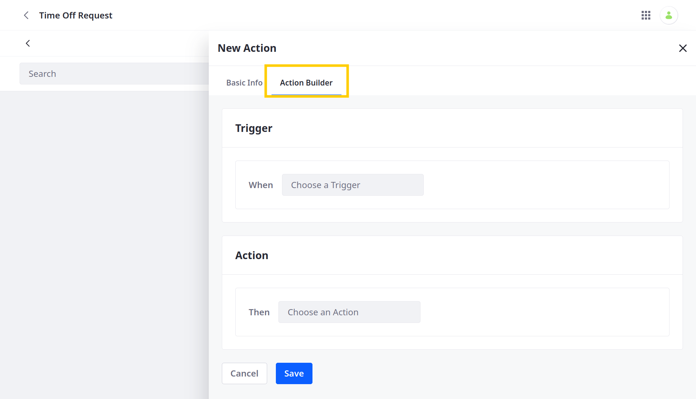
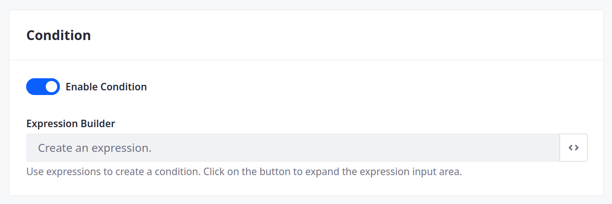

# Defining Object Actions

{bdg-secondary}`Available Liferay 7.4 U33+/GA33+`

Actions define custom operations triggered by object entry events. Liferay listens for the event---add, delete, or update---and executes the operation.

To add an action,

1. Open the Global Menu (  ), go to the *Control Panel* tab, and click *Objects*.

1. Begin editing an object definition.

   ```{note}
   For Liferay 7.4 U22+ and GA22+, you can add actions to system objects.
   ```

1. Go to the *Actions* tab and click *Add* (  ).

1. In the Basic Info tab, enter a *Name* and *Description* for the action.

   

1. Go to the *Action Builder* tab to define the custom trigger, conditions, and action.

   

1. Specify a Trigger event to determine when the action is performed.

   | Trigger | Description |
   | :--- | :--- |
   | On After Add| When an entry is added |
   | On After Delete | When an entry is deleted |
   | On After Update | When an entry is updated |

   

1. (Optional) Enable a Condition upon which the action is triggered. Click the *Code* button (  ) to view available expressions.

   On Liferay 7.4 U33+ and GA33+, Liferay validates your expression syntax when you click *Done*. If the expression is invalid, Liferay displays an error message.

   

1. For Action, select the type of action performed and fill out all additional fields. See [Understanding Action Types](./understanding-action-types.md#understanding-action-types) for more information.

1. Click *Save*.

Once created, the action is active and triggered according to your configuration.

You can deactivate an action from its Basic Info tab. Toggle the *Active* switch and click *Save*.


## Additional Information

* [Creating Objects](../creating-objects.md)
* [Understanding Action Types](./understanding-action-types.md)
