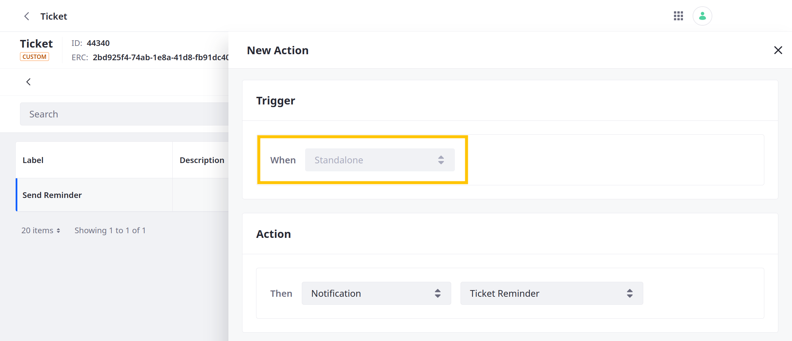

# Using Manual Actions

{bdg-secondary}`Available Liferay 7.4 U60+/GA60+`

When you use the standalone trigger for object actions, the actions become manual instead of automatic. You can trigger these actions in one of two ways:

* via the object's UI
* using dedicated action APIs

This example creates a standalone action for sending notifications.

See [Defining Object Actions](./defining-object-actions.md) for how to add standalone actions to object definitions.

## Trigger Actions via UI

Active standalone actions appear in the Actions menu for object entries. To trigger these actions via the UI,

1. Navigate to the object definition's application page.

1. Click the *Actions* button () for the desired entry and select the standalone action.

   In this example, the action is Send Reminder.

   

## Trigger Actions via APIs

Liferay automatically generates REST APIs for published object definitions. These include APIs for active standalone actions.

To view these APIs,

1. Open Liferay's API Explorer at `[server]:[port]/o/api` (e.g., `localhost:8080/o/api`).

1. Click *REST Applications* and select the desired object definition. Custom objects use the `c/[pluralobjectlabel]` naming pattern (e.g., `c/tickets`).

For each standalone action, Liferay generates two PUT APIs, one that uses the entry's ID and another that uses the entry's external reference code (ERC).

Calling either API triggers the action for the specified entry.

## Action Permissions

Liferay automatically generates permissions for standalone actions so you can manage which roles can trigger them. Each permission follows the `action.{actionName}` naming pattern (e.g., `action.sendReminder`). See [Permissions Framework Integration](../../understanding-object-integrations/permissions-framework-integration.md) for more information on object permissions.

## Additional Information

* [Defining Object Actions](./defining-object-actions.md)
* [Understanding Action Types](./understanding-action-types.md)
* [Headless Framework Integration](../../understanding-object-integrations/headless-framework-integration.md)
