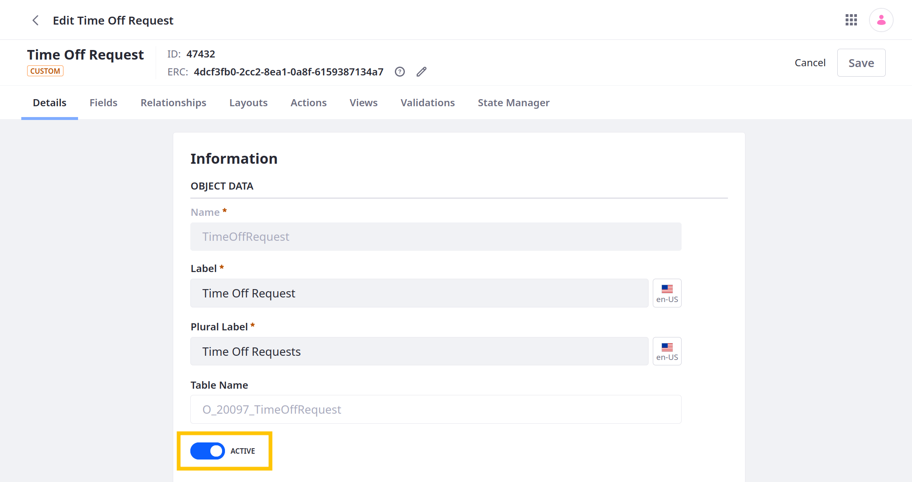

# Activating and Deactivating Objects

By default, custom objects are *Activated* when they're first [published](./creating-objects.md#publishing-object-drafts). This makes the application available for use as soon as it's created. While active, users can access the object and its entries via the Liferay UI and Headless API calls. However, you can deactivate custom objects at any time.

Deactivating an object removes it from its Panel Category, integrated frameworks, and related objects. While inactive, you can only edit and extend an object in the Objects application. If an object's entries appear in a site or related object at the time it's deactivated, those entries are blank, and their fields no longer appear in any related object layouts.

You can reactivate any inactive object to make it and its data available for use.

```{important}
Deactivating an object does not affect its data; it only prevents users from accessing it until the object is reactivated.
```

To deactivate or activate a custom object,

1. Open the Global Menu (), go to the *Control Panel* tab, and click *Objects*.

1. Click the desired custom object.

   You cannot deactivate system objects.

1. Under Object Data in the Details tab, toggle the switch to *Active* or *Inactive*.

    

1. Click *Save*.

## Additional Information

* [Creating Objects](./creating-objects.md)
* [Deleting Objects](./deleting-objects.md)
* [Exporting and Importing Object Definitions](./exporting-and-importing-object-definitions.md)
