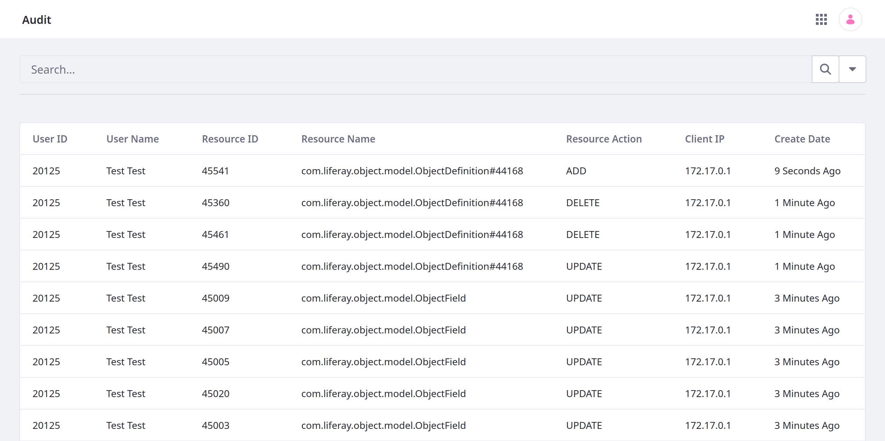
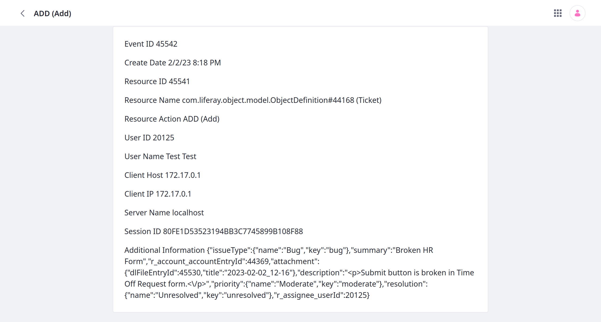

# Auditing Object Definition Events

{bdg-secondary}`Available Liferay 7.4 U47+/GA47+`

The Objects application is integrated with Liferay's Audit framework, so you can track events for both object definitions and entries. To access the Audit application, open the *Global Menu* (), go to the *Control Panel* tab, and click *Audit*.

The Audit application lists events in a table with these columns:

| Column | Description |
| :--- | :--- |
| User ID | Acting user's ID. |
| User Name | Acting user's name. |
| Resource ID | Affected resource's ID. |
| Resource Name | Affected resource's name, including its ID (e.g., `ObjectDefinition#44168`). |
| Resource Action | Action performed (`ADD`, `UPDATE`, or `DELETE`). |
| Client IP | IP address responsible for the action. |
| Create Date | When the event record was created. |

You can click any event field to view a more complete record, including specific action details.

If desired, you can search and filter results using keywords and other facets.

## Enabling Entry History

By default, entry history is disabled for custom objects. You can configure this setting for definition drafts. After publishing, you cannot change this setting.

Follow these steps:

1. Open the *Global Menu* (), go to the *Control Panel* tab, and click *Objects*.

1. Begin editing the desired object definition draft.

1. In the Details tab, enable entry history and click *Save*.

   

## Additional Information

* [Objects](../../objects.md)
* [Creating and Managing Objects](../creating-and-managing-objects.md)
