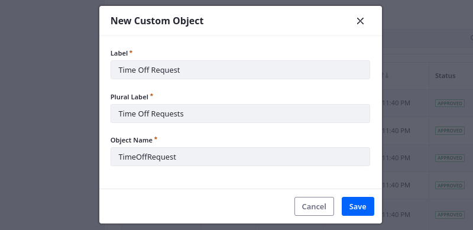
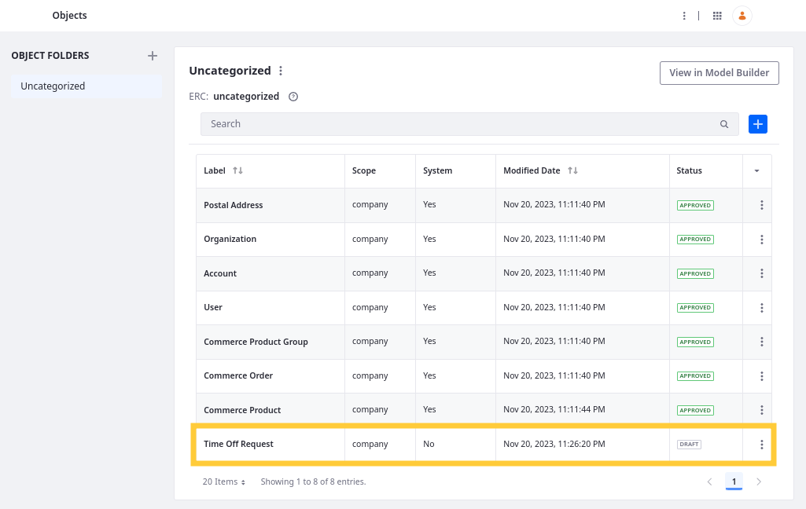
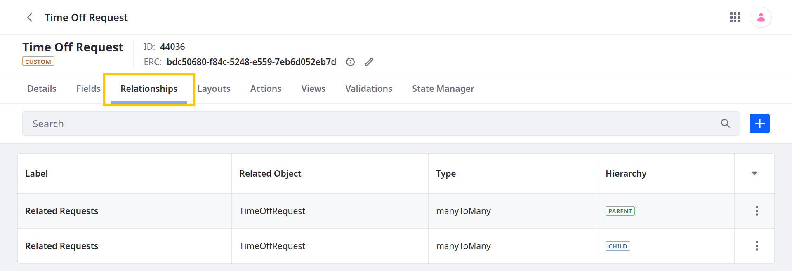
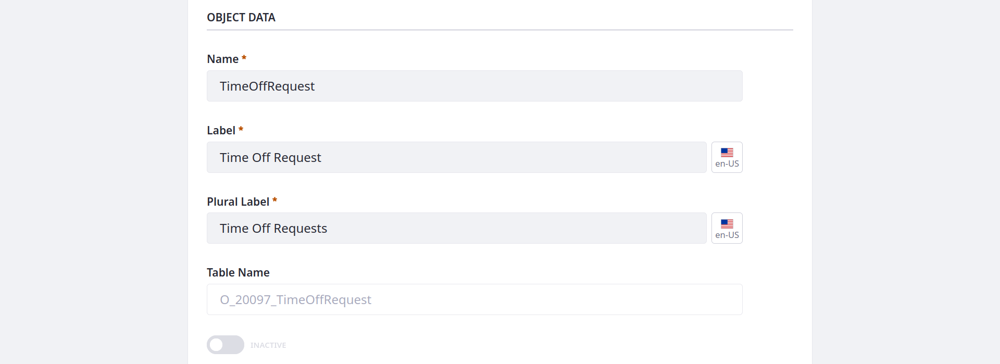

# Creating Objects

{bdg-secondary}`Available Liferay 7.4+`

Liferay Objects provides development capabilities in the Liferay UI. Using Objects, you can build fully integrated Liferay applications without writing any code or manually deploying modules. This process includes [creating](#creating-object-drafts) an initial draft of the object definition, [editing](#editing-object-drafts) the draft, and finally [publishing](#publishing-object-drafts) it to create the new application. Publishing an object draft creates a fully integrated Liferay application that can be managed and extended at any time via the Objects admin page.

```{important}
Liferay creates database tables when you publish object definitions, so you cannot use Objects with the high security database practices described in [Database Configurations](../../../installation-and-upgrades/reference/database-configurations.md#high-security-database-user-practices).
```

## Creating Object Drafts

Object drafts are application templates that store the necessary data for creating an object application. Follow these steps to create an object draft:

1. Open the *Global Menu* (), go to the *Control Panel* tab, and click *Objects*.

1. Click the *Add* button ().

1. Provide these details for your object draft.

   **Label**: Identifies the object in the Objects admin and supported application contexts (e.g., Workflow, Display Page Templates, Forms).

   **Plural Label**: Determines the display name for the object application in the UI.

   **Object Name**: Determines the object's `definition.name` and cannot be changed once the object is published.

   

1. Click *Save*.

Once saved, a blank object draft is created without any configurations or data elements. You can view the draft in the Objects admin alongside system objects. To finish the creation process, you must [edit](#editing-object-drafts) the draft and then [publish](#publishing-object-drafts) it to your Liferay instance.



## Editing Object Drafts

Before publishing an object, you can add elements and configure its settings. This includes adding fields, defining validations, setting a scope for its data, and more.

```{note}
Whenever you add a field, relationship, or layout, the object draft is saved automatically. However, any unsaved changes in the Details tab are lost if you navigate to other tabs.
```

Follow these steps to edit the object draft:

1. From the Objects admin page, click the newly created object draft to begin editing it.

   Object features and configuration options are organized into the following tabs: Details, Fields, Relationships, Layouts, Actions, Views, Validations, and State Manager.

   

1. Click the *Fields* tab to add custom fields. Each field represents a database column for storing specific types of values. See [Adding Fields to Objects](./fields/adding-fields-to-objects.md).

   By default, all objects include these system fields: Author, Create Date, External Reference Code, ID, Modified Date, and Status.

   

1. (Optional) Click the *Relationships* tab to add relationships. Relationships are connections between object definitions that you can use to link their entries. See [Defining Object Relationships](./relationships/defining-object-relationships.md).

   

1. (Optional) Click the *Layouts* tab to add layouts. Object layouts determine how fields and relationships appear when creating and viewing object entries. See [Designing Object Layouts](./layouts/designing-object-layouts.md).

   ```{note}
   If you do not add a custom layout and set it as default, the object uses an automatically generated layout for its entries. This layout has a single tab that displays all object fields in alphabetical order and does not display relationships. To display relationships, you must create a custom layout with a dedicated relationships tab.
   ```

   

1. (Optional) Click the Actions tab to add custom actions. Each action defines an operation that runs automatically according to a set trigger. See [Defining Object Actions](./actions/defining-object-actions.md).

   

1. (Optional) Click the Views tab to add custom views. Object views determine how entries are displayed in the object's application page. See [Designing Object Views](./views/designing-object-views.md).

   

1. (Optional) Click the Validations tab to add validations. Each validation sets rules for determining valid field entries. See [Adding Custom Validations](./validations/adding-custom-validations.md).

   

1. (Optional) If you've added a state field to the draft, click the State Manager tab to define its flow. See [Adding and Managing Custom States](./fields/adding-and-managing-custom-states.md).

   

1. Click the Details tab to configure the object draft.

1. (Optional) Change the name, label, or plural label for the object.

   

1. Select an Entry Title. This determines the field used to identify the object's entries in the UI (e.g., relationship fields). By default, objects use the ID field.

   

1. Select an object *scope*. This determines how the object's data is stored.

   **Company** (default): When scoped by Company, the object's data is stored per Liferay instance.

   **Site**: When scoped by Site, the object's data is stored per Site.

1. Select a Panel Category Key to determine where the definition appears in Liferay.

   For company-scoped objects, select tab and category in the Global Menu ().

   For site-scoped objects, select a section in the Site Menu ().

   You can leave this value blank if you don't want to display the application in a UI menu.

   

1. Configure account restriction to restrict access to object entries by account. You can only configure this setting before publishing.

   This option only appears if the object is on the child side of a one-to-many relationship with the Account system object. See [Restricting Access to Object Data by Account](./using-system-objects-with-custom-objects/restricting-access-to-object-data-by-account.md).

   

1. Show or hide the object's page widget.

   While enabled, you can add the object's widget to site pages. See [Deploying Object Widgets in Sites](../deploying-object-widgets-to-sites.md).

1. Enable or disable categorization for custom layouts.

   While enabled, you can add categorization blocks to fields tabs in custom layouts. See [Adding Categorization to Fields Tabs](./layouts/adding-categorization-to-fields-tabs.md).

1. Enable or disable comments for object display pages.

   While enabled, you can use the Page Comments widget in entry display pages. See [Creating Display Page Templates for Objects](../displaying-object-entries.md#creating-display-page-templates-for-objects).

1. Enable or disable history for object entries. You can only configure this setting before publishing.

   While enabled, object entry events appear in the Audit application. See [Auditing Object Events](./auditing-object-events.md).

1. Click *Save*.

Once you've finished configuring and editing the draft, you can [publish](#publishing-object-drafts) it.

## Publishing Object Drafts

Publishing an object creates and activates your new application. When activated, users can access it in the Liferay UI according to its scope and panel category key. Before publishing your object, review the following information to understand the consequences of publishing a draft.

### What Happens During Publishing

The publishing process includes the following operations:

* A database table is created for the object with the draft's data definitions.

* A new Headless API is automatically created for CRUD operations.

* A collection provider is created for displaying the object's entries.

* A page widget is created for the object.

* The object is integrated with Info framework, so you can select the object as a content type for a [display page template](../../../site-building/displaying-content/using-display-page-templates.md)

* The object is integrated with the [Permissions framework](../understanding-object-integrations/permissions-framework-integration.md), so you can manage permissions for the new application and its resources.

* The object is integrated with the Workflow framework, so you can configure a custom workflow for the object.

* The object is integrated with Forms, so you can select the object as a data storage option.

### Configuration Restrictions for Published Objects

{bdg-secondary}`For 7.4 U26+/GA26+`

To prevent data loss and system conflicts, some configuration options are removed for objects after publishing.

* The name and scope of a published object cannot be changed.

* Any fields included in an object at the time of publishing cannot be removed.

* Most configuration options for published fields and relationships cannot be changed.

You can still edit and localize labels for objects, fields, and relationships after publishing, but most configuration options are removed. For objects, you can change the Panel Category Key as well as add new fields, relationships, and layouts. For relationships, you can configure its Deletion Type.

```{note}
For Liferay 7.4 U25/GA25 and earlier versions, users cannot delete published object definitions or remove relationships included in an object at the time of publishing.
```

## Additional Information

* [Objects Overview](../../objects.md)
* [Adding Fields to Objects](./fields/adding-fields-to-objects.md)
* [Defining Object Relationships](./relationships/defining-object-relationships.md)
* [Designing Object Layouts](./layouts/designing-object-layouts.md)
