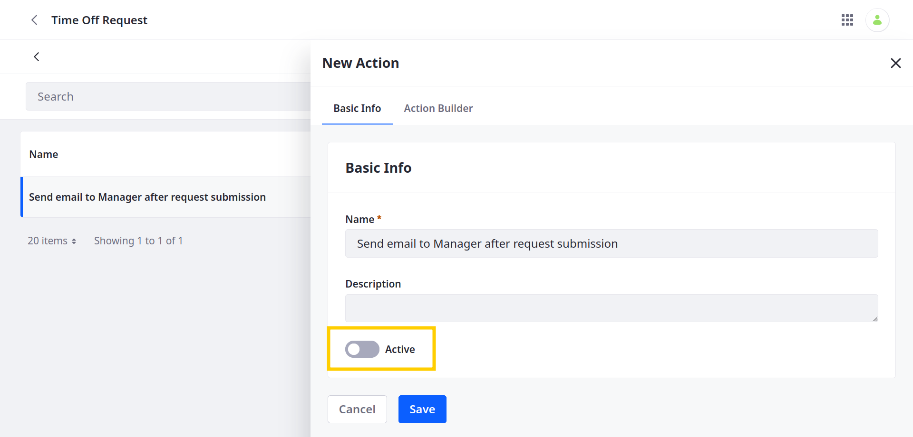

# Defining Object Actions

{bdg-secondary}`Available Liferay 7.4 U27+ and GA27+`

With Liferay Objects, you can define actions that are triggered under specified conditions. While an action is active, Liferay listens for when an Object's data is added, deleted, or updated and then performs the set action.

Currently, Liferay supports two action types:

* *Webhook* actions deliver a payload to an URL.

* *Groovy Script* actions execute custom Groovy code.

Follow these steps to define actions for an Object:

1. Open the *Global Menu* (), click on the *Control Panel* tab, and go to *Objects*.

1. Select an existing Object or [create a new one](./creating-objects.md).

   ```{note}
   Beginning with Liferay DXP 7.4 U22, you can add actions to system Objects.
   ```

1. While viewing the Object, select the *Actions* tab and click the *Add* button ().

1. In the Basic Info tab, enter a *name* and *description* for the action.

   

1. Go to the *Action Builder* tab to define a custom trigger, conditions, and action.

   

1. For Trigger, determine *when* the action is performed.

   | Trigger | Description |
   | :--- | :--- |
   | On After Add| When an Object entry is added |
   | On After Delete | When an Object entry is deleted |
   | On After Update | When an Object entry is updated |

   

   <!--1. (Optional) After selecting a trigger, you can use expressions to set additional conditions for the trigger. Click the  button to view available expressions.-->

   <!---->

1. For Action, select *Webhook* or *Groovy Script* to determine the type of action performed.

   If you've selected *Webhook*, enter a *URL* and *secret* (if applicable).

   

   If you've selected *Groovy Script*, enter your custom script into the provided code window.

   

1. Click *Save*.

Once created, the action is active and is triggered according to your configuration.


If desired, you can deactivate an action at any time. To do this, go to the action's *Basic Info* tab, toggle the *Active* switch, and click *Save*.


## Additional Information

* [Creating Objects](./creating-objects.md)
* [Adding Fields to Objects](../creating-and-managing-objects/adding-fields-to-objects.md)
* [Defining Object Relationships](../creating-and-managing-objects/defining-object-relationships.md)
