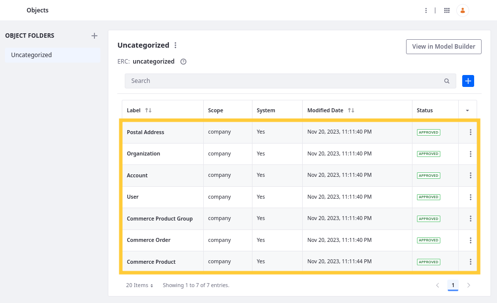

# Extending System Objects

{bdg-secondary}`Liferay 7.4 U86+/GA86+`

With Liferay Objects, you can extend supported system services. Currently, only these services are integrated with the Objects framework:

* Account
* Commerce Order
* Commerce Product
* Commerce Product Group
* Organization
* Postal Address
* User

```{note}
The Postal Address object stores account addresses. For this reason, you can only relate it to custom objects that are related to the Accounts object. See [Using System Accounts with Custom Objects](./using-system-objects-with-custom-objects.md) for more information.
```



When extending system objects, you can add [fields](#adding-fields), [relationships](#adding-relationships), [actions](#adding-actions), and [validations](#adding-validations) to them.

| Feature       | System Objects | Custom Objects |
|:--------------|:---------------|:---------------|
| Fields        | &#10004;       | &#10004;       |
| Relationships | &#10004;       | &#10004;       |
| Layouts       |                | &#10004;       |
| Actions       | &#10004;       | &#10004;       |
| Views         |                | &#10004;       |
| Validations   | &#10004;       | &#10004;       |

## Adding Fields

You can add fields to system objects. The additional database columns are added to a separate database table that uses the service's original table name with `_x` appended to it (e.g., `AccountEntry_x`). System objects support all available [field types](./fields.md). Since system objects do not support custom layouts or views, you can only access these custom fields via Headless APIs. See [Adding Fields to Objects](./fields/adding-fields-to-objects.md) for more information.

```{note}
Liferay's [Custom Fields](../../../system-administration/configuring-liferay/adding-custom-fields.md) application is for adding fields to most Liferay system applications using the [Expando](../../data-frameworks/expando-framework/accessing-custom-fields-with-expando.md) framework. Objects does not support the Expando-based custom fields, so you cannot use them with Objects features (e.g., [relationships](#adding-relationships), [actions](#adding-actions), and [validations](#adding-validations)).
```

## Adding Relationships

You can add relationships between system and custom objects to link their entities. System objects support both one-to-many and many-to-many relationships. See [Defining Object Relationships](./relationships/defining-object-relationships.md) for more information.

```{important}
Since system objects don't support custom [layouts](./layouts/designing-object-layouts.md) and [views](./views/designing-object-views.md), you cannot add relationships to the UI for system objects. You can only interact with them via headless APIs. 
```

### Relationship APIs

If the system object is in a many-to-many relationship or on the parent side of a one-to-many relationship, Liferay generates [REST endpoints](../understanding-object-integrations/headless-framework-integration.md#relationship-rest-apis) for querying and managing the relationship. This includes a GET endpoint for returning related object entries, PUT endpoint for relating entries, and DELETE endpoint for disassociating related entries.

In this example, the User system object is in a one-to-many relationship (`userRequests`) with a custom object (`timeOffRequest`). These endpoints appear in the [`headless-admin-user`](http://localhost:8080/o/api?endpoint=http://localhost:8080/o/headless-admin-user/v1.0/openapi.json) service.


See [Using Relationships REST APIs](../objects-tutorials/using-apis/using-relationship-rest-apis.md) for an introductory tutorial.

## Adding Actions

You can add actions to system objects, triggered on events like adding, updating, or removing entries. The table below shows actions supported by system objects: 

| Action Type                                                                        | Supported in System Objects? |
|:-----------------------------------------------------------------------------------|:-----------------------------|
| [Webhook](./actions/defining-object-actions.md#webhook)                            | &#10004;                     |
| [Groovy Script](./actions/defining-object-actions.md#groovy-script)                | &#10004;                     |
| [Notification](./actions/defining-object-actions.md#notification)                  | &#10004;                     |
| [Add Object Entry](./actions/defining-object-actions.md#add-an-object-entry)       | &#10004;                     |
| [Update Object Entry](./actions/defining-object-actions.md#update-an-object-entry) | &#10004;                     |

See [Defining Object Actions](./actions/defining-object-actions.md) for more information.

## Adding Validations

You can add Groovy and Expression Builder validations to system objects. When triggered, these validations check for valid field entries and show custom error messages for invalid entries. Currently, Objects only supports validations for a system object's default fields and does not support validations for its custom fields. See [Adding Custom Validations](./validations/adding-custom-validations.md) for more information.

## Additional Configuration Options

When editing a system object, you can also configure the following settings in the *Details* tab.

| Field                            | Description                                                              | Supported in System Objects? |
|:---------------------------------|:-------------------------------------------------------------------------|------------------------------|
| Title Field                      | Determine the field used as the title for object entries.                | &#10004;                     |
| Panel Link                       | Determine where the application appears in the UI.                       | &#10006;                     |
| Widget in Page Builder           | Determine whether the object's Page widget is available in sites.        | &#10006;                     |
| Categorization of Object Entries | Determine whether categorization tools are available for object entries. | &#10006;                     |
| Comments in Page Builder         | Determine whether users can add comments on object entries.              | &#10006;                     |
| Entry History in Audit Framework | Determine whether object events appear in the audit history.             | &#10006;                     |

## Related Topics

* [Adding Fields to Objects](./fields/adding-fields-to-objects.md)
* [Defining Object Relationships](./relationships/defining-object-relationships.md)
* [Defining Object Actions](./actions/defining-object-actions.md)
