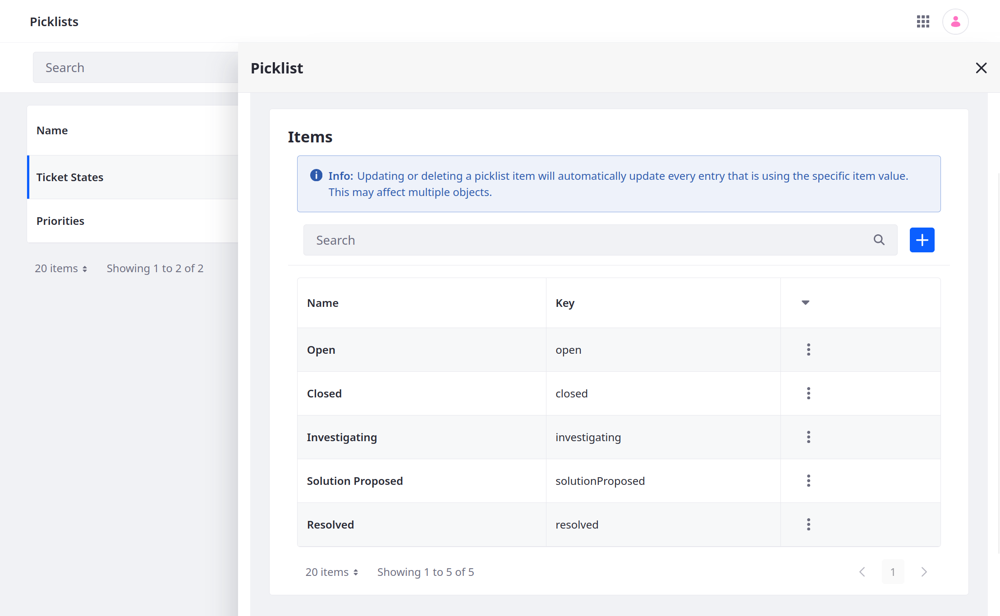
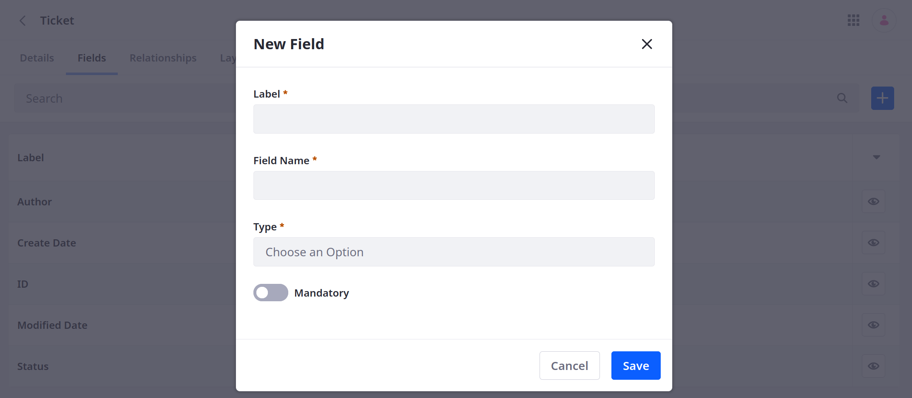

# Adding and Managing Custom States

{bdg-secondary}`Available Liferay 7.4 U41+/GA41+`

Some use cases may require assigning multiple states to an object entry at the same time. For example, when building an Order application, you may need to assign and manage order, payment, and delivery statuses for the same entry, each with its own flow and associated business logic. Using Liferay picklists with custom objects, you can achieve this functionality.

With [picklists](../../picklists.md), you can define lists of strings and use them as object fields to define custom states for entries. Once added to an object definition, you can design the flow for each state and use [validations](../validations/adding-custom-validations.md) and [actions](../actions/defining-object-actions.md) to add business logic for different states. States can also be used alongside [workflow statuses](../../enabling-workflows-for-objects.md) to define more complex review and approval processes.


## Adding a State Field to Object Definitions

1. Open the *Global Menu* (), go to the *Control Panel* tab, and click *Picklists*.

1. Create a picklist with the desired items. These items define object entry states. See [Creating a Picklist](../../picklists/using-picklists.md#creating-a-picklist) for more detailed steps.

   ```{note}
   You can add, remove, or edit picklist items for both draft and published object definitions at any time.
   ```

   

1. Open the *Global Menu* (), go to the *Control Panel* tab, and click *Objects*.

1. Begin editing the desired custom object.

1. Go to the *Fields* tab and click *Add* ().

   

1. Enter a *Label* and *Field Name*.

1. Select the *Picklist type* and choose the desired list.

1. Toggle *Mark as State*.

   ```{note}
   State fields are set automatically to *mandatory*, and you cannot change them to optional.
   ```

1. Select a *Default Value* for the state field.

   

1. Click *Save*.

After adding the field to a definition, you can [set up a flow](#setting-up-a-flow-for-state-fields) to determine which transitions are available for each state.

## Setting Up a Flow for State Fields

By default, each state can transition to all other states. However, you can restrict transitions to ensure the entry goes through the desired process.

Follow these steps to set up a custom flow for state fields:

1. While editing a custom object, go to the *State Manager* tab and select the desired *state field*.

   

1. Under Next Status, click the drop-down menus and check the boxes to determine available transitions for each state.

   You can select any number of transitions for a state.

   

1. Click *Save*.

Once saved, users can only transition an entry's state according to your defined flow.


## Additional Information

* [Picklists](../../picklists.md)
* [Fields](../fields.md)
* [Adding Fields to Objects](../fields/adding-fields-to-objects.md)
