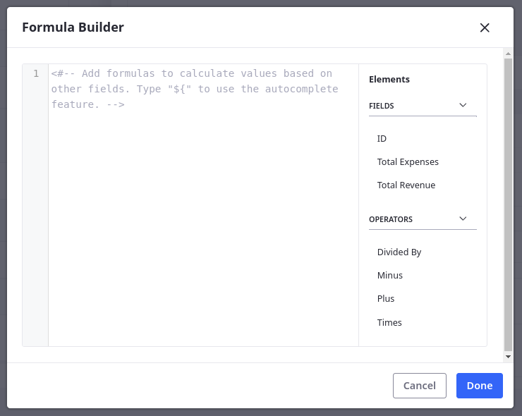
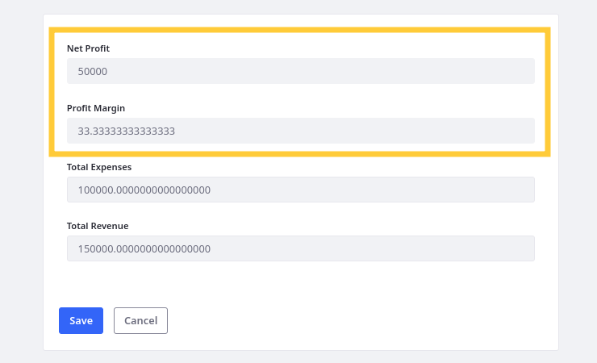

# Formula Fields

{bdg-secondary}`Liferay 7.4 2023.Q4+/GA107`

Formula fields store read-only values calculated using numeric fields in the object definition. Example use cases include calculating an employee's available PTO hours after subtracting their pending requests, calculating an agent's commission based on an order's total, and more.

During field creation, you can determine whether the field's value is stored as an integer or decimal. After creating the field, you must edit the field to define the formula used to calculate its value. Available functions include add (`+`), subtract (`-`), multiply (`*`), and divide (`/`). You can use these functions with any integer, long integer, decimal, and precision decimal fields in the object.



For example, consider a scenario with two numeric fields, `totalRevenue` (precision decimal) and `totalExpenses` (precision decimal). You can add a formula field with this expression to calculates your net profit:

```
totalRevenue - totalExpenses
```


Additionally, you could add a formula field with this expression to calculate the profit margin:

```
(totalRevenue - totalExpenses) / totalRevenue * 100
```


Formula field values are set dynamically using these expressions whenever entries are created or updated.



## Related Topics

* [Adding Field to Objects](./adding-fields-to-objects.md)
* [Aggregation Fields](./aggregation-fields.md)
<!-- * [Numeric Fields](./numeric-fields.md) -->
