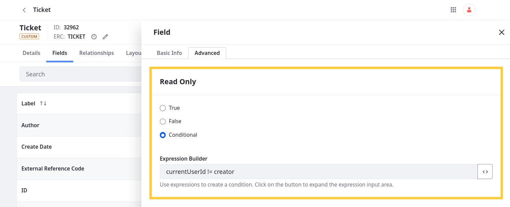

# Using Read-Only Fields

Some use cases may require data fields to be read-only. For example, you may need to prevent unauthorized users from changing [state fields](./adding-and-managing-custom-states.md), or data integrity may require some field values to remain immutable. With Liferay Objects, you can configure any custom field to be read-only. This prevents users from directly updating the field's value. You can only update read-only fields using conditions or [actions](../actions.md).

## Adding a Read-Only Field

1. Begin editing the desired [custom field](./adding-fields-to-objects.md).

1. Go to the *Advanced* tab.

1. Select a Read Only option:

   **True**: Mark the field as read-only.

   **False**: Allow users to directly edit the field.

   **Conditional**: Use expression builder to set conditions for when the field is read-only.

   

1. Click *Save*.

## Example Use Case: Event Speaker Applications

Consider an event solution with these requirements:

* Users must submit applications to speak at a company event.

* Event managers must track each application's status during the review process.

* Event managers must track when the state field was last updated.

To achieve this, create a picklist for application statuses and an Event Submissions object. Use this picklist for a state field in the object and set the field to read-only. Then, add [standalone actions](../actions/using-manual-actions.md) for manually updating the state field to specific values, according to the desired state flow. Event managers can use these actions to update the state field's value.

For the final requirement, add a read-only date and time field to store when the state was last updated. Then, create an [automatic action](../actions/defining-object-actions.md) that sets this field's value to the current date and time whenever the state field is updated.

## Related Topics

* [Adding Fields to Objects](./adding-fields-to-objects.md)
* [Adding and Managing Custom States](./adding-and-managing-custom-states.md)
* [Defining Object Actions](../actions/defining-object-actions.md)
