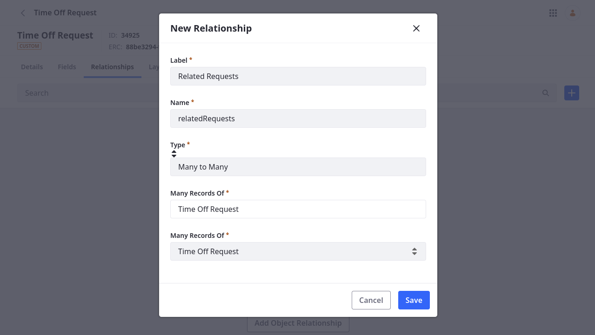
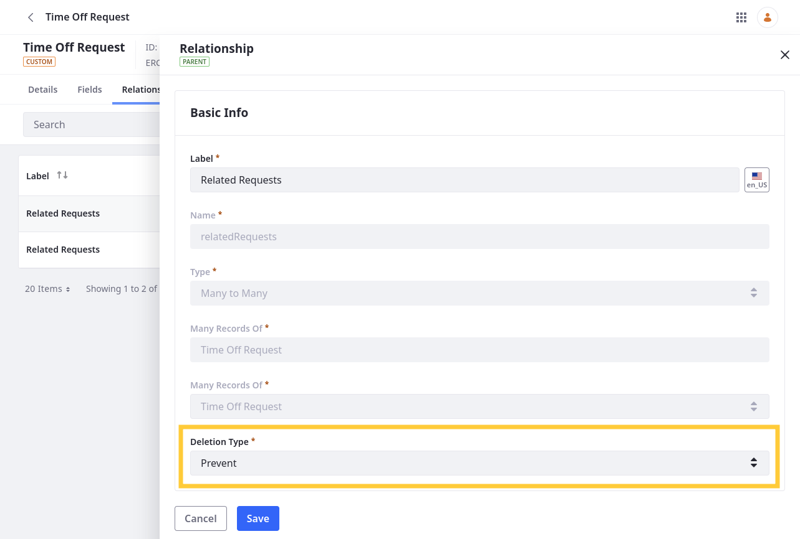
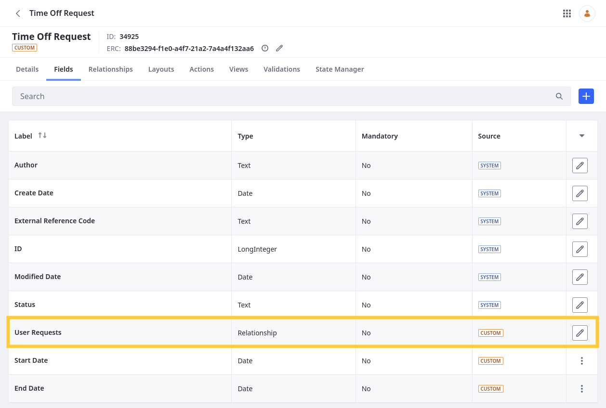
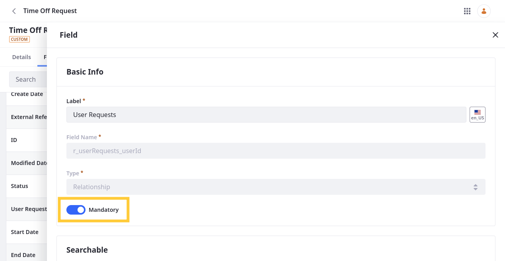

# Defining Object Relationships

{bdg-secondary}`Available Liferay 7.4+`

Relationships add fields and tables to object definitions for relating their entries with one another. Follow these steps to add relationships to object definitions:

1. Open the *Global Menu* (  ), go to the *Control Panel* tab, and click *Objects*.

1. Begin editing the desired object definition.

1. Go to the *Relationships* tab and click the *Add* button (  ).

   

1. Enter a *label* and *name*.

   **Label**: Identifies the relationship in the Objects UI and can be localized after the relationship is created.

   **Name**: Determines the relationship's name in the back-end and uses camel case. Once the relationship is published, this value cannot be changed.

1. Select a relationship type: *One to Many* or *Many to Many*.

   **One to Many**: Relate one object entry to multiple object entries. This type adds a relationship table to entries on the parent side of the relationship (i.e., the 'one' side) and a relationship field to entries on the child side (i.e., the 'many' side).

   **Many to Many**: Relate multiple object entries with multiple object entries. This adds a relationship table to entries on both sides of the relationship.

   ```{note}
   In the Objects UI, relationship fields appear in a definition's Fields tab, while tables appear in the Relationships tab.
   ```

1. Select an *object* to relate to the current object. You can relate objects to themselves or other object definitions.

   Beginning with 7.4 U46/GA46, you can define one-to-many and many-to-many relationships that relate an object definition to itself. Previously, you could only use the one-to-many type to relate entries within the same object.

1. Click *Save*.

   

Once saved, you can use the relationship to relate entries.

you can edit the relationship to configure its [deletion type](#configuring-deletion-type) or make it [mandatory](#making-relationship-fields-mandatory).

```{important}
Relationship fields automatically appear in a custom object's default layout. Displaying relationship tables requires a custom layout with a [Relationships tab](../layouts/designing-object-layouts.md#adding-relationships-tabs). This tab lists all entries related to the current entry. System objects do not support custom layouts, so they cannot display relationship fields or tables. You can only access their relationship fields via REST APIs. See [Designing Object Layouts](../layouts/designing-object-layouts.md) for more information.
```

## Configuring Deletion Type

After defining a relationship, you can configure its deletion type. This setting determines how entry deletion is handled when an entry relates to another entry.



Available options include *Prevent*, *Disassociate*, and *Cascade*.

**Prevent** (Default): Prevent the deletion of parent entries if they are related to child entries.

**Disassociate**: Allow users to delete parent entries while they are related to child entries. Deleting parent entries does not affect related entries.

**Cascade**: Allow users to delete parent entries while they are related to child entries. Deleting parent entries also deletes their related entries if the user has permission to delete entries in the child object.

## Making Relationship Fields Mandatory

{bdg-secondary}`For 7.4 U47+/GA47+`

In some scenarios, you may want to make relationship fields mandatory. For example, if you're creating a Ticket object, you may want to define a mandatory relationship field for selecting an 'assignee'. Or if you want to [restrict access to object data](../using-system-objects-with-custom-objects/restricting-access-to-object-data-by-account.md) by account, you should make the object's relationship with the account object mandatory.

Follow these steps to make a relationship field mandatory:

1. Begin editing the *object* with the desired relationship field.

1. Go to the *Fields* tab and begin editing the *relationship field*.

   

1. Toggle the *Mandatory* switch.

   

1. Click *Save*.

## Additional Information

* [Creating Objects](../creating-objects.md)
* [Designing Object Layouts](../layouts/designing-object-layouts.md)
* [Removing Relationships](./removing-relationships.md)
