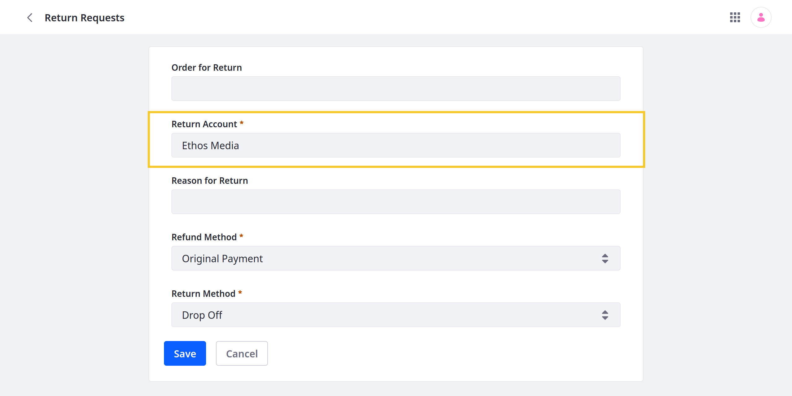

# Restricting Access to Object Data by Account

In scenarios with multiple business [Accounts](../../../users-and-permissions/accounts.md), you may want to restrict access to custom Object entries by Account. To do this, your custom Object must have a [relationship](./defining-object-relationships.md) with the Account system Object, and you must configure the custom Object to use this relationship for restricting entry data. Once set up, anyone adding entries to the custom Object must also select an Account. This Account becomes the entry's owner, so only Account members can access the entry.

Follow these steps to use Accounts to restrict access to custom Object data:

1. Open the *Global Menu* (), go to the *Control Panel* tab, and click *Objects*.

1. Begin editing the Account system Object.

1. Add a *One to Many* or *Many to Many* relationship, relating the Account Object to the desired custom Object. See [Defining Object Relationships](./defining-object-relationships.md) for more information.

   

1. Return to the Objects page and begin editing the desired custom Object.

1. In the Details tab, toggle *Account Restriction* to active and select the *Account relationship* you want to use for relating entries.

   

1. Click *Save*.

This adds a new mandatory Account selection field to the Object, so anyone adding an entry must select an Account. Available options are determined by the user's Account memberships. Once set, only members of the selected Account can access the entry.

## Additional Information

* [Accounts](../../../users-and-permissions/accounts.md)
* [Defining Object Relationships](./defining-object-relationships.md)
