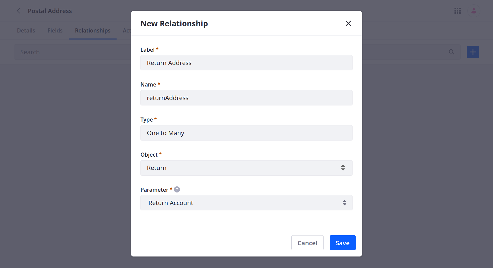
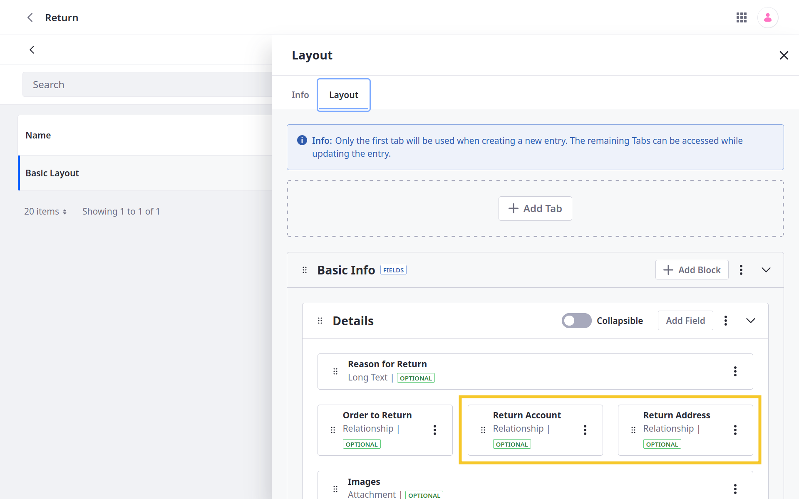
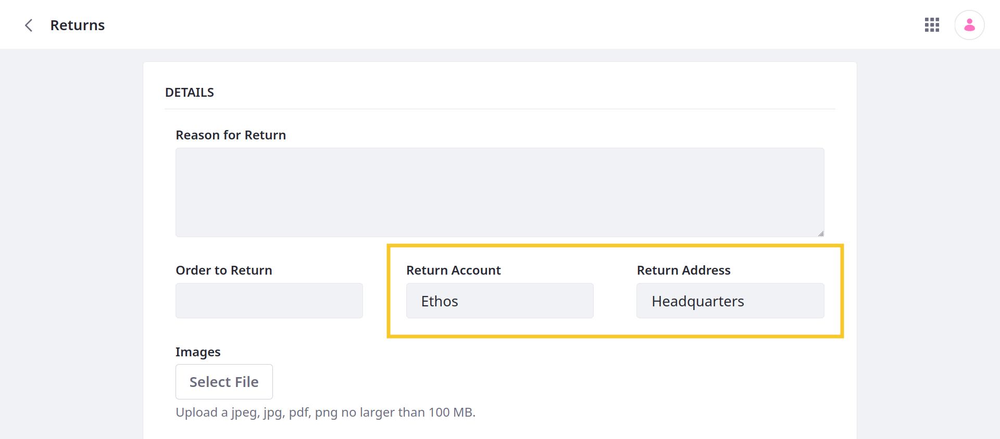

# Accessing Accounts Data from Custom Objects

{bdg-secondary}`Available Liferay 7.4 U35+/GA35+`

In some use cases, you may want to access account data from a custom object. For example, if you're building a custom returns application, you may want to prompt users to select their desired account and postal address when creating a return request. In this scenario, users would need access to their existing account and address entries while in the returns application.

To achieve this, Liferay provides access to the Account and Postal Address applications in the Objects admin. Here, you can define relationships between them and your custom objects. Once defined, users can use the generated relationship fields in the custom object to select their desired Account and Postal Address entries.


```{note}
The Account object stores general account data (e.g., name, email), while the Postal Address object stores billing and shipping addresses for an account. Postal Address entries are created in the Accounts UI and are scoped to the individual account for which they're created.
```

When relating a custom object to the Accounts and Postal Address system objects, these relationships should be defined on the system object side and use the one-to-many type. The custom object should be on the many side of both relationships.

Follow these steps to set up relationships for accessing Account and Postal Address entries from your custom object:

1. Open the *Global Menu* (), go to the *Control Panel* tab, and click *Objects*.

1. Begin editing the *Accounts* object.

1. Go to the *Relationships* tab and click the *Add* button ().

1. Enter a *Label* and *Name*.

1. For Type, select *One to Many*.

1. For Object, select your *custom object*.

   

1. Click *Save*.

1. Return to the Objects admin page and begin editing the *Postal Address* object.

1. Go to the *Relationships* tab and click *Add* ().

1. Enter a *Label* and *Name*.

1. For Type, select *One to Many*.

1. For Object, select the same *custom object* as you did for the previous relationship.

1. For Parameter, select the custom object's *relationship with the Account object* that you created earlier.

   This is necessary because Postal Address entries are scoped to specific accounts. The parameter sets up a dependent relationship where available addresses depend on the Account relationship's field value.

   

1. Click *Save*.

1. Add the relationship fields to the custom object's default layout and view. See [Designing Object Layouts](../layouts/designing-object-layouts.md) and [Designing Object Views](../views/designing-object-views.md) for detailed instructions.

   

Once added, users can select from available accounts and addresses in the custom object. Available account options depend on the user's account memberships, and available addresses depend on the selected account.



```{tip}
By default, objects use entry IDs for their title fields. The title field value determines how each entry option appears to end users in the relationship field. If desired, you can improve readability by configuring each object to use a different field for the title.

To do this, begin editing the desired object definition, go to the *Details* tab, and select a different value for the *Title Field*. Click *Save* when finished.
```

## Additional Information

* [Accounts](../../../../users-and-permissions/accounts.md)
* [Extending System Objects](../extending-system-objects.md)
* [Defining Object Relationships](../relationships/defining-object-relationships.md)
* [Restricting Access to Object Data by Account](./restricting-access-to-object-data-by-account.md)
