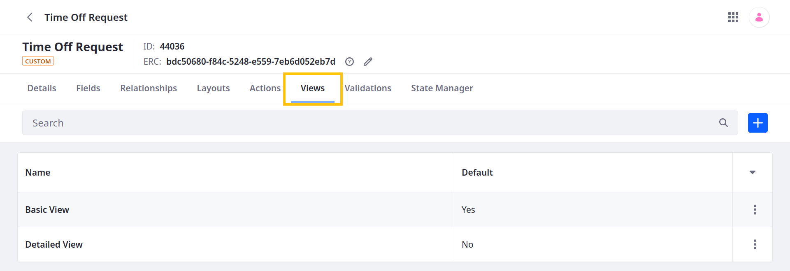

---
toc:
  - ./views/designing-object-views.md
  - ./views/renaming-table-columns.md
  - ./views/setting-a-default-sorting.md
  - ./views/adding-filters-to-views.md
uuid: c6bcae5f-e1d4-4c1a-873f-96c671c0b72d
taxonomy-category-names:
- Development and Tooling
- Objects
- Liferay Self-Hosted
- Liferay PaaS
- Liferay SaaS
---
# Views

Views define how entries appear in an object's application page. All published objects include an autogenerated table that displays all field columns alphabetically. However, you can [design custom views](./views/designing-object-views.md) to determine which fields to include, how columns are ordered, and available [filters](./views/adding-filters-to-views.md).

```{note}
Custom views can only be added to custom objects. They cannot be added to system objects.
```



::::{grid} 2
:gutter: 3 3 3 3

:::{grid-item-card} Designing Object Views
:link: ./views/designing-object-views.md
:::

:::{grid-item-card} Renaming Table Columns
:link: ./views/renaming-table-columns.md
:::

:::{grid-item-card} Setting a Default Sorting
:link: ./views/setting-a-default-sorting.md
:::

:::{grid-item-card} Adding Filters to Views
:link: ./views/adding-filters-to-views.md
:::
::::
