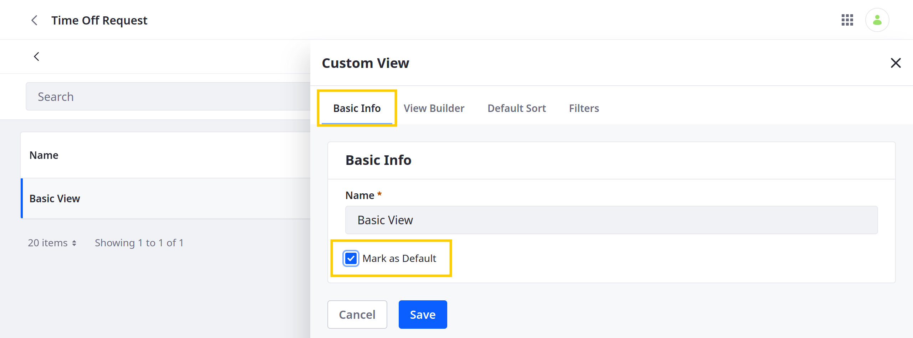

# Designing Object Views

{bdg-secondary}`Available Liferay 7.4+`

Views define how entries appear in an object's application page. Though each published object has an autogenerated view, you can create your own.


Follow these steps:

1. Open the *Global Menu* (  ), go to the *Control Panel* tab, and click *Objects*.

1. Begin editing a custom object definition, go to the *Views* tab, and click *Add* (  ).

   ```{note}
   System objects do not support custom views. See [Extending System Objects](../extending-system-objects.md) for more information.
   ```

1. Enter a *name* and click *Save*.

   

1. Click the new view to begin editing it.

1. In the Basic Info tab, check *Mark as Default* to set it as the default view for the object definition.

   This ensures the view is used for the object's application page. If no custom layout is set as default, the object uses its autogenerated layout.

   

1. Go to the *View Builder* tab and click the *Add* button ().

1. Check the *fields* you want to include in the view table and click *Save*.

   Each selected field becomes a column in the view table. Available options include both [custom fields](../fields/adding-fields-to-objects.md) and default system fields (i.e., ID, Author, Creation Date, Modified Date, and Workflow Status). However, custom views do not support columns containing multiple entries (e.g., relationships tables from one-to-many or many-to-many relationships)

1. Drag and drop fields to determine their order in the view table.

   

1. Click *Save*.

Once saved, the view table displays the selected fields. If desired, you can also rename and localize [column display names](./renaming-table-columns.md), add a [default sorting](./setting-a-default-sorting.md), and select which fields to use as [table filters](./adding-filters-to-views.md).


```{tip}
For 7.4 U21+, you can duplicate a view by clicking its Actions button (  ) and selecting *Duplicate*. This creates a complete copy of the original view with "(Copy)" appended to it's name. 
```

## Additional Information

* [Creating Objects](../creating-objects.md)
* [Adding Fields to Objects](../fields/adding-fields-to-objects.md)
* [Designing Object Layouts](../layouts/designing-object-layouts.md)
