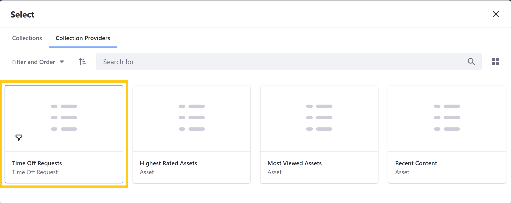
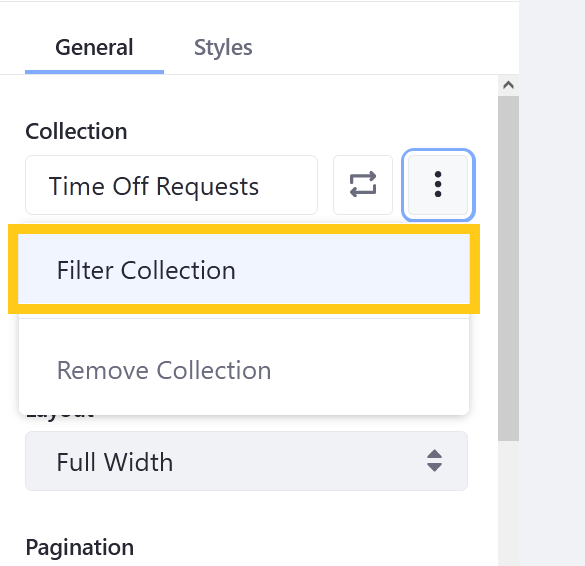
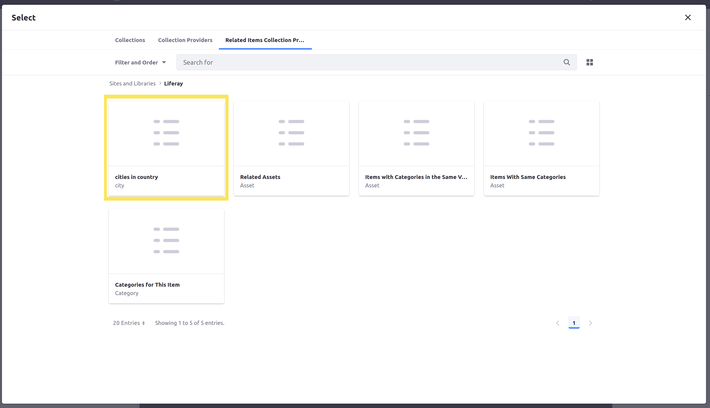
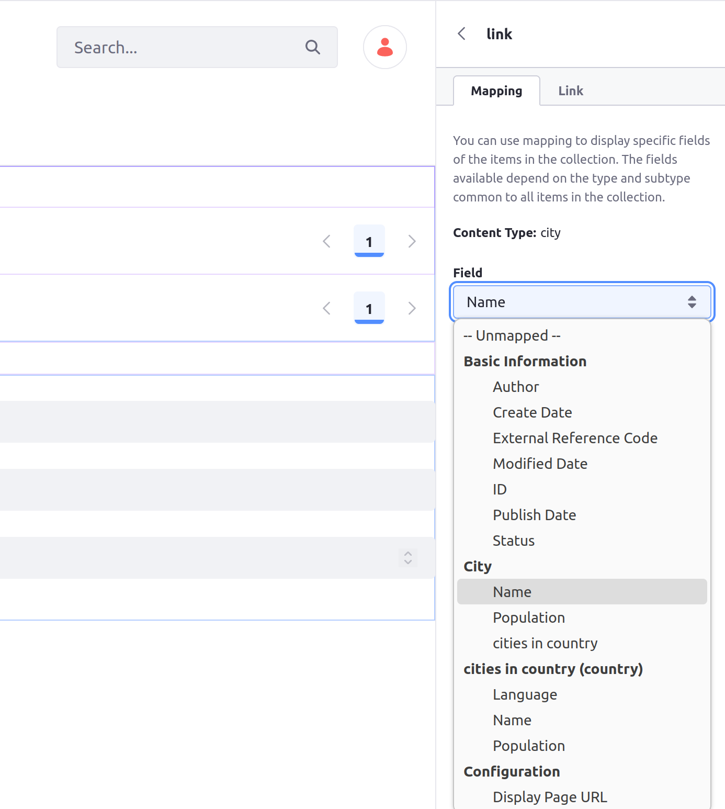

# Displaying Object Entries with Collection Providers

{bdg-secondary}`Available 7.4+`

When an object is published, Liferay creates a [collection provider](../../content-authoring-and-management/collections-and-collection-pages/collection-provider.md) for use with the [Collection Display fragment](../../site-building/displaying-content/additional-content-display-options/displaying-collections.md#adding-a-collection-display-fragment-to-a-page) to display multiple object entries. You can then use the Collection Display fragment to display that specific object type, use the fragment's filtering, style, and display options, and embed more fragments within it to customize the information you show for each object entry listed. You can also display the collection of objects with a [collection page](../../site-building/displaying-content/additional-content-display-options/displaying-collections.md#displaying-collections-on-a-collection-page).

## Mapping Fragment Fields to Object Fields

When you've selected an object within a Collection Display fragment, the object is set as the fragment's mapping source, so you can easily map fragment fields to object fields to create flexible page displays for individual object entries. Many basic component fragments (like headers, buttons, etc.) can map their fields to the object you place them under. This works the same way if you are on a collection page associated with that object type.

For example, you can embed a button within a Collection Display fragment mapped to an object, and then configure the button's link to display the name of each item in the collection.


### Mapping a Related Object's Fields

{bdg-secondary}`Available 7.4 U77 and GA77+`

```{important}
Mapping a fragment's fields to an object related to the main object is currently behind a release feature flag. Read [Release Feature Flags](../../system-administration/configuring-liferay/feature-flags.md#release-feature-flags) for more information.
```

If the mapped object has a [one-to-many relationship](./creating-and-managing-objects/relationships/defining-object-relationships.md) with another object (where the displayed object has a single related object), you can also display information from the related object's fields.

For example, if you are using a collection provider for a "City" object that has a related "Country" object, you can also choose any of the Country fields to display in embedded fragments. Here's an example where the relationship is called "cities in country":



```{note}
You can't display related object entries' information like this if there are multiple other object entries in the same relationship.
```

## Using the Collection Provider for Objects

Once you've published an object, follow these steps to use the Collection Display fragment to display an object's entries:

1. Create a new [content page](../../site-building/creating-pages/using-content-pages.md) or [display page template](../../site-building/displaying-content/using-display-page-templates/creating-and-managing-display-page-templates.md). Alternatively, begin *editing* (  ) an existing one.

   ```{note}
   You can also create a collection page using the collection provider. See [Collections and Collection Pages](../../content-authoring-and-management/collections-and-collection-pages/about-collections-and-collection-pages.md) for more information.
   ```

1. Drag and drop the *Collection Display* fragment into the page or template from the *Fragments and Widgets* () sidebar.

1. Select the *Collection Display Fragment* to access its configuration options and click *Select Collection* in the General tab.

   

1. In the modal window, click the *Collection Providers* tab and select the *object's provider*.

   

1. (Optional) Filter which object entries are displayed. You can filter by any picklist or boolean fields in the object.

   To do this, click the *Collection Options* button () and select *Filter Collection*.

   

   Then, select the desired *filters* and click *Apply*.

   

After selecting the desired provider, use additional fragment options to determine how Object entries are displayed, including *List Style* and *Pagination*.

### Displaying Related Object Information

{bdg-secondary}`Available 7.4 U77 and GA77+`

If your object has a [relationship with other objects](./creating-and-managing-objects/relationships/defining-object-relationships.md), you can also use a nested Collection Display fragment to show the related objects in that relationship. The embedded Collection Display fragment uses a unique [related items collection provider](../../content-authoring-and-management/collections-and-collection-pages/collection-provider.md#related-items-collections-providers) to form the new collection.

```{important}
Displaying related objects with a related items collection provider is currently behind a release feature flag. Read [Release Feature Flags](../../system-administration/configuring-liferay/feature-flags.md#release-feature-flags) for more information.
```

Once you've created some object data with related objects, follow these steps:

1. [Use a collection provider to display a collection of objects.](#using-the-collection-provider-for-objects)

1. Embed another Collection Display fragment under the items in the existing fragment's collection.

   ```{tip}
   Select the *Browser* tab in the page edit menu and drag the new Collection Display element there to more precisely embed it under the Collection Item in the hierarchy.
   ```

   

1. Click *Select Collection* in the new Collection Display fragment's configuration options.

1. Click the *Related Items Collection Providers* tab.

1. Select the collection provider with the name of the object's relationship. The type of object this relationship is associated with is shown under the relationship's name.

   

For each item in the top-level Collection Display fragment, the new fragment now lists all of the objects in the selected relationship. Use the fragment's options or add more fragments to show how these are displayed.

## Related Topics

* [Creating Objects](./creating-and-managing-objects/creating-objects.md)
* [Displaying Object Entires](./displaying-object-entries.md)
* [About Collections and Collection Pages](../../content-authoring-and-management/collections-and-collection-pages/about-collections-and-collection-pages.md)
* [Collection Providers](../../content-authoring-and-management/collections-and-collection-pages/collection-provider.md)
* [Defining Object Relationships](./creating-and-managing-objects/relationships/defining-object-relationships.md)
