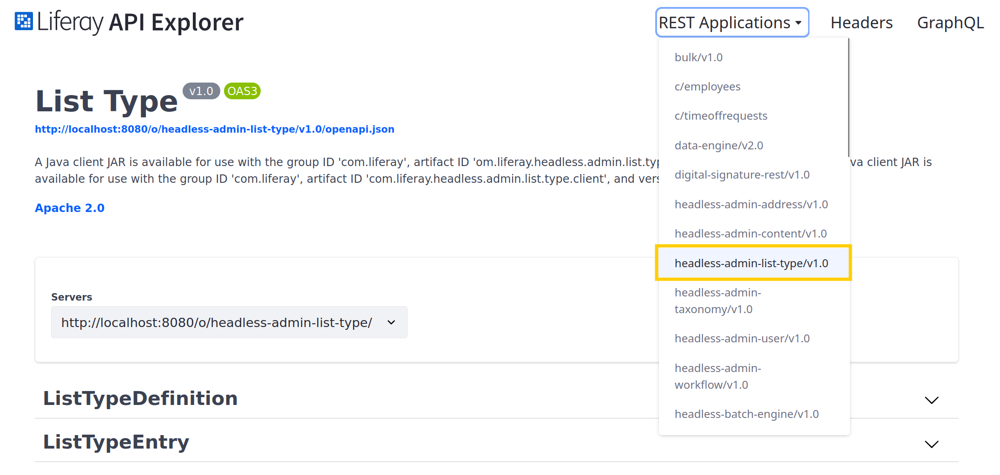

# Picklists API Basics

Liferay provides the [`headless-admin-list-types`](http://localhost:8080/o/api?endpoint=http://localhost:8080/o/headless-admin-list-type/v1.0/openapi.json) REST APIs for creating and managing picklist definitions (`ListTypeDefinition`) and their entries (`ListTypeEntry`). You can view and test available APIs in Liferay's API Explorer at `[server]:[port]/o/api` (e.g., `localhost:8080/o/api`) under the REST Services menu.



Call the [`headless-admin-list-types`](http://localhost:8080/o/api?endpoint=http://localhost:8080/o/headless-admin-list-type/v1.0/openapi.json) services to create and manage picklists.

## Adding a Picklist

```{include} /_snippets/run-liferay-dxp.md
```

Next, prepare the sample code:

1. Download and unzip [Picklists API Basics](./liferay-v3n6.zip).

   ```bash
   curl https://learn.liferay.com/dxp/latest/en/building-applications/objects/picklists/liferay-v3n6.zip -O
   ```

   ```bash
   unzip liferay-v3n6.zip
   ```

1. Use the cURL script to add a new picklist to your instance. On the command line, navigate to the `curl` folder. Execute the `ListTypeDefinition_POST_ToInstance.sh` script.

   ```bash
   ./ListTypeDefinition_POST_ToInstance.sh
   ```

   The JSON response shows a new picklist has been added:

   ```json
   "dateCreated" : "2022-11-17T18:42:13Z",
   "dateModified" : "2022-11-17T18:42:13Z",
   "id" : 47502,
   "listTypeEntries" : [ ],
   "name" : "Foo",
   "name_i18n" : {
      "en-US" : "Foo"
   }
   ```

1. Navigate to *Global Menu* &rarr; *Control Panel* &rarr; *Picklists*. The new picklist appears.

   

1. Alternatively, you can call the REST service using the Java client. Navigate into the `java` folder and compile the source files:

   ```bash
   javac -classpath .:* *.java
   ```

1. Run the `ListTypeDefinition_POST_ToInstance.java` class: 

   ```bash
   java -classpath .:* ListTypeDefinition_POST_ToInstance
   ```

## Examine the cURL Command

The `ListTypeDefinition_POST_ToInstance.sh` script calls the REST service using cURL.

```{literalinclude} ./picklists-api-basics/resources/liferay-v3n6.zip/curl/ListTypeDefinition_POST_ToInstance.sh
   :language: bash
```

Here are the command's arguments:

| Arguments | Description |
| :--- | :--- |
| `-H "Content-Type: application/json"` | Indicates that the request body format is JSON. |
| `-X POST` | The HTTP method to invoke at the specified endpoint |
| `"http://localhost:8080/o/headless-admin-list-type/v1.0/list-type-definitions"` | The REST service endpoint |
| `-d "{\"name\": \"Foo\", \"name_i18n\": {\"en_US\": \"Foo\"}}"` | The data you are requesting to post |
| `-u "test@liferay.com:learn"` | Basic authentication credentials |

```{note}
Basic authentication is used here for demonstration purposes. For production, you should authorize users via [OAuth2](../../../headless-delivery/using-oauth2.md).
```

The other cURL commands use similar JSON arguments.

## Examine the Java Class

The `ListTypeDefinition_POST_ToInstance.java` class adds a picklist by calling the `ListType`-related services.

```{literalinclude} ./picklists-api-basics/resources/liferay-v3n6.zip/java/ListTypeDefinition_POST_ToInstance.java
   :dedent: 1
   :language: java
   :lines: 11-30
```

This class invokes the REST service using three lines of code:

| Line (abbreviated) | Description |
| :----------------- | :---------- |
| `ListTypeDefinitionResource.Builder builder = ...` | Gets a `Builder` for generating an `ListTypeDefinitionResource` service instance. |
| `ListTypeDefinitionResource listTypeDefinitionResource = builder.authentication(...).build();` | Specifies basic authentication and generates a `ListTypeDefinitionResource` service instance. |
| `ListTypeDefinition listTypeDefinitionResource = listTypeDefinitionResource.postListTypeDefinition(...);` | Calls the `listTypeDefinitionResource.postListTypeDefinition` method and passes the data to post. |

Note that the project includes the `com.liferay.headless.admin.list.type.client` file as a dependency. You can find client JAR dependency information for all REST applications in your installation's API explorer at `/o/api` (e.g., <http://localhost:8080/o/api>).

```{note}
The `main` method's comment demonstrates running the class.
```

The other Java classes similarly call different `ListTypeDefinitionResource` methods.

```{important}
See [ListTypeDefinitionResource](https://github.com/liferay/liferay-portal/blob/[$LIFERAY_LEARN_PORTAL_GIT_TAG$]/modules/apps/headless/headless-admin-list-type/headless-admin-list-type-client/src/main/java/com/liferay/headless/admin/list/type/client/resource/v1_0/ListTypeDefinitionResource.java) for service details.
```

Below are examples of calling other `ListTypeDefinition` REST services using cURL and Java.

## Get Picklists from Instance

You can list picklists by executing the following cURL or Java command.

### ListTypeDefinitions_GET_FromInstance.sh

Command:

```bash
./ListTypeDefinitions_GET_FromInstance.sh
```

Code:

```{literalinclude} ./picklists-api-basics/resources/liferay-v3n6.zip/curl/ListTypeDefinitions_GET_FromInstance.sh
   :language: bash
```

### ListTypeDefinitions_GET_FromInstance.java

Command:

```bash
java -classpath .:* ListTypeDefinitions_GET_FromInstance
```

Code:

```{literalinclude} ./picklists-api-basics/resources/liferay-v3n6.zip/java/ListTypeDefinitions_GET_FromInstance.java
   :dedent: 1
   :language: java
   :lines: 11-25
```

The Instance's `Picklist` objects appear in JSON.

## Get a Picklist

Get a specific picklist with the following cURL or Java command.

```{tip}
Use ``ListTypeDefinitions_GET_FromInstance.[java|sh]`` to get instance ``Picklist`` IDs.
```

### ListTypeDefinition_GET_ById.sh

Command:

```bash
./ListTypeDefinition_GET_ById.sh 1234
```

Code:

```{literalinclude} ./picklists-api-basics/resources/liferay-v3n6.zip/curl/ListTypeDefinition_GET_ById.sh
   :language: bash
```

### ListTypeDefinition_GET_ById.java

Command:

```bash
java -classpath .:* -DlistTypeDefinitionId=1234 ListTypeDefinition_GET_ById
```

Code:

```{literalinclude} ./picklists-api-basics/resources/liferay-v3n6.zip/java/ListTypeDefinition_GET_ById.java
   :dedent: 1
   :language: java
   :lines: 8-20
```

The `Picklist` fields appear in JSON.

## Patch a Picklist

Edit an existing picklist with cURL and Java patch commands. Replace `1234` with your picklist's ID.

### ListTypeDefinition_PATCH_ById.sh

Command:

```bash
./ListTypeDefinition_PATCH_ById.sh 1234
```

Code:

```{literalinclude} ./picklists-api-basics/resources/liferay-v3n6.zip/curl/ListTypeDefinition_PATCH_ById.sh
   :language: bash
```

### ListTypeDefinition_PATCH_ById.java

Command:

```bash
java -classpath .:* -DlistTypeDefinitionId=1234 ListTypeDefinition_PATCH_ById
```

Code:

```{literalinclude} ./picklists-api-basics/resources/liferay-v3n6.zip/java/ListTypeDefinition_PATCH_ById.java
   :dedent: 1
   :language: java
   :lines: 11-31
```

## Put a Picklist

Completely overwrite an existing picklist with cURL and Java `put` commands. Replace `1234` with your picklist's ID.

### ListTypeDefinition_PUT_ById.sh

Command:

```bash
./ListTypeDefinition_PUT_ById.sh 1234
```

Code:

```{literalinclude} ./picklists-api-basics/resources/liferay-v3n6.zip/curl/ListTypeDefinition_PUT_ById.sh
   :language: bash
```

### ListTypeDefinition_PUT_ById.java

Command:

```bash
java -classpath .:* -DlistTypeDefinitionId=1234 ListTypeDefinition_PUT_ById
```

Code:

```{literalinclude} ./picklists-api-basics/resources/liferay-v3n6.zip/java/ListTypeDefinition_PUT_ById.java
   :dedent: 1
   :language: java
   :lines: 11-31
```

## Delete a Picklist

Delete an existing picklist with cURL and Java `delete` commands. Replace `1234` with your picklist's ID.

### ListTypeDefinition_DELETE_ById.sh

Command:

```bash
./Picklist_DELETE_ById.sh 1234
```

Code:

```{literalinclude} ./picklists-api-basics/resources/liferay-v3n6.zip/curl/ListTypeDefinition_DELETE_ById.sh
   :language: bash
```

### ListTypeDefinition_DELETE_ById.java

Command

```bash
java -classpath .:* -DlistTypeDefinitionId=1234 ListTypeDefinition_DELETE_ById
```

Code:

```{literalinclude} ./picklists-api-basics/resources/liferay-v3n6.zip/java/ListTypeDefinition_DELETE_ById.java
   :dedent: 1
   :language: java
   :lines: 8-19
```

## Picklist Entry Services

After creating a picklist, use the services below to create and manage picklist entries. The cURL commands and Java classes for `ListTypeEntry` work like `ListTypeDefinition`. Some services require passing the picklist ID.

| Files | Description |
| :---- | :---------- |
| `ListTypeEntries_GET_FromListTypeDefinition.[java\|sh]` | Get a list of picklist entries from a picklist. |
| `ListTypeEntry_DELETE_ById.[java\|sh]` | Delete a picklist entry. |
| `ListTypeEntry_GET_ById[java\|sh]` | Get a specific picklist entry by ID. |
| `ListTypeEntry_POST_ToListTypeDefinition.[java\|sh]` | Post an entry to a picklist.  |
| `ListTypeEntry_PUT_ById.[java\|sh]` | Put a picklist entry. |

The [API Explorer](../../../headless-delivery/consuming-apis/consuming-rest-services.md) shows all `ListTypeDefinition` and `ListTypeEntry` services and schemas and has an interface to test each service.

## Related Topics

* [Using Picklists](./using-picklists.md)
* [Exporting and Importing Picklists](./exporting-and-importing-picklists.md)
