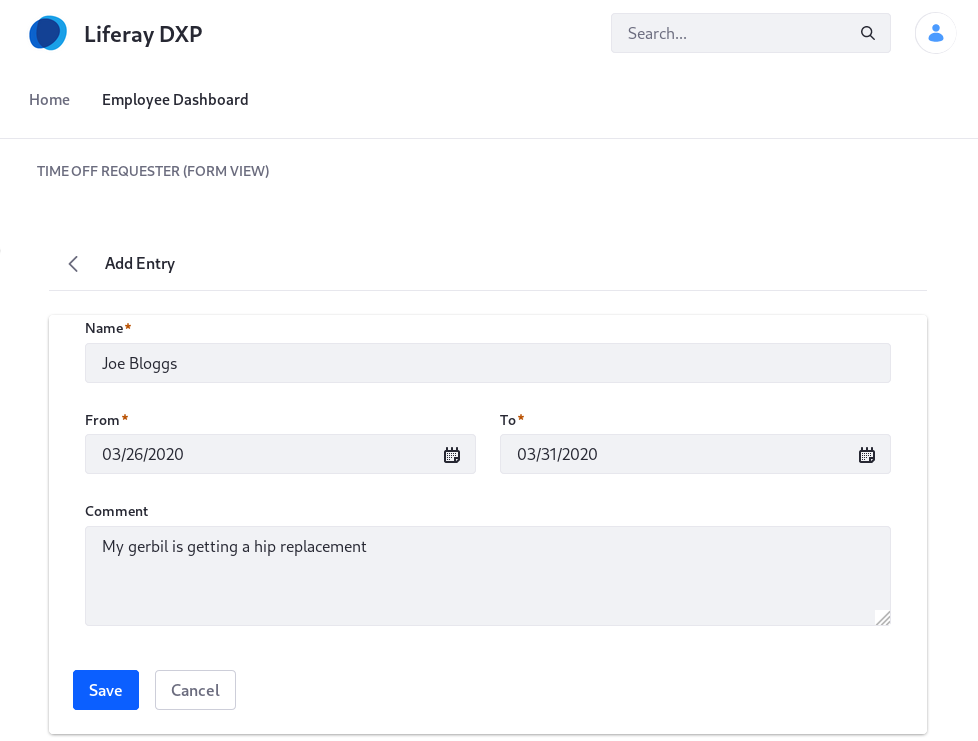

---
toc:
  - ./app-builder/creating-a-standard-application.md
  - ./app-builder/creating-a-workflow-powered-application.md
  - ./app-builder/creating-the-role-change-request-object.md
  - ./app-builder/creating-the-role-change-request-app.md
uuid: f36da885-6c54-454e-8380-ef4fc63247ef
---
# App Builder

```{toctree}
:maxdepth: 3

app-builder/creating-a-standard-application.md
app-builder/creating-a-workflow-powered-application.md
app-builder/creating-the-role-change-request-object.md
app-builder/creating-the-role-change-request-app.md
```

> Available: Liferay CE/DXP 7.3 ([deprecated and removed in 7.4](../../installation-and-upgrades/upgrading-liferay/reference/maintenance-mode-and-deprecations-in-7-4.md#features-deprecated-in-7-4))

App Builder is a low-code application development solution for Liferay DXP. Build a data model, define the application's forms (for entering data) and tables (for viewing and managing data records), then deploy your application to a Site or as a completely standalone application. With App Builder, you can create functional business applications with dedicated user interfaces and data separation without a single line of code.


Why use App Builder when the [Liferay Forms](../../process-automation/forms/introduction-to-forms.md) application includes similar form-building capabilities? Here's an overview of the differences:

| Capability | Liferay Forms | App Builder |
|------------|:-------------:|:-----------:|
| Create simple or complex forms | &#10004; | &#10004; |
| Deploy the form in a widget or at a dedicated URL | &#10004; | &#10004; |
| Keep form data separate from other forms' data |  | &#10004; |
| Deploy the form to the product menu |      |    &#10004;   |
| Display collected data in multiple places |        |  &#10004;       |
| Control the presentation of form data |        |      &#10004;   |
| Deploy multiple forms for one data object |        |      &#10004;   |
| Deploy multiple data record views for one data object |        |      &#10004;   |

App Builder goes beyond forms by providing data display tables, flexible deployment options, form combining, and more, all backed by a single data object. 

## Creating an App

App Builder comes in two flavors: Standard and Workflow Powered. All apps made with App builder consist of three components defined in the app builder UI: objects, form views, and table views. To skip straight to building an application, see [Creating an Application with App Builder](./app-builder/creating-a-standard-application.md).

### App Builder Objects

An _Object_ is at the foundation of every App Builder application. It defines the information the application collects and manages. For example, a Guestbook object would at least contain a _Name_ field and a _Message_ field. 

When creating an application based on an object, you create at least one form view, at least one table view, and deploy the application.

Native objects contain data fields out of the box. You can define the data fields of a custom object at the same time as creating its form views.

### Form Views

A form view defines which of the object's data fields users should fill out. The Liferay Forms application's form builder tool is repurposed for this. An App Builder object can have multiple form views.

Adding fields to a form view automatically adds them to the object. You can reuse fields added to the object via a previously created form view by dragging the field from a field listing in the form viewer.

### Table Views

Table views show the data records collected for an object. In addition, those with permission can access the _Add new entry_ functionality, see the details of an entry, and manage the application's entries. Table views can show all or a subset of the object's fields. Every app has at least one table view, though the object can have as many as needed. A drag-and-drop interface makes it easy to create table views out of existing fields. 

## Deployment

Once an object is defined and at least one form and table view are created, you can deploy an application. You have several deployment options:

**Widget:** Deploy the application to the widget menu and add it to a page using the Add Widgets menu (from Add &rarr; Widgets, search for your application by name). Deploying as a widget really deploys three variations of the application to the Add Widgets menu, each with a different label. Each option exposes different features: 

| Widget Menu Label     | Submit Form Entries | View Entries | Update and Delete Entries |
|-----------------------|:-----------:|:------------:|:----------------:|
| App Name              |     &#10004;   |      &#10004;   |      &#10004;       |
| App Name [Form View]  |     &#10004;   |         |          |
| App Name [Table View] |        |      &#10004;   |      &#10004;       |



**Standalone:** Deploy the application to a dedicated page that's not part of a site and not visible to any navigation menu. This limits access to only those with the link.


**Product Menu:** Deploy the application to the Control Panel, the Site Menu, or both. This gives you flexibility in deciding which administrative Users can access the application.


A Standalone or Product Menu application always includes both the form and table view. The table view is the default view, while an add button provides access to the form view.

## Next Steps

* [Creating an Application with App Builder](./app-builder/creating-a-standard-application.md)
* [Creating a Workflow Powered Application](./app-builder/creating-a-workflow-powered-application.md)

```{raw} html
:file: ../../landingpage_template.html
```

```{raw} html
:file: app-builder/landing.html
```
