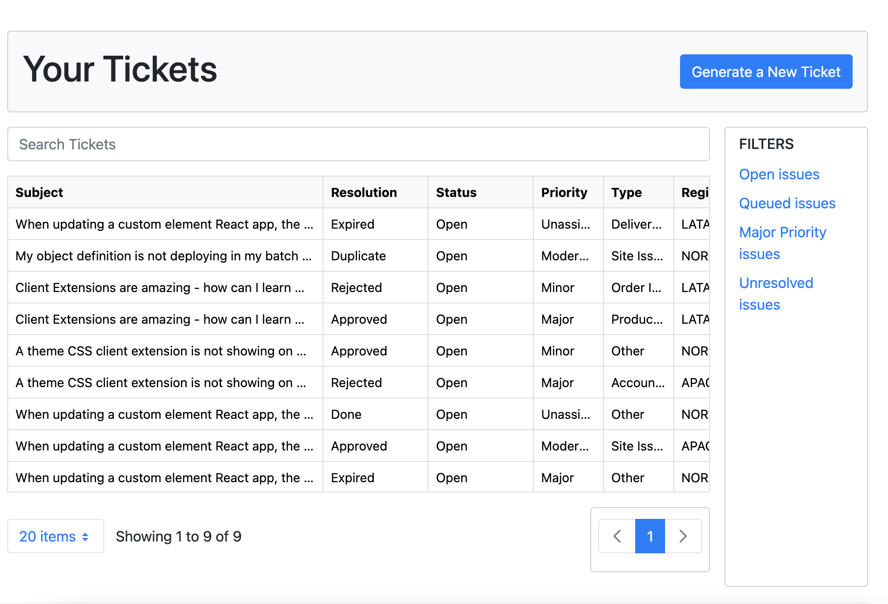

# Ticket Management with Cron Jobs

Use Cron jobs to automate managing tickets. For example, have a job to run at a regular schedule to delete any tickets that have a resolution type of `duplicate` or `done`.

Follow the steps to enable and deploy the cron job:

1. Navigate back to the _ticketing system_ site page. Click _Generate a New Ticket_ a few times until you have at least one ticket that has either a `duplicate` or `done` resolution type.

   

1. Open a command line and run the following command:

   ```bash
   ./gradlew :client-extensions:liferay-ticket-etc-cron:deploy
   ```

   Check your logs to verify successful deployment.

1. Next, run the following command to start the spring boot application:

   ```bash
   ./gradlew :client-extensions:liferay-ticket-etc-cron:bootRun
   ```

   The cron job is now running. Check the logs or refresh the _ticketing system_ site page to verify that a ticket has been deleted.

   

## Examine the Cron Job Code

This cron job is a [microservice](../../building-applications/client-extensions/microservice-client-extensions.md) type client extension. Specifically, it is a Spring Boot application just like the previous documentation referral system client extension. Therefore, the `client-extension.yaml` file contains the same `assemble` block section as well as the `oAuthApplicationUserAgent` section like before.

The relevant Spring Boot files for the application are contained in the `/src` folder. A full explanation of the Java code is beyond the scope of this tutorial, but there are a few things to note:

* The `TicketSpringBootApplication.java` file does the OAuth authorization.

* The main logic is found in the `TicketCommandLineRunner.java` file. If the ticket's resolution equals `duplicate` or `done`, the ticket is deleted.

See [Developing a Java Web Application](../../building-applications/developing-a-java-web-application.md) for more information.

Congratulations on completing this solutions tutorial on building a custom ticketing system.
