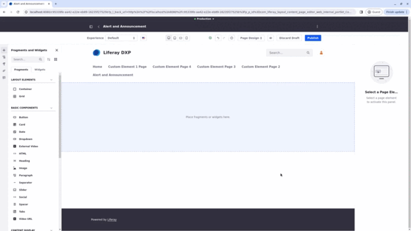
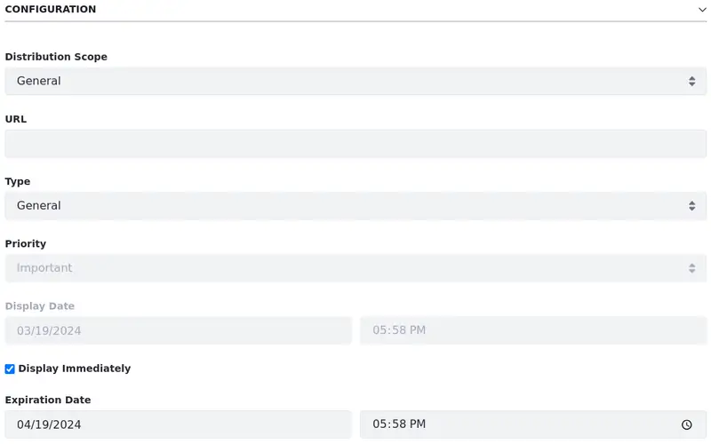
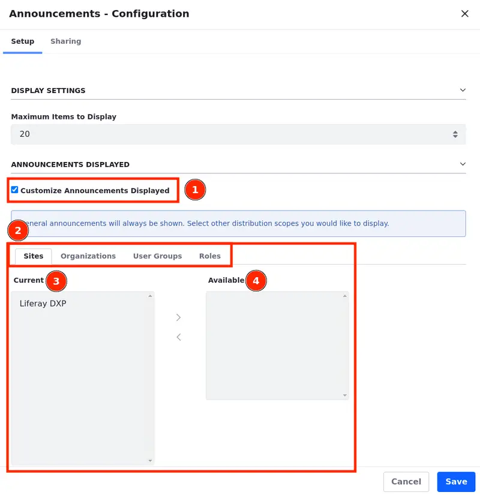
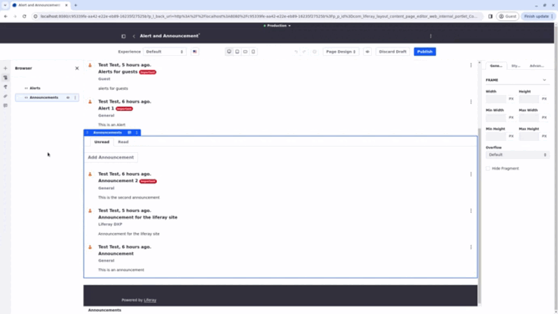
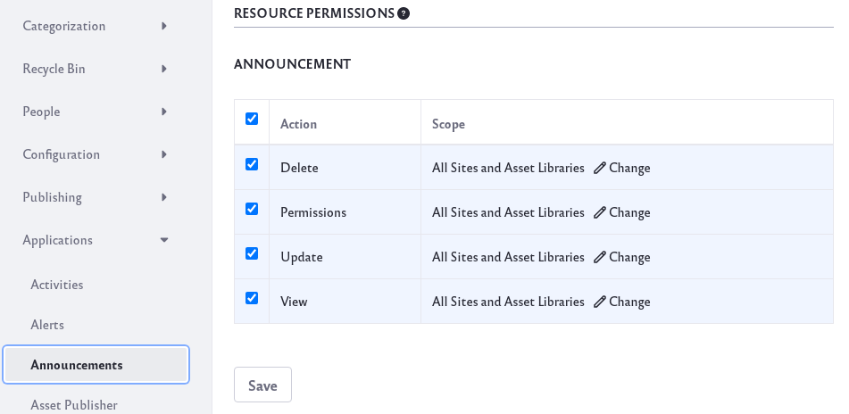

# Sending Alerts and Announcements

Use the Alerts or the Announcements widgets to broadcast important information.

Alerts are for high-priority information (e.g. planned downtime alerts, security alerts, etc.) and come with a red *Important* tag. Conversely, Announcements are for all other information you might want to broadcast.

!!! tip
    You can set the announcement's priority to Important to display the red *Important* tag in the message.

Although similar, alerts and announcements have some differences:

| Configuration      | Alert                       | Announcement                                                       |
|:-------------------|:----------------------------|:-------------------------------------------------------------------|
| Distribution Scope | Automatic                   | Use the `Customize Announcements Displayed` option to customize it |
| Pagination         | Not Configurable            | Set the maximum number of items shown in the widget.               |
| Priority           | Set to Important by default | Normal or Important                                                |

!!! tip
    To separate critical alerts from regular announcements, consider placing the widgets on different pages or targeting specific user groups.

## Creating Alerts and Announcements

Administrators can create and manage announcements and alerts through the Announcements and Alerts application:

Open the *Global Menu* (), select the *Applications* tab, and click *Announcements and Alerts* under Communication.

In the application, select the *Announcements* or the *Alerts* tab (1) to create (2), view (3), select and delete multiple entries (4), filter by site or role (5), sort entries (6), or use the actions menu (7) to edit and delete announcements or alerts.

Another way to create, display, and manage alerts and announcements is by using widgets:

1. [Create a new page](../../site-building/creating-pages/adding-pages/adding-a-page-to-a-site.md) or [start editing](../../site-building/creating-pages/using-content-pages/adding-elements-to-content-pages.md) one.

1. In the Fragments and Widgets menu on the left, search for the Announcements or Alerts widgets under the News section and drag it to your page.

   The widgets have two tabs: Unread for non-expired alerts/announcements that you haven't read, and Read for alerts/announcements that have expired or that you've already read.

   

1. To create an alert or announcement click *Add Alert* or *Add Announcement*. A new window opens.

1. Use the Title field to give the alert or announcement a title. Add additional text in the Content field.

1. Set additional settings under the Configuration section. See [Alerts and Announcements Configuration Reference](#alerts-and-announcements-configuration-reference) for more information.

1. Click *Save* when you’re done. Your alert/announcement now appears in the widget.

### Alerts and Announcements Configuration Reference

While creating or editing alerts and announcements, expand the Configuration section to view the available settings.

**Distribution Scope:** The scope where the alert/announcement should appear. The default General scope sends the alert/announcements to everyone in the instance. Alternatively, you can select your site or specific roles. See [Configuring the Distribution Scope](#configuring-the-distribution-scope) to learn more.

**URL:** A URL (optional) to include with the alert/announcement. For example, an announcement about a news story could include a link to the news article. The URL must be valid and begin with `http://` or `https://`.

**Type:** The alert/announcement type. This can be General, News, or Test. Note that each user can specify a different delivery mechanism for each type of alert/announcement. See [User Configuration ](#user-configuration) for details.

**Priority:** The announcement's priority. This can be Normal or Important. Note that this is disabled for alerts because alerts are always set to a high priority by default.

**Display Date:** The date the alert/announcement should be displayed. This determines when the alert/announcement is sent and appears in the widget. By default, the *Display Immediately* box is checked. This sets the display date equal to the creation date. Uncheck this box to enter a custom display date. For example, you can create alerts/announcements for display at a later date. This date can be days, weeks, months, or years in the future. Uncheck the *Display Immediately* box and click the *Display Date* field to open the date-picker.

**Expiration Date:** The date and time the alert/announcement expires. Once an alert/announcement expires, the widget displays it in the Read tab. Clicking the Expiration Date field opens the date-picker.

### Configuring the Distribution Scope

Configure the distribution scope to define where the alert/announcement appears. By default, it's set to *General*, which is everyone. To set the distribution scope,

1. [Add an announcement or alert](#creating-alerts-and-announcements) using the application or the widgets.

1. Click the *Distribution Scope* field to see a list of available sites, organizations, user groups, and roles. This list varies depending on the current user's permissions.

   **Sites**: All sites the user belongs to.

   **Organizations**: All organizations the user belongs to.

   **User Groups**: All user groups in the instance.

   **Roles**: All roles in the instance.

You can also configure your Announcements widget to customize the distribution scope. This is useful when you want to send an announcement to specific groups of people.

1. Click *Options* () on your widget and select *Configuration*.

1. Select the *Customize Announcements Displayed* option (1) to customize the distribution scope for your Announcement widget. Click *Save*.

   

   A new section appears. You can select tabs to define which available sites, organizations, user groups, and roles are included in the distribution scope. If there are no elements in a category, the tab isn't shown.

1. Select the available options and use the arrows to move them from the Available to the Current column to include the option in the distribution scope.

   By default, the site where the widget is placed is shown in the Current column.

   The options under the Available column vary according to the user's permissions. See [Alert and Announcement Roles](#alert-and-announcement-roles) to learn more.

## User Configuration

Users can configure how they'd like to receive announcements.

1. Click on your User profile at the top right and select *Account Settings*.

1. Open the *Preferences* tab to find the *Alerts and Announcements Delivery* option.

   

1. Alerts and announcements are always visible from the page on which the widget is configured. Users can choose to receive alerts and announcements by email as well. Select between General, News, or Test types.

1. Click *Save* when you're finished.

## Alert and Announcement Roles

You can also create roles and assign permissions for users to be able to manage alerts and announcements:

1. Open the *Global Menu* () &rarr; *Control Panel* &rarr; *Roles*.

1. With the *Regular Roles* tab selected, click *Add* (). This opens the New Role form.

1. Name your role *Announcements*, give it a title and description, and click *Save*.

1. Click the role's *Options* () &rarr; *Edit*.

1. Open the *Define Permissions* tab.

   Under Control Panel, click *General Permissions*, and select *Add General Announcements*. Click *Save*.

   

   Go back to the Define Permissions tab. Navigate to *Site and Asset Library Administration* &rarr; *Applications* &rarr; *Announcements*. Select all the resource permissions and click *Save*.

1. Now any user assigned to this role can manage alerts and announcements.

### Distribution Scope Permissions

Here's a list of necessary permissions users must have to publish alerts/announcements at each distribution scope and where you can find them in the Define Permissions tab:

| Option        | Permission                | Where is the Permission                                                                                 |
|:--------------|:--------------------------|:--------------------------------------------------------------------------------------------------------|
| General       | Add General Announcements | Control Panel &rarr; General Permissions                                                                |
| Sites         | Manage Announcements      | Control Panel &rarr; Sites &rarr; Sites                                                                 |
| Organizations | Manage Announcements      | Control Panel &rarr; Users &rarr; Users and Organizations                                               |
| User Groups   | Manage Announcements      | Control Panel &rarr; Users &rarr; Users Groups                                                          |
| Roles         | Manage Announcements      | The user must have a role assigned within the site that grants them permission to manage announcements. |
