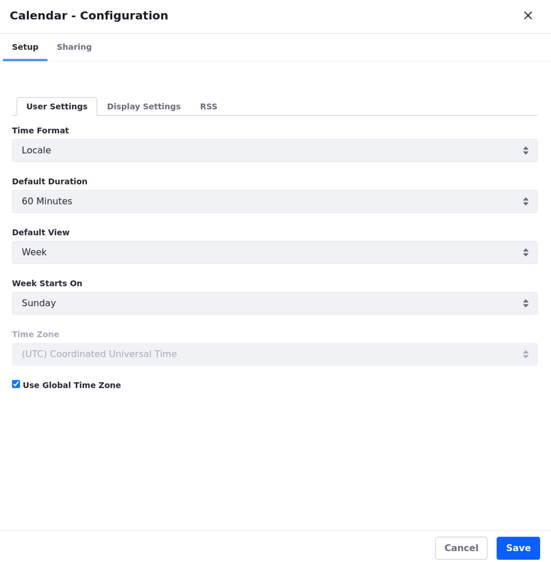
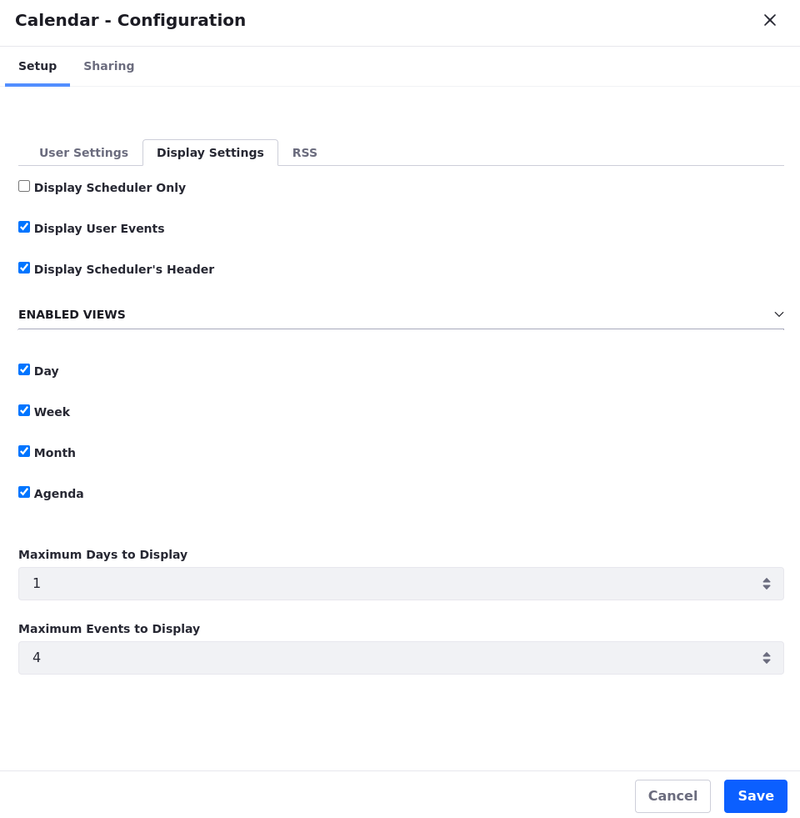

# Calendar Widget Configuration Reference

<!-- A configuration reference should be just that: a reference. Rather than having steps, it should document what's on all these reference screens so the reader knows what all the options mean. Use lists of definitions like this (https://learn.liferay.com/w/dxp/using-search/search-configuration-reference) or if the forms have tons of options, tables like this (https://learn.liferay.com/w/dxp/process-automation/forms/creating-and-managing-forms/forms-configuration-reference) to explain every option on the forms. And don't ever use bullets for definitions (https://learn.liferay.com/w/reference/style-guide/liferay-conventions#definitions). -Rich -->

Use the Calendar widget configuration options to tailor the display and functionality of your calendar. From choosing the time format and default view to setting the week start day and time zone, users can configure various aspects to suit their preferences.

To configure the Calendar widget,

1. [Start editing the Calendar widget's page](../../site-building/creating-pages/using-content-pages/adding-elements-to-content-pages.md) and click [Options](../../images/icon-widget-options.png) in the widget's header &rarr; *Configuration*.

1. Select a tab under Setup: [User Settings](#user-settings), [Display Settings](#display-settings), or [RSS](#rss).

   To learn more about the Sharing tab, read [Sharing Widgets with Other Sites](../../site-building/creating-pages/page-fragments-and-widgets/using-widgets/configuring-widgets/sharing-widgets-with-other-sites.md).

1. Make your alterations and click *Save*.

## User Settings

From the *User Settings* tab, customize the calendar's default view and settings. Here are the available options:

-  **Time Format:** Choose *Locale*, *AM/PM*, or *24 Hour*.

   Locale is a dynamic setting that chooses whether to display the time in AM/PM or a 24-hour format, based on the preferences set by the user's locale. AM/PM displays times such as 8 AM or 11 PM. The 24-hour time format displays times such as 08:00 and 23:00.

-  **Default Duration:** Choose an event duration.

   When you add a new event to the calendar, the time you set here specifies how long events last by default.

-  **Default View:** Choose *Day*, *Week*, *Month* or *Agenda*.

   This sets the default for when the calendar is first displayed, but the view can be changed by clicking the appropriate button at the top-right of the widget.

-  **Week Starts On:** Choose *Sunday*, *Monday*, or *Saturday*.

-  **Time Zone:** Choose a time zone or check the *Use Global Time Zone* box.

   If you check Use Global Time Zone, the time displayed depends on whether it's being viewed by a logged-in user or a guest.

   If a user is logged in, the calendar displays events using the time zone set for the user in the User Personal Menu &rarr; Account Settings &rarr; Preferences &rarr; Display Settings  &rarr; Time Zone.

   If the calendar is viewed by a guest or a user who is not logged in, the calendar displays events using the time zone set by the portal administrator in Control Panel &rarr; Configuration &rarr; Instance Settings &rarr; Platform &rarr; Localization &rarr; VIRTUAL INSTANCE SCOPE &rarr; Time Zone.

## Display Settings

From the *Display Settings* tab, set how the Calendar widget is displayed. Here are the available options:

-  **Display Scheduler Only:** By default, the list of calendars and a mini-calendar view are displayed.

   Check this to display only the scheduler (i.e., the large calendar view showing the calendar and scheduled events).

-  **Display User Events:** Turns off the display of the current, logged-in user's calendar and events.

-  **Display Scheduler's Header:** If disabled, it removes the ability to toggle through the calendar views and access to the Add Event button.

-  **Enabled Views:** If one of the available views is disabled it disappears from the scheduler's header.

-  **Maximum Days to Display:** Set the maximum number of days to display in the agenda view.

-  **Maximum Events to Display:** Set the maximum number of events to display in the agenda view.

## RSS

Use the *RSS* tab to enable/disable the RSS subscription and configure the RSS behavior.

## Related Topics

- [Using the Calendar Widget](./using-the-calendar-widget.md)
- [Exporting/Importing Calendar Data](./exporting-importing-calendar-data.md)
- [Mapping Calendar Event Fields to Display Page Templates](./mapping-calendar-event-fields-to-display-page-templates.md)
