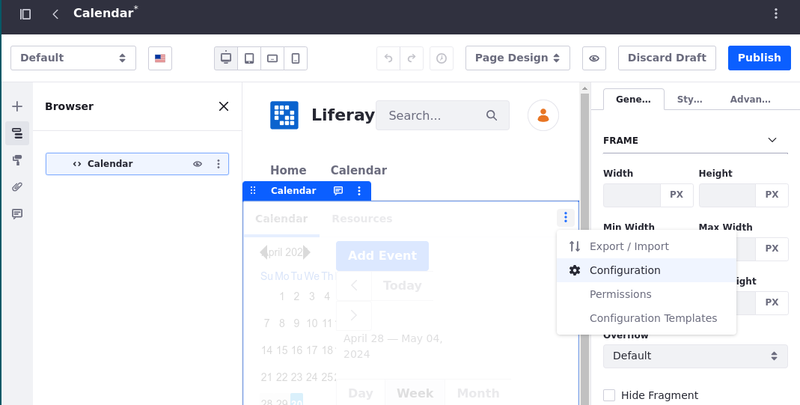
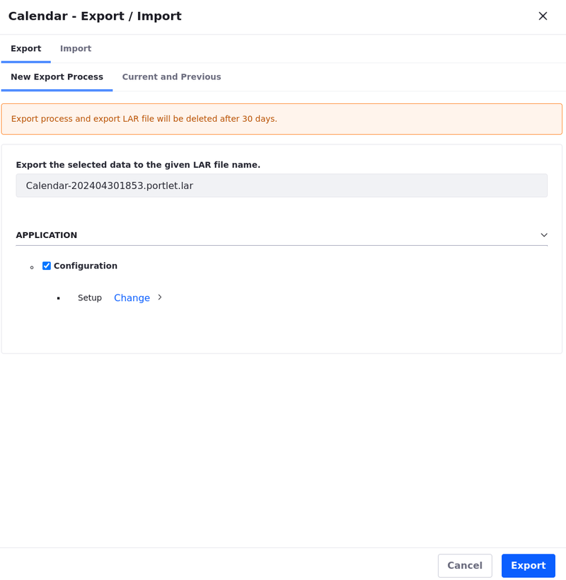
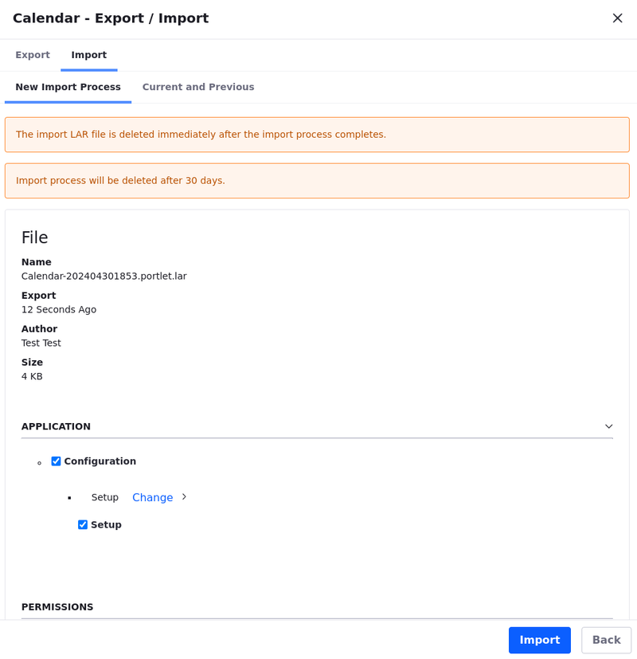

# Exporting/Importing Calendar Data

Like other Liferay Applications, you can [export](#exporting-and-importing-calendar-data) and [import](#importing-calendar-data) calendar data as Liferay Archive (LAR) files.

!!! note
    Data can only be ported between installations of the same version.

## Exporting Calendar Data

1. Start [editing the page](../../site-building/creating-pages/using-content-pages/adding-elements-to-content-pages.md) where the calendar widget is located.

1. From the calendar widget, click  in the widget header and select *Export/Import*.

1. Click the *Export* tab.

   

1. Enter a name for the LAR file (or use the default).

1. Under *Application*, choose whether to include the widget's configuration in the LAR.

1. Under *Content*, choose how much historical data to export and select the content types (calendars, resources, and events) to include. You can also choose whether to include comments and ratings.

1. Check the appropriate boxes to select whether to include deletions and permissions in the LAR.

1.  Click *Export*. When a success message displays (this may take a few moments) you can click on the LAR's filename to download it.

## Importing Calendar Data

1. Start [editing the page](../../site-building/creating-pages/using-content-pages/adding-elements-to-content-pages.md) where the calendar widget is located.

1. From the calendar widget, click  in the widget header and select *Export/Import*.

1. Click the *Import* tab.

1. Click *Choose File* or else drag-and-drop a LAR into the area surrounded by a dotted line. Click *Continue*.

   

1. Decide how much data you want to import:

1. Under *Application*, check the box to import the configuration stored in the LAR or leave it unchecked to keep your current configuration.

1. Under *Content*, decide which content types (calendars, resources, and events) to import, and whether to include comments and ratings.

1. Choose whether to import permissions and deletions and decide whether to delete your widget's existing data before the import.

1. In the collapsible *Update Data* section, choose how data will be updated.

   **Mirror:** The data will be imported along with a reference to its source. This allows data to be updated rather than duplicated if the same LAR is imported more than once.

   **Copy as New:** All data is imported as new entries. Repeat imports will produce duplicates.

1. In the *Authorship of the Content* section, choose whether to keep the original author of the imported content (where available) or to list the current user as the author.

1. Click *Import*.

Your calendar is set up and ready to go! Better check it to see what's next on the agenda.

## Related Topics

- [Using the Calendar Widget](./using-the-calendar-widget.md)
- [Calendar Widget Configuration Reference](./calendar-widget-configuration-reference.md)