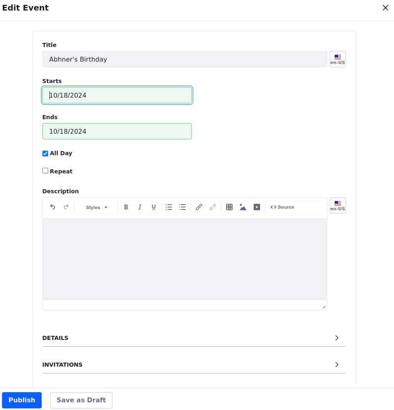
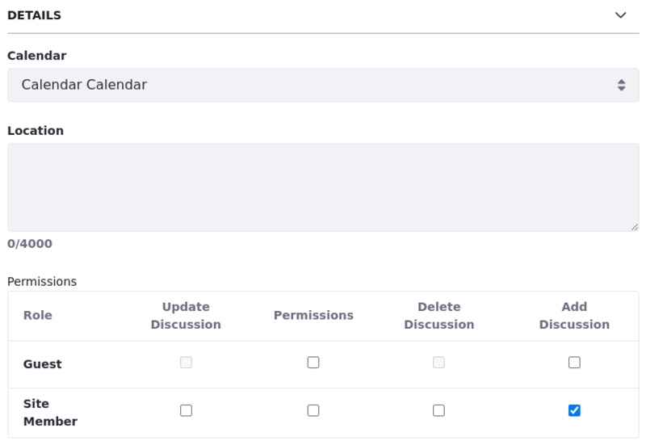
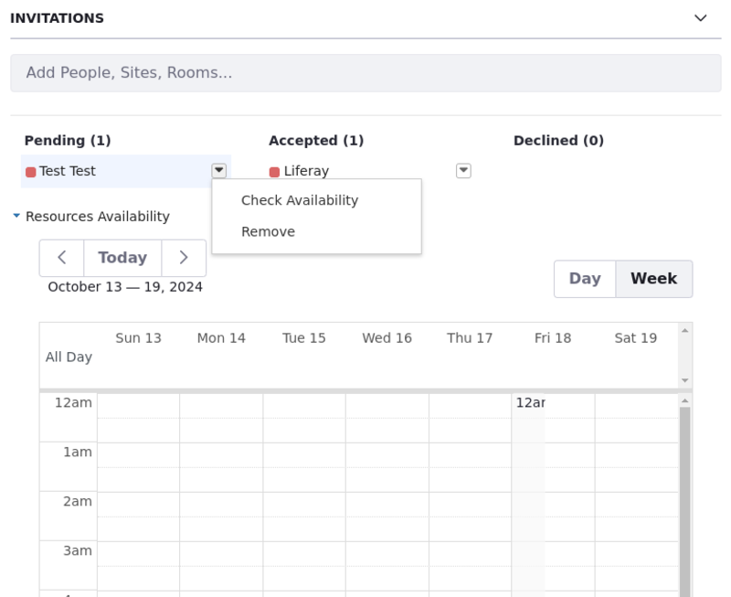
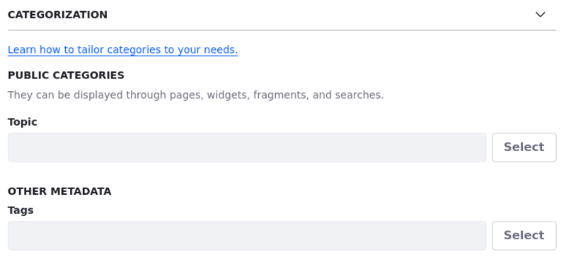
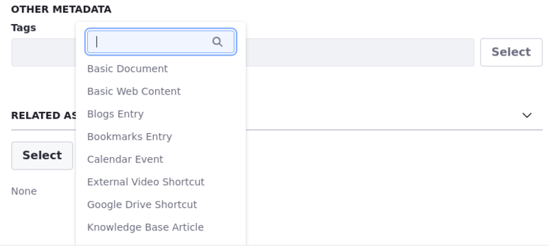
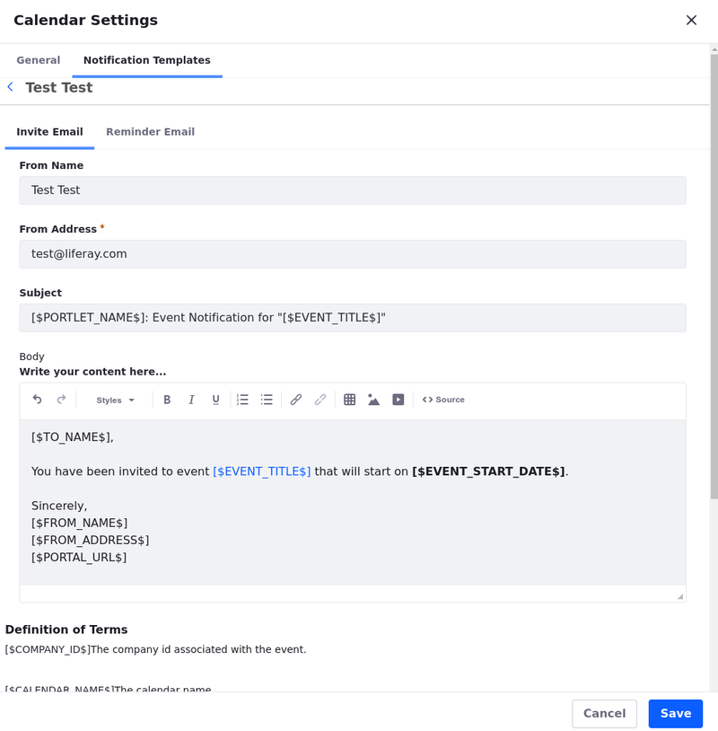
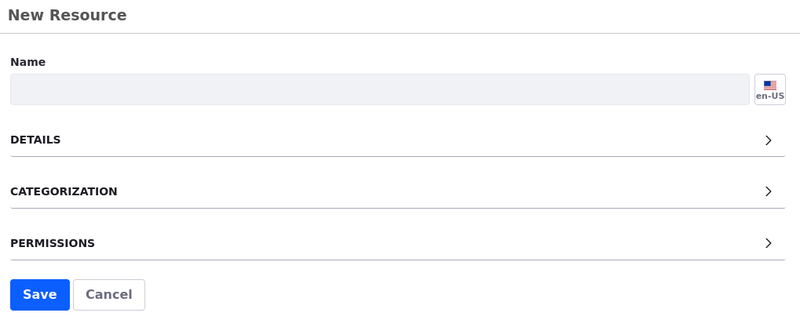

# Using the Calendar Widget

The calendar widget displays a small monthly calendar showing an overview of upcoming events. A larger area shows the Scheduler, a more detailed calendar with several options. You can set it to display a day, week, or month, or choose a more event-oriented agenda setting.

## Adding a Calendar Widget to a Page

1. [Create a new page](../../site-building/creating-pages/adding-pages/adding-a-page-to-a-site.md) or [start editing a content page](../../site-building/creating-pages/using-content-pages/adding-elements-to-content-pages.md).

1. Click *Add* () to open the Fragments and Widgets panel.

1. Under the Collaboration category in the Widgets tab, drag the *Calendar* widget to a place on the page.

Two calendars appear by default when the widget is first added to a page: a personal calendar for the current user and a site calendar for the current site. These are displayed in the widget's lower left.

Next to each calendar is a colored box. Click it to show/hide that calendar's events in the main viewing area.

## Adding New Calendars

1. Click the arrow to the right of the My Calendars header and select *Add Calendar* from the menu. Fill in the *Add Calendar* form.

1. Give the calendar a name and a description.

1. Set a time zone.

1. Pick a color for this calendar's events whenever multiple calendar events are displayed at once.

1. Decide if the calendar should be the user's default, automatically shown whenever the widget is displayed.

1. Decide to enable ratings and comments on the calendar events.

1. Configure visibility and permissions.

   After the calendar is created, set permissions by clicking the arrow to the right of the calendar's name &rarr; *Permissions*.

   Read [Calendar Permissions Reference](#calendar-permissions-reference) to learn more about each permission.

1. Click *Save*.

## Adding Events to a Calendar

1. Click any day in the main viewing area to open an event creation pop-up. If you've selected the Day or Week view, you can click on the specific time when your event begins.

   Alternatively, click *Add Event*.

   

1. Name your event and assign it to a calendar. Click *Save* to create the event immediately or *Edit* to enter additional information.

   

1. If you choose to edit the event, complete the edit event form. Enter start and end times and enter a description.

1. To schedule a recurring event, check the Repeat box and specify its frequency, duration, and end date in the pop-up.

   

1. Further configure your event through the options in the collapsed sections: [Details](#details), [Invitations](#invitations), [Reminders](#reminders), [Categorization](#categorization), and [Related Assets](#related-assets).

1. Click *Publish* or *Save as a Draft* to publish your event later.

### Details

Here you can move the event to another calendar, enter a location, and set permissions for Guests and Site Members.

### Invitations

Here, you add users, sites, or [calendar resources](#creating-calendar-resources) to your event.

1. Enter the name of an invitee (user, site, or resource) in the *Invitations* field. Hit *Enter* to add them to the *Pending* column.

   An automated [customizable](#customizing-email-notifications) email is sent to invitees who must navigate to the calendar widget to respond. When invitees respond to the invitation, their names move to the Accepted, Declined, or Maybe columns.

1. Click the arrow next to invitees' names and select *Check Availability*. This displays invitees' calendars (assuming you have permission to view them).

   

### Reminders

Schedule up to two email reminders to send to attendees.

!!! note
    Reminders translate the time of the event into the recipient's time zone.

Read [Customize Email Notifications](#customizing-email-notifications) to learn how to customize the content of the reminder email.

### Categorization

[Tag your event or assign it to a category](../../content-authoring-and-management/tags-and-categories.md) so it appears in relevant search results and gets published by any asset publisher set to publish content assigned to the same category.

### Related Assets

List an asset (e.g., an agenda or supplementary material for a meeting) as related to your event. Links to related assets appear in the Event Details window.

## Customizing Email Notifications

Customize email notifications for event invitations and reminders.

1. From the Calendar widget, click the arrow next to a calendar and select *Calendar Settings*.

   

1. Click the *Notification Templates* tab. Then select the *Invite Email* or the *Reminder Email* tab.

1. Edit the email as desired. A glossary at the bottom of the screen shows variables for terms that were set when you created the event. Use these variables to refer to event-specific information, such as the event's name, date or location.

   !!! tip
       It's a good idea to include a link to the event (use the variable `$EVENT_URL$]`), as users must navigate to the calendar widget to respond.

1. Click *Save*. Now your notifications contain the proper text. 

## Creating Calendar Resources

Use calendar resources, to invite shared resources to your events so those important resources your event requires, like a conference room, laptop, or projector are available for your event.

1. Click on the *Resources* tab and click *New*.

1. Fill in the *New Resource* form. Enter a name, give it a description, and choose whether to set it as active.

   

1. You can also [tag it and assign it to categories](../../content-authoring-and-management/tags-and-categories.md).

1. Configure its [permissions](#calendar-permissions-reference).

1. Click *Save*.

The resource has its calendar that was generated automatically (this is how users can check its availability when creating events). Just as with users, however, resources can have more than one calendar:

1. Go to the widget's *Resources* tab, click *Actions* () next to the resource, and select *View Calendars*.

2. Click *Add Calendar* and continue as if you were creating a calendar for a user or a site.

Once a resource is created, invite it to your events just as you would an attendee.

## Calendar Permissions Reference

Here's a list of calendar permissions:

| Permission         | Description                                                                              |
|:-------------------|:-----------------------------------------------------------------------------------------|
| Delete             | Grants the ability to delete calendars.                                                  |
| Permissions        | Grants the ability to view and modify the calendar's permissions.                        |
| Manage Events      | Grants the ability to manage events. This includes deleting, editing, and updating them. |
| View Event Details | Grants the ability to view event details by using the View Details button.               |
| Update             | Grants the ability to access the calendar settings and update general calendar settings. |
| View               | Grants the ability to view the calendar.                                                 |

## Related Topics

- [Configuring the Calendar Widget](./configuring-the-calendar-widget.md)
- [Exporting/Importing Calendar Data](./exporting-importing-calendar-data.md)
