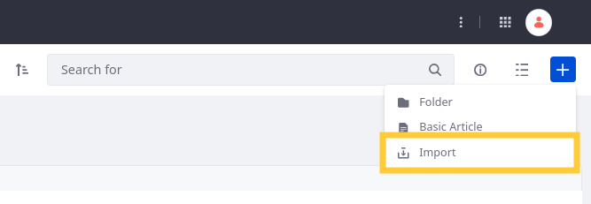
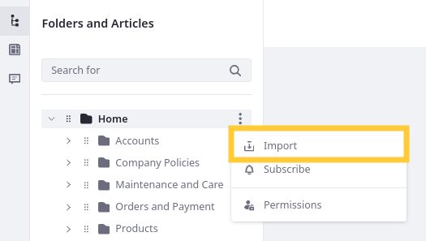
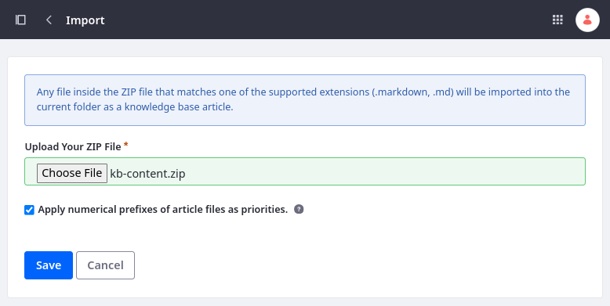

# Importing Knowledge Base Articles

{bdg-secondary}`Liferay 7.4 U72+/GA72+`

You can draft Knowledge Base articles as [Markdown](https://www.markdownguide.org/) files and import them to Liferay. To do this, you must ensure each Markdown file is properly formatted and packaged in a ZIP archive. Imported articles are automatically converted to HTML and appear in the Knowledge Base UI.

This way you can use external tools to draft, host, and collaborate on articles before publishing them to Liferay.

```{note}
You must have the *Knowledge Base > Knowledge Base: Import Articles* permission to import Markdown articles.
```

## Preparing Markdown Files for Import

Knowledge Base supports a Markdown dialect known as [Multi-Markdown](https://fletcherpenney.net/multimarkdown). This dialect extends basic Markdown with features like table formatting, image captions, and footnotes. As a language, Markdown is readable, intuitive, and versatile. Using services like GitHub, you and others can easily review and collaborate on documentation.

### File Requirements

To import Markdown files, they must

* Be packaged in a ZIP file.
* Use the `.md` or `.markdown` file extensions.
* Begin with an H1 (e.g., `# Some Heading`) to set the article's title.
* Include a unique ID after the H1 (e.g., `# Some Heading [](id=some-heading)`) to set the article’s friendly URL.

For example, an article named `modern-pentathlon.md` could include this content,

```markdown
# Modern Pentathlon [](id=modern-pentathlon)

The modern pentathlon is a competition across five different sport disciplines.

Each athlete must compete in fencing, shooting, swimming, horseback riding, and running.
```

Each ZIP file can include any number of new or modified files.

### Optional Configurations

You can determine article order when imported by adding numerical prefixes to file names (e.g., `00-foo.md`, `01-bar.md`). Additionally, you can add the `-intro` suffix to files with the `.markdown` extension to create parent/child hierarchies for the imported articles.

For example, consider a scenario where these files are in the same folder: `00-foo-intro.markdown`, `01-bar.markdown`, and `02-goo.markdown`. When imported, this is resulting article order and hierarchy:

```bash
└── Foo
    ├── Bar
    └── Goo
```

If your articles reference images, you can include them in your import by adding them to an `/images` folder in the root of the ZIP file. Supported attachment extensions are `.bmp`, `.gif`, `.jpeg`, `.jpg`, and `.png`.

```{note}
Image resources are only imported if they are referenced in an article. Otherwise, they are ignored.
```

You can view and configure Knowledge Base import settings via system setting. See [Knowledge Base System Settings](knowledge-base-system-settings.md) for more information.

### Setting a Source URL

If you're hosting your Markdown files on a service like [Github](https://github.com/), you can set a source URL that specifies the repository location. To use this feature, first enable source URLS in the [Knowledge Base System Settings](knowledge-base-system-settings.md). Then, add a `.METADATA` file to the root of the ZIP file with the base URL for the desired repository. The importer appends each file's path in the ZIP archive to this base URL to form the complete source URL (`[base URL]/[article file path]`).

For example, consider a scenario with this base URL:

```
https://github.com/clarity/clarity-guide/blob/master/docs/latest/en
```

If you import a ZIP archive with `folder-01/file.md`, then this is the resulting source URL:

```
https://github.com/clarity/clarity-guide/blob/master/docs/latest/en/folder-01/file.md
```

## Importing Markdown Files

1. Open the *Site Menu* () and go to *Content and Data* &rarr; *Knowledge Base*.

1. In the Articles and Folders () section, go to the desired folder, click *Add* () and select *Import*.

   

   Alternatively, click the *Actions* button () for the desired folder and select *Import*.

   

1. Click *Choose File* and select the desired ZIP file.

   

1. Enable/Disable *Apply numerical prefixes of article files as priorities*. This determines whether Knowledge Base uses each file’s numerical prefixes to order them.

1. Click *Save*.

Once saved, the importer converts each file’s Markdown to HTML and the resulting articles are published.

```{important}
Imported articles are independent of the workflow settings. This means that imported articles are automatically approved.
```

## Understanding the Import Process

When initiated, the Markdown importer checks whether each file's H1 and ID match any existing Knowledge Base articles. If a match is found, the importer replaces the existing article's content. If no match is found, a new article is created.

The importer only creates and updates articles. It does not delete any existing articles. To delete an article, you must manually do so.

```{tip}
You can update a file's numerical prefix to update its order in Liferay (e.g., changing `00-file.md` to `01-file.md`).

Updating an article's header ID creates a new article with a new friendly URL and does not update or remove the existing article.
```

## Related Topics

* [Creating Knowledge Base Articles](./creating-knowledge-base-articles.md)
* [Managing the Knowledge Base](./managing-the-knowledge-base.md)