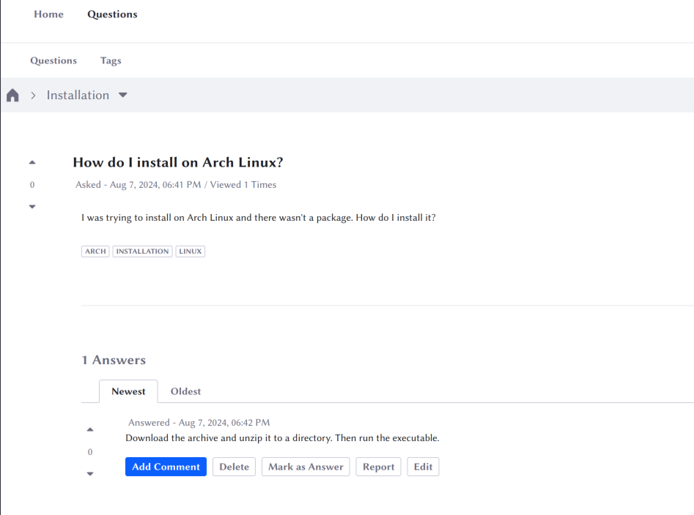

---
toc:
  - ./questions-application/using-the-questions-app.md
  - ./questions-application/configuring-the-questions-app.md
uuid: e576ecee-a1e0-4bd8-ab23-ae2c18295232
taxonomy-category-names:
- Content Management System
- Forums and Message Boards
- Liferay Self-Hosted
- Liferay PaaS
- Liferay SaaS
---

# Questions Application

{bdg-secondary}`Available: Liferay DXP/Portal 7.3+`

<!-- Hey Gabriel, when you see a badge formatted like the above, it means it was created before we had the current badge syntax. Please convert this to the current badge syntax whenever you see it. I'm sending this back to you because of that, because I've corrected these before. I'm not convinced you're looking at my wordsmithing commits when stuff gets merged, because you still let these through. You should be reviewing those commits even when I don't send you writing feedback, because you'll see the kinds of things I catch (and thus avoid them in the future). -Rich -->

The Questions app is a new UI of the Message Boards application, focused on presenting a question-and-answer format. The Questions app allows the creation of:

**Topics:** Themes where questions are categorized

**Questions:** A question inside the app

**Answers:** An answer to a specific question

Liferay offers this application to enable knowledge sharing, problem-solving, and community interaction in the platform. The app includes features such as voting, commenting, and subscribing to topics or questions for a better user experience, improving search functionality, and motivating user collaboration.

When questions are created, tags can also help others find relevant content. By using tags, the user can better manage by reducing duplicated inquiries and streamline content moderation by providing a clear framework for managing and organizing questions.

The user also has the power to [Configure the Questions App](../collaboration-and-social/questions-application/configuring-the-questions-app.md) so it can be adapted to specific needs and preferences. Here are some ways that the app can be customized:

**Topic Display Style**: Topics can be displayed as cards or as a list.

**Limiting Topic Display**: Questions default display behavior is to show all Topics. You can opt to only display certain topics by configuring a Root Topic.

**Managing App Permissions**: You can give or limit privileges to specific users and roles.

**Redirecting Guest Users to Login**: Guest users are redirected to a login page when they try to click *Ask Question*.

**Creating a Service Access Policy to Allow Guest Viewers**: It is possible to set up permissions for external applications or services to access the Questions app.
