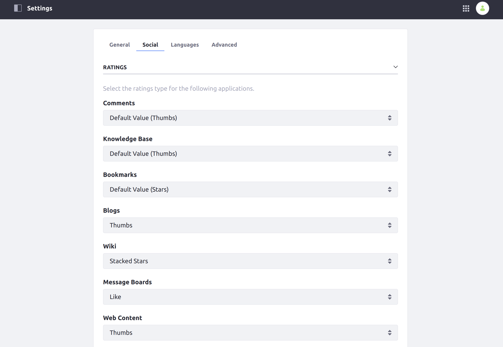

# Using the Ratings System

With Liferay DXP's [asset framework](../../liferay-development/building-applications/data-frameworks/asset-framework.md), users can use a content rating system and rate or value content. Many of DXP's built-in content types have ratings enabled by default.

## Ratings Types

The following types of ratings are available out-of-the-box for compatible assets:

- **Likes**: Content has a heart icon for users to "like" the content. The total number of likes is shown next to the heart button.

    

- **Stars**: Content is rated from 1 to 5 stars. The content's total star rating is shown next to the drop-down menu.

    

- **Stacked Stars**: Content is rated from 1 to 5 stars in a horizontal selection. The content's total star rating is shown above the user's selection.

    

- **Thumbs**: Content is given either a "thumbs up" or "thumbs down" rating. The total number of thumbs up or down is shown next to each thumb button.

    

## Ratings Value Conversion

Because the different types of configurable ratings (likes, stars, etc.) are presented differently, the database stores a normalized ratings value for assets that have them enabled. If the ratings type of an asset is changed, the ratings are converted and carried over to the new type.

The following table shows how ratings from each type can be converted to the other types:

|            | **Converted to Likes**                        | **Converted to Stars**                                     | **Converted to Thumbs Up/Down**                    |
|:-----------|:----------------------------------------------|:-----------------------------------------------------------|:---------------------------------------------------|
| **Likes**  | No change                                     | 1 Like = 5 Star rating                                     | 1 Like = 1 Thumbs Up                               |
| **Stars**  | 3-5 Stars = 1 Like; 1-2 Stars are omitted     | No change                                                  | 3-5 Stars = 1 Thumbs Up; 1-2 Stars = 1 Thumbs Down |
| **Thumbs** | 1 Thumbs Up = 1 Like; Thumbs Down are omitted | 1 Thumbs Up = 5 Star rating; 1 Thumbs Down = 1 Star rating | No change                                          |

## Enabling Ratings for Your Content

Ratings can be configured for your content from the Site Settings menu (individually per Site).

From the Site menu, navigate to *Configuration* &rarr; *Settings*, and then click the *Social* tab. Under the *Ratings* section, the rating type for each available asset type can be individually configured:

Administrators can also enable or disable ratings for specific widgets across multiple Sites via the Control Panel, in either *Instance Settings* (for a single virtual DXP instance) or *System Settings* (globally).

From either of these settings menus, find the icon for the chosen asset type under *Content and Data* (for example, *Blogs* or *Wiki*). Then, choose the menu option for the specific widget under the *WIDGET SCOPE* header (e.g., *Widgets Display*):

!!! note
    Not every widget that supports content ratings can have ratings enabled or disabled from the Control Panel.

<!-- TODO: (When developer-oriented article available) You can also enable ratings for your own applications by adding just a few lines of code. See the article on [adding support for ratings](link) to your content widgets for more information. -->

## Related Topics

- [Using the Activities Widget](./social-tools/using-the-activities-widget.md)
- [Using the Contacts Center Widget](./social-tools/using-the-contacts-center-widget.md)