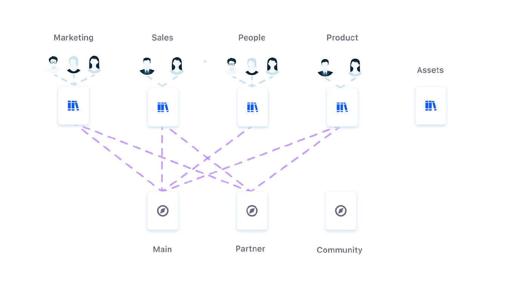

---
toc:
  - ./asset-libraries/creating-and-managing-asset-libraries.md
  - ./asset-libraries/asset-library-content.md
taxonomy-category-names:
- Digital Asset Management
- Asset Libraries
- Liferay Self-Hosted
- Liferay PaaS
- Liferay SaaS
uuid: 1678aa17-009f-4055-9780-643c54d67ae6
---
# Asset Libraries

{bdg-secondary}`Available 7.3+`

Asset Libraries are virtual spaces for storing reusable assets. You can create as many of these spaces as needed to group content for departments, teams, or even individual products and campaigns. Each library is created at the instance level and can be connected to multiple sites, so your users can develop and manage assets in each library instead of within individual sites. Supported applications include Web Content, Documents and Media, Collections, and Translation Processes.

By organizing content into smaller, focused buckets, you can more easily access and manage content in different site contexts. [Tags and Categories](./tags-and-categories/organizing-content-with-categories-and-tags.md) can also be used to categorize library assets, further improving organization.

Implement a custom [workflow](../process-automation/workflow/introduction-to-workflow.md) to direct the publishing process lowering the risk of editing conflicts and content duplication. You can also enable [Staging](../site-building/publishing-tools/staging.md) for a library to manage content publishing while maintaining data isolation.

Once you've connected your library to a site, you can display its content in fragments and widgets. You can also display asset library content in sites using each site's default display page template for the respective content type.

Finally, asset libraries work under the same permission management system as other applications, so you can configure who can create or access assets in a library. By default, there are four asset library roles, equivalent to their site counterparts: Asset Library Owner, Admin, Member, and Content Reviewer. You can create new asset library roles for your specific needs.

Use asset libraries to improve content collaboration, simplify asset organization, and reduce content duplication across your instance. See [Creating and Managing Asset Libraries](./asset-libraries/creating-and-managing-asset-libraries.md) to get started with asset libraries.

::::
:gutter: 3 3 3 3

:::{grid-item-card} 
:link: ./asset-libraries/creating-and-managing-asset-libraries.md
:::

:::{grid-item-card} 
:link: ./asset-libraries/asset-library-content.md
:::
::::
