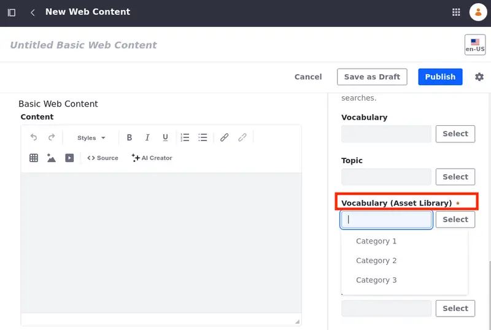

---
taxonomy-category-names:
- Digital Asset Management
- Asset Libraries
- Liferay Self-Hosted
- Liferay PaaS
- Liferay SaaS
uuid: eab61f93-ede9-48d8-adb8-4fa10438a5c9
---

# Additional Content Configuration in Asset Libraries

Although creating content in asset libraries is essentially the same as creating it in a site, there are differences, mainly in scope and default theme settings. Some content requires additional configuration when set within an asset library's context.

These are the contents that require additional configuration:

- [Categories and Vocabulary](#categories-and-vocabulary)

## Categories and Vocabulary

When creating a vocabulary within an asset library, some additional configurations for [categories and vocabularies](../tags-and-categories/defining-categories-and-vocabularies-for-content.md) are available:

1. Open the *Global Menu* (), go to the *Applications* tab, and select *Asset Libraries* under Content.

1. Click the name of the asset library where you want to add your vocabulary.

1. Under categorization, click *Categories*.

1. Click *Add* () next to Vocabularies.

1. Configure whether and where that vocabulary is required. You can find the configuration under Associated Asset Types with three options:

   

   | Option                                                 | Description                                                                                      |
   |:-------------------------------------------------------|:-------------------------------------------------------------------------------------------------|
   | Not Required                                           | The vocabulary field is not required.                                                            |
   | Only Required in This Asset Library                    | The vocabulary field is only required in content created in that asset library.                  |
   | Required in This Asset Library and Its Connected Sites | The vocabulary field is required in content created in the asset library and in connected sites. |

   !!! note
       When the vocabulary is marked as required, an asterisk marks the vocabulary field, and it must have content or it cannot be saved. Trying to save content without the required vocabulary causes an error message to appear.

   

Note that when using the Required in This Asset Library and Its Connected Sites option, if a [site gets disconnected](./creating-and-managing-asset-libraries.md#sites) from the asset library, the vocabulary stops being shown on the content created at a site level. Without the required vocabulary, you can publish content without filling in the vocabulary field.

If a site is connected to an asset library with a required vocabulary, the vocabulary becomes required for the content on that site, and filling in the vocabulary field becomes mandatory. Content cannot be saved without entering the required vocabulary field first.

## Related Topics

- [Asset Library Content](./asset-library-content.md)
- [Creating and Managing Asset Libraries](./creating-and-managing-asset-libraries.md)
