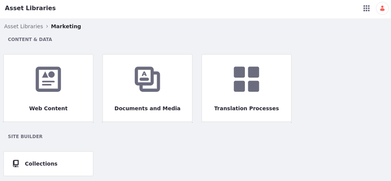
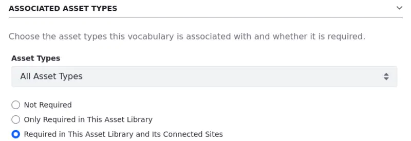
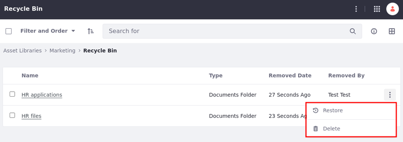

---
taxonomy-category-names:
- Digital Asset Management
- Asset Libraries
- Liferay Self-Hosted
- Liferay PaaS
- Liferay SaaS
uuid: 10493643-7970-49b1-89a8-2363bc7a390a
---
# Asset Library Content

{bdg-secondary}`Liferay DXP/Portal 7.3+`

*Asset libraries* provide a convenient way to share content across Liferay sites while streamlining content collaboration and reducing the risk of data duplication. To add, view, and manage an asset library's content, first navigate to the Library's menu page.

1. Open the *Global Menu* (), select the *Applications* tab, and click *Asset Libraries* under Content.

1. Click the *name* of the desired asset library.

Now you can access the library's active applications to create and manage content. You can also enable staging, implement custom workflows, categorize content using tags and categories, create collections, and more.
<!--TASK: document Collections and Workflow for Asset Libraries-->

## Creating Content

To create content in an asset library, first go to the library's menu page, and click the desired application. From here, creating content is essentially the same as creating it in a site. The differences are mainly its scope and default theme settings.

However, some content requires additional configuration when set within an asset library's context. Read [Additional Content Configuration in Asset Libraries](./additional-content-configuration-in-asset-libraries.md) to learn more.

See [Content Authoring and Management](../../content-authoring-and-management.md) articles for more information about creating each type of content.

!!! note
    Only active applications appear on a library's menu page. To activate or deactivate an application, see [Configuring Asset Libraries](./creating-and-managing-asset-libraries.md#configuring-asset-libraries) for more information.

## Using Content in Sites

Once you've added content to an asset library, you can access it from [connected sites](./creating-and-managing-asset-libraries.md#sites) and display it using display page templates, fragments, widgets, and more.

For Liferay 7.4 U21+ and GA21+, when using the item selector in a site, you can browse content (e.g. web content, documents and media, and blogs) in connected asset libraries. To do this, open the item selector window and use the breadcrumb to navigate to *Sites and Libraries*.

From here, navigate to the *Asset Library* tab and select a connected asset library. Once selected, you can browse its content and select the desired asset.

Alternatively, you can filter the item selector window to include content from *Everywhere*. This displays both site content and asset library content.

When publishing content using the Asset Publisher widget, you must set its scope to include content from a specific asset library and select the content you want to use.

See [Displaying Content](../../site-building/displaying-content.md) documentation for more information about using content in your sites.

!!! note
    Unlike sites, display page templates cannot be defined in an asset library. Instead, asset library content is displayed using each site's default display page template for the respective content type.

## Staging Content

Asset libraries support both [Local Live](../../site-building/publishing-tools/staging/configuring-local-live-staging.md) and [Remote Live](../../site-building/publishing-tools/staging/configuring-remote-live-staging.md) staging. This provides a working environment for adding, removing, and editing assets in the Web Content or Documents and Media applications before making those changes live. Staged content options are limited to the applications enabled for the asset library. Once enabled, you can then connect the library to staging-enabled sites.

See [Using Staging in Asset Libraries](../../site-building/publishing-tools/staging/using-staging-in-asset-libraries.md) for more information.

## Categorizing Content

The Tags and Categories applications are enabled for all asset libraries. To access them, navigate to a library's menu page and click *Tags* or *Categories* under Categorization. Tags created in an asset library are scoped to that library and can only be viewed and applied in that context. However, vocabularies and categories defined in an Asset library are immediately available in all connected sites.

!!! note
    If created in an asset library, vocabularies and categories cannot be edited or removed in connected sites. They can only be modified in the asset library in which they were created.

See [Tags and Categories](../tags-and-categories.md) documentation for more information about using these applications.

## Categories and Vocabulary

{bdg-secondary}`Liferay DXP 2024.Q1+/Portal 7.4 GA112+`

When creating a vocabulary within an asset library, some additional configurations for [categories and vocabularies](../tags-and-categories/defining-categories-and-vocabularies-for-content.md) are available:

1. Open the *Global Menu* (), go to the *Applications* tab, and select *Asset Libraries* under Content.

1. Click the name of the asset library where you want to add your vocabulary.

1. Under categorization, click *Categories*.

1. Click *Add* () next to Vocabularies.

1. Configure whether and where that vocabulary is required. You can find the configuration under Associated Asset Types with three options:

   

   | Option                                                 | Description                                                                                      |
   |:-------------------------------------------------------|:-------------------------------------------------------------------------------------------------|
   | Not Required                                           | The vocabulary field is not required.                                                            |
   | Only Required in This Asset Library                    | The vocabulary field is only required in content created in that asset library.                  |
   | Required in This Asset Library and Its Connected Sites | The vocabulary field is required in content created in the asset library and in connected sites. |

   !!! note
       When the vocabulary is marked as required, an asterisk marks the vocabulary field, and it must have content or it cannot be saved. Trying to save content without the required vocabulary causes an error message to appear.

   

Note that when using the Required in This Asset Library and Its Connected Sites option, if a [site gets disconnected](./creating-and-managing-asset-libraries.md#sites) from the asset library, the vocabulary stops being shown on the content created at a site level. Without the required vocabulary, you can publish content without filling in the vocabulary field.

If a site is connected to an asset library with a required vocabulary, the vocabulary becomes required for the content on that site, and filling in the vocabulary field becomes mandatory. Content cannot be saved without entering the required vocabulary field first.

## Exporting and Importing Content

You can export and import asset library content as LAR files. To initiate a new export/import process for a library, go to its dashboard and click  *Export* or *Import* at the bottom of the page. Then click *Add* () to initiate a new process.

Exporting and importing library content follows the same process as site assets. You can also create and use custom export templates by clicking *Actions* () in the application bar and selecting *Export Templates*. See [Exporting/Importing Site Pages and Content](../../site-building/sites/exporting-importing-site-pages-and-content.md) for more information.

## Removing Content

Asset libraries support the [Recycle Bin](../recycle-bin/configuring-the-recycle-bin.md) application. When enabled, any content removed from the library is temporarily stored in its recycle bin. By default, recycled content is retained for 43200 minutes (i.e., 30 days), but you can adjust this period in each asset library's settings. Recycled content that has been in the recycle bin for more than the allotted time is deleted automatically from your instance.

Alternatively, you can then manually delete recycled content or restore it to your asset library via the asset's *Actions* button (  ).

See [Recycle Bin Overview](../recycle-bin/recycle-bin-overview.md) for more information.

## Related Topics

- [Asset Libraries Overview](../asset-libraries.md)
- [Creating and Managing Asset Libraries](./creating-and-managing-asset-libraries.md)
